# Architectural Philosophy

<cite>
**Referenced Files in This Document**   
- [OfflineContext.tsx](file://src/contexts/OfflineContext.tsx) - *Updated in recent commit*
- [sw.js](file://public/sw.js) - *Service worker implementation*
- [ConvexProvider.tsx](file://src/providers/ConvexProvider.tsx) - *Convex integration*
- [schema.ts](file://convex/schema.ts) - *Data model definition*
- [AuthContext.tsx](file://src/contexts/AuthContext.tsx) - *Authentication management*
- [SettingsContext.tsx](file://src/contexts/SettingsContext.tsx) - *User settings management*
- [expenses.ts](file://convex/expenses.ts) - *Expense management functions*
- [layout.tsx](file://src/app/layout.tsx) - *Application layout and providers*
- [ProtectedRoute.tsx](file://src/components/ProtectedRoute.tsx) - *Route protection*
- [NetworkStatusIndicator.tsx](file://src/components/NetworkStatusIndicator.tsx) - *Network status UI*
- [LocalFirstProvider.tsx](file://src/providers/LocalFirstProvider.tsx) - *Added in recent commit*
- [useLocalFirst.ts](file://src/hooks/useLocalFirst.ts) - *Added in recent commit*
- [LocalStorageManager.ts](file://src/lib/storage/LocalStorageManager.ts) - *Added in recent commit*
- [CloudSyncManager.ts](file://src/lib/sync/CloudSyncManager.ts) - *Added in recent commit*
- [ConflictDetector.ts](file://src/lib/sync/ConflictDetector.ts) - *Added in recent commit*
- [ConflictPrompt.tsx](file://src/components/ConflictPrompt.tsx) - *Added in recent commit*
</cite>

## Update Summary
**Changes Made**   
- Updated documentation to reflect the new local-first architecture implementation
- Added new sections for LocalFirstProvider and enhanced offline capabilities
- Updated context hierarchy to include the new LocalFirstProvider
- Added detailed information about conflict detection and resolution
- Updated offline data synchronization diagrams and descriptions
- Added new components and hooks to referenced files list

## Table of Contents
1. [Introduction](#introduction)
2. [Project Structure](#project-structure)
3. [Offline-First Architecture](#offline-first-architecture)
4. [Full-Stack Architecture with Next.js and Convex](#full-stack-architecture-with-nextjs-and-convex)
5. [Context Hierarchy and Global State Management](#context-hierarchy-and-global-state-management)
6. [System Context and Data Flow](#system-context-and-data-flow)
7. [Scalability and Constraints](#scalability-and-constraints)

## Introduction
The Expense-Tracker---Warp application is a mobile-first Progressive Web App (PWA) designed to provide seamless expense tracking with robust offline capabilities. This document details the architectural philosophy behind the application, focusing on its offline-first design, full-stack implementation using Next.js and Convex, and the strategic use of React Context for global state management. The architecture prioritizes user experience by ensuring uninterrupted functionality regardless of network conditions, while leveraging modern backend-as-a-service technology to simplify development and deployment.

## Project Structure
The project follows a well-organized, feature-based structure that separates concerns between frontend, backend, and shared resources. The directory layout reflects a clear separation of responsibilities, with distinct folders for application code, components, contexts, and backend functions.

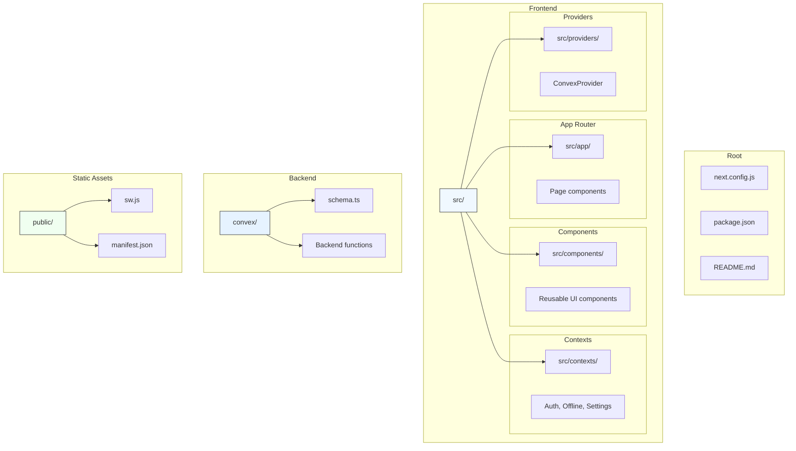

**Diagram sources**
- [src/app](file://src/app)
- [convex](file://convex)
- [public](file://public)

**Section sources**
- [README.md](file://README.md#L1-L264)

## Offline-First Architecture
The application implements an offline-first philosophy through a combination of React Context (OfflineContext) and service worker (sw.js) caching. This ensures uninterrupted user experience even when network connectivity is unreliable or unavailable.

### Local-First Architecture Implementation
The application has been enhanced with a comprehensive local-first architecture that provides advanced offline capabilities, automatic background synchronization, and intelligent conflict detection. The LocalFirstProvider integrates all local-first data management components, including conflict detection, resolution UI, and offline capabilities.

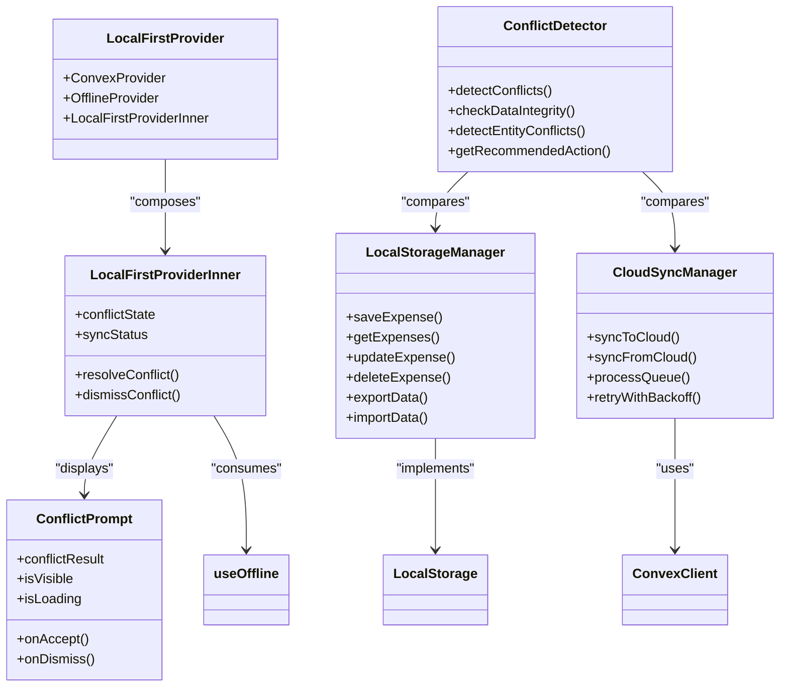

**Diagram sources**
- [LocalFirstProvider.tsx](file://src/providers/LocalFirstProvider.tsx#L1-L66)
- [useLocalFirst.ts](file://src/hooks/useLocalFirst.ts#L1-L544)
- [LocalStorageManager.ts](file://src/lib/storage/LocalStorageManager.ts#L1-L487)
- [CloudSyncManager.ts](file://src/lib/sync/CloudSyncManager.ts#L1-L663)
- [ConflictDetector.ts](file://src/lib/sync/ConflictDetector.ts#L1-L491)

**Section sources**
- [LocalFirstProvider.tsx](file://src/providers/LocalFirstProvider.tsx#L1-L66)
- [useLocalFirst.ts](file://src/hooks/useLocalFirst.ts#L1-L544)
- [LocalStorageManager.ts](file://src/lib/storage/LocalStorageManager.ts#L1-L487)
- [CloudSyncManager.ts](file://src/lib/sync/CloudSyncManager.ts#L1-L663)
- [ConflictDetector.ts](file://src/lib/sync/ConflictDetector.ts#L1-L491)

### Enhanced Offline Context Implementation
The OfflineContext has been enhanced to support the local-first architecture, managing the state of pending operations and conflicts that cannot be immediately synchronized with the backend due to network unavailability or data conflicts. It uses a comprehensive LocalStorageManager that provides a unified interface for local data operations using IndexedDB.

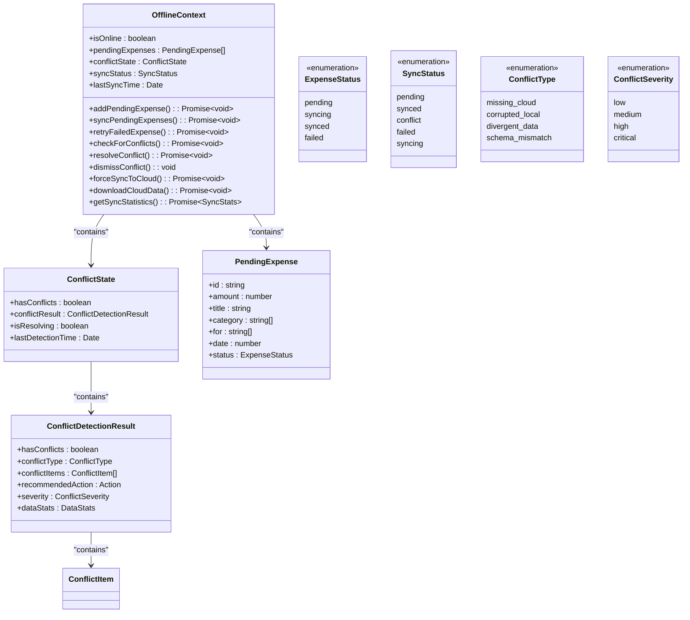

**Diagram sources**
- [OfflineContext.tsx](file://src/contexts/OfflineContext.tsx#L28-L427)

**Section sources**
- [OfflineContext.tsx](file://src/contexts/OfflineContext.tsx#L1-L427)
- [local-storage.ts](file://src/lib/types/local-storage.ts#L1-L229)

### Service Worker Caching Strategy
The service worker (sw.js) implements a cache-first strategy for essential application resources, ensuring that the core functionality remains available offline. It caches the main application pages and static assets during the installation phase.

```javascript
// Cache strategy in sw.js
const CACHE_NAME = 'expense-tracker-v1';
const urlsToCache = [
  '/',
  '/login',
  '/register',
  '/expenses',
  '/dashboard',
  '/settings',
  '/manifest.json',
  '/icon-192.png',
  '/icon-512.png'
];
```

The service worker intercepts fetch requests and attempts to serve responses from the cache before falling back to the network. This ensures that the application shell is always available, even when offline.

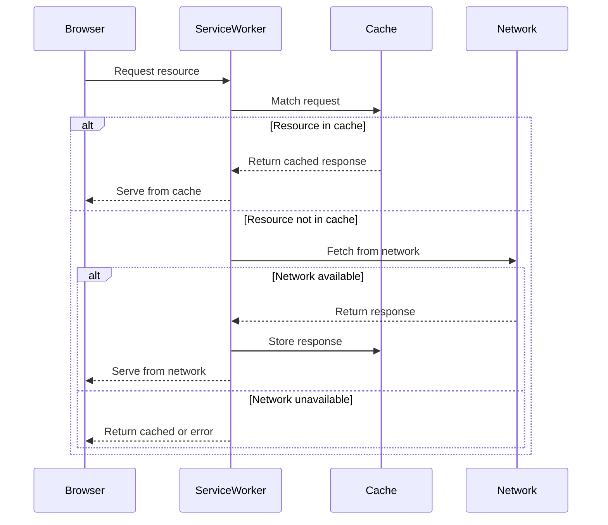

**Diagram sources**
- [sw.js](file://public/sw.js#L1-L50)

**Section sources**
- [sw.js](file://public/sw.js#L1-L50)

## Full-Stack Architecture with Next.js and Convex
The application leverages Next.js App Router for server-side rendering (SSR) and static site generation (SSG), combined with Convex as a backend-as-a-service for real-time data synchronization, authentication, and schema enforcement.

### Next.js App Router Implementation
The Next.js App Router provides a file-based routing system that maps directly to the application's URL structure. Each route is implemented as a React component in the src/app directory, with server components handling data fetching and client components managing interactivity.

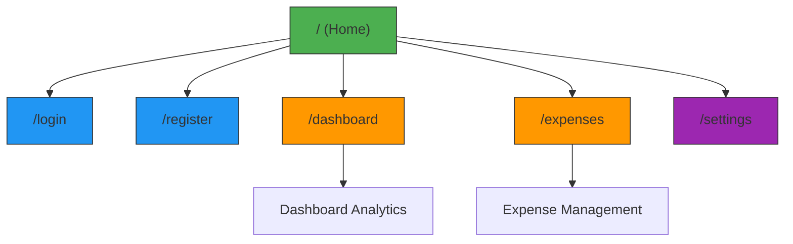

**Diagram sources**
- [src/app](file://src/app)

### Convex Backend-as-a-Service
Convex serves as the backend-as-a-service, providing a unified solution for database operations, real-time updates, and business logic. The schema is defined in schema.ts, which specifies the data model and indexes for efficient querying.

```typescript
// Data model from schema.ts
export default defineSchema({
  users: defineTable({
    username: v.string(),
    hashedPassword: v.string(),
    tokenIdentifier: v.string(),
  }).index("by_username", ["username"]).index("by_token", ["tokenIdentifier"]),

  expenses: defineTable({
    amount: v.number(),
    title: v.string(),
    category: v.array(v.string()),
    for: v.array(v.string()),
    date: v.number(),
    createdAt: v.number(),
    userId: v.id("users"),
  }).index("by_user", ["userId"]).index("by_user_date", ["userId", "date"]),
  
  // Additional tables...
});
```

The use of Convex eliminates the need for traditional REST or GraphQL APIs, as client-side code can directly call server functions using the useMutation and useQuery hooks. This reduces boilerplate code and simplifies data synchronization.

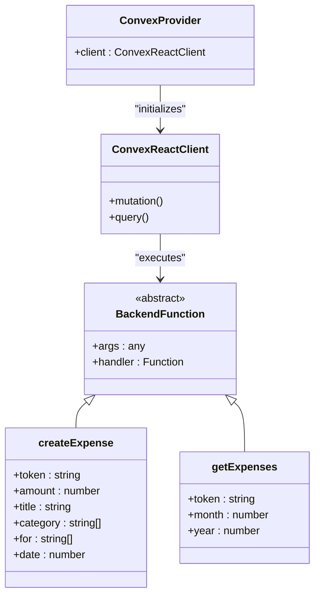

**Diagram sources**
- [ConvexProvider.tsx](file://src/providers/ConvexProvider.tsx#L1-L16)
- [schema.ts](file://convex/schema.ts#L1-L62)
- [expenses.ts](file://convex/expenses.ts#L1-L325)

**Section sources**
- [ConvexProvider.tsx](file://src/providers/ConvexProvider.tsx#L1-L16)
- [schema.ts](file://convex/schema.ts#L1-L62)
- [expenses.ts](file://convex/expenses.ts#L1-L325)

### Rationale for Choosing Convex
The decision to use Convex over traditional REST/GraphQL backends was driven by several key factors:

- **Faster iteration**: Convex allows developers to write backend functions in TypeScript alongside frontend code, reducing context switching and enabling rapid development.
- **Built-in real-time capabilities**: Convex automatically pushes data updates to clients, eliminating the need for manual WebSocket implementation or polling.
- **Simplified deployment**: Convex handles database management, scaling, and security, allowing developers to focus on application logic rather than infrastructure.
- **Type safety**: The generated API types ensure compile-time validation of function arguments and return values, reducing runtime errors.

## Context Hierarchy and Global State Management
The application implements a well-defined context hierarchy that manages global state without prop drilling. The provider pattern is used to compose multiple contexts, creating a clean separation of concerns.

### Provider Composition
The main layout (layout.tsx) composes the providers in a specific order to establish dependencies between contexts. The ConvexProvider is the outermost layer, followed by AuthProvider, SettingsProvider, and OfflineProvider. With the recent update, the LocalFirstProvider now wraps the entire application, integrating all local-first data management components.

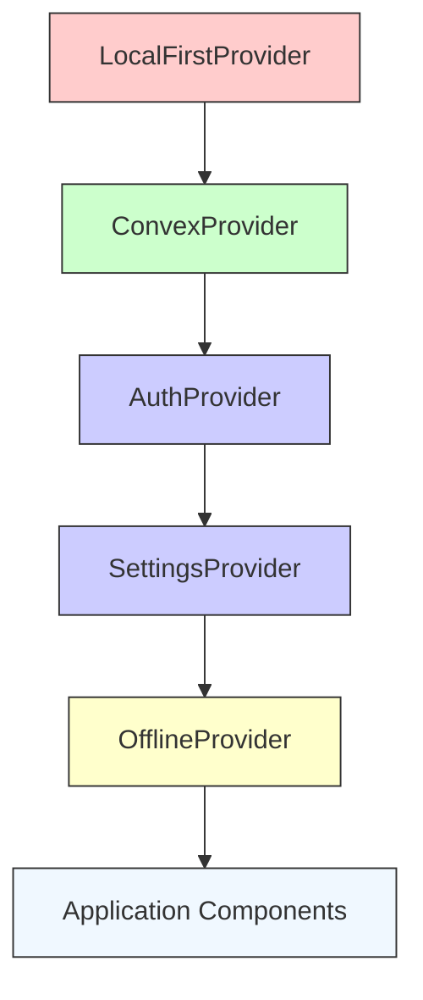

This hierarchy ensures that:
- Local-first data management is available throughout the application
- Convex is initialized before any context that requires database access
- Authentication state is available before settings and offline contexts
- User settings can be accessed by components that need user preferences
- Offline state is available to all components that need to handle network connectivity

**Diagram sources**
- [layout.tsx](file://src/app/layout.tsx#L1-L59)
- [LocalFirstProvider.tsx](file://src/providers/LocalFirstProvider.tsx#L1-L66)

**Section sources**
- [layout.tsx](file://src/app/layout.tsx#L1-L59)
- [LocalFirstProvider.tsx](file://src/providers/LocalFirstProvider.tsx#L1-L66)

### Context Implementation Details
Each context is implemented as a custom React hook that provides a clean API for consuming components.

#### Authentication Context
The AuthContext manages user authentication state, including login, registration, and logout functionality. It persists the authentication token in localStorage to maintain sessions across browser restarts.

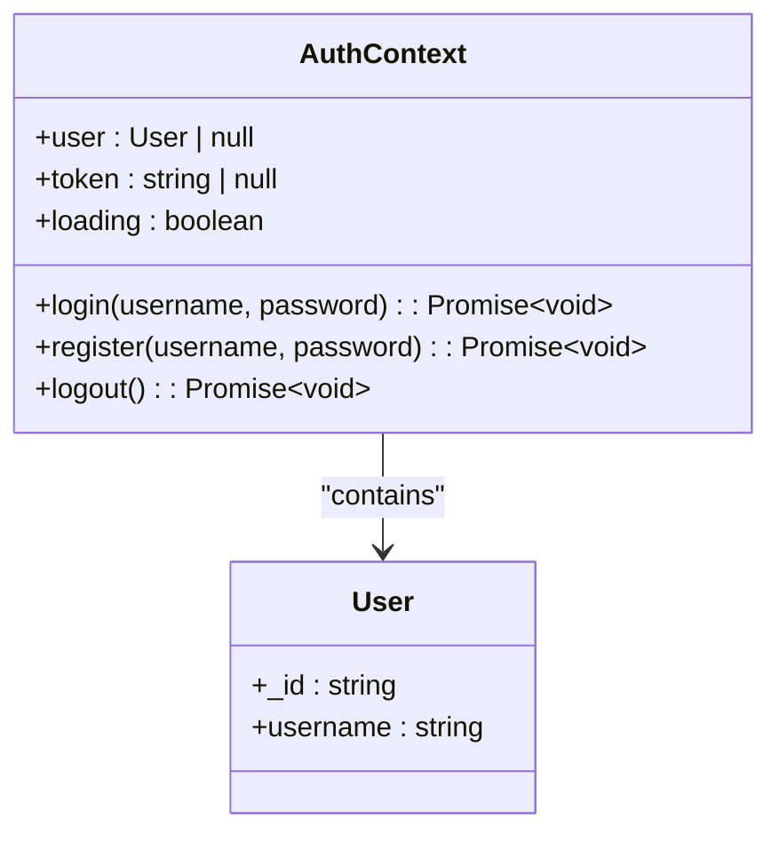

**Diagram sources**
- [AuthContext.tsx](file://src/contexts/AuthContext.tsx#L1-L97)

**Section sources**
- [AuthContext.tsx](file://src/contexts/AuthContext.tsx#L1-L97)

#### Settings Context
The SettingsContext manages user preferences such as currency and calendar type. It synchronizes settings with the backend through Convex mutations.

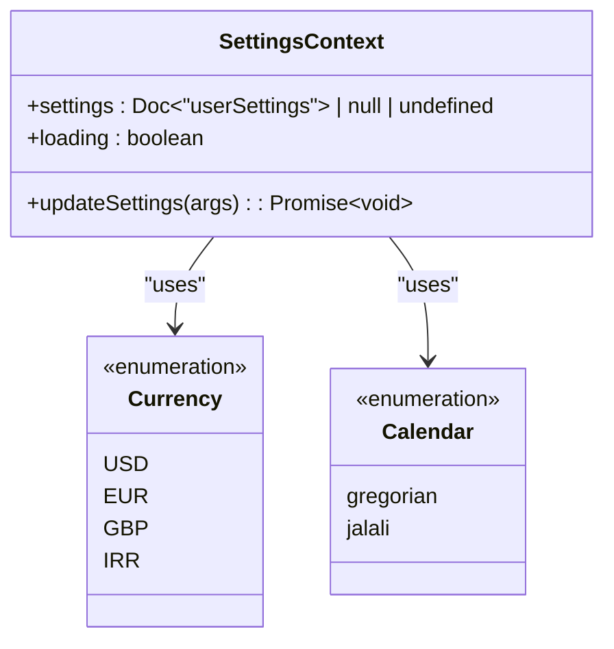

**Diagram sources**
- [SettingsContext.tsx](file://src/contexts/SettingsContext.tsx#L1-L58)

**Section sources**
- [SettingsContext.tsx](file://src/contexts/SettingsContext.tsx#L1-L58)

## System Context and Data Flow
The application's architecture creates a clear separation between client and server, with well-defined data flow patterns for both online and offline scenarios.

### Client-Server Interactions
When the application is online, data flows directly between the client and Convex backend through the ConvexReactClient. The client components use hooks to subscribe to data queries and trigger mutations.

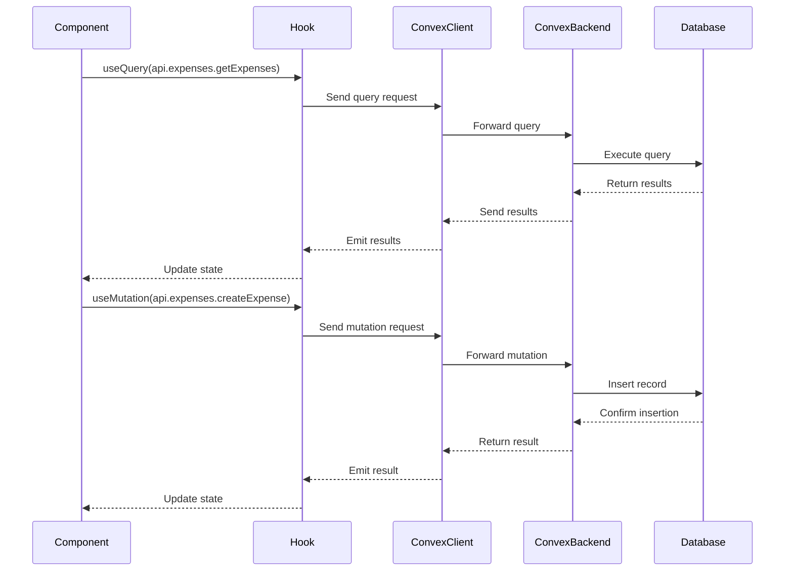

**Diagram sources**
- [expenses.ts](file://convex/expenses.ts#L1-L325)
- [ConvexProvider.tsx](file://src/providers/ConvexProvider.tsx#L1-L16)

### Enhanced Offline Data Synchronization
The application now implements an advanced local-first architecture that provides comprehensive offline capabilities. When the application is offline, the LocalFirstConvexClient intercepts all data operations and stores them in IndexedDB through the LocalStorageManager. When connectivity is restored, the pending operations are automatically synchronized with the backend through the CloudSyncManager.

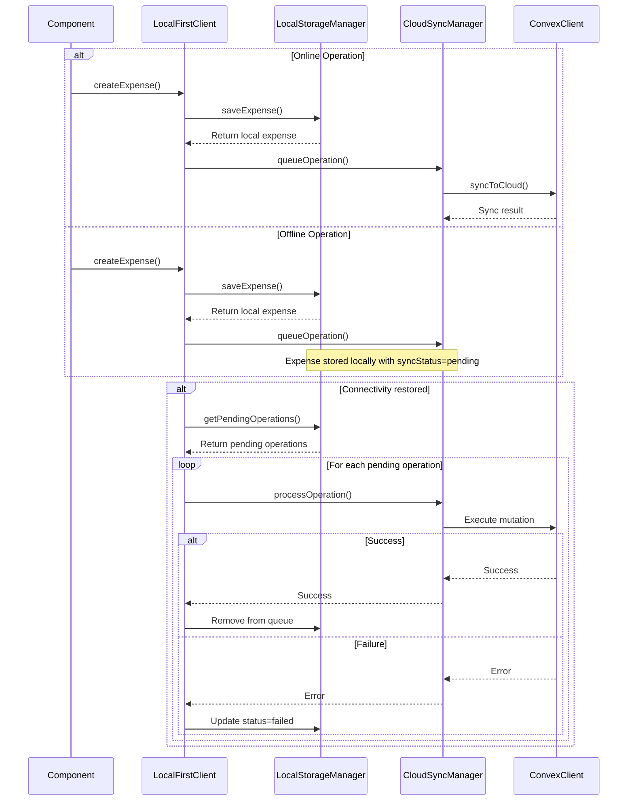

**Diagram sources**
- [LocalFirstConvexClient.ts](file://src/lib/client/LocalFirstConvexClient.ts#L1-L666)
- [LocalStorageManager.ts](file://src/lib/storage/LocalStorageManager.ts#L1-L487)
- [CloudSyncManager.ts](file://src/lib/sync/CloudSyncManager.ts#L1-L663)
- [OfflineContext.tsx](file://src/contexts/OfflineContext.tsx#L1-L427)

### Conflict Detection and Resolution
The application implements intelligent conflict detection and resolution through the ConflictDetector and ConflictPrompt components. When conflicts are detected between local and cloud data, the user is presented with a clear interface to resolve them.

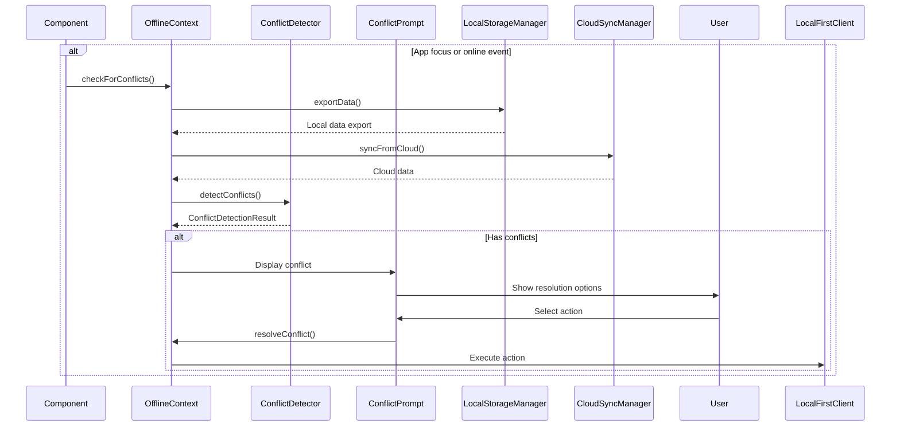

**Diagram sources**
- [ConflictDetector.ts](file://src/lib/sync/ConflictDetector.ts#L1-L491)
- [ConflictPrompt.tsx](file://src/components/ConflictPrompt.tsx#L1-L361)
- [OfflineContext.tsx](file://src/contexts/OfflineContext.tsx#L1-L427)

### Security Boundaries
The application implements several security measures to protect user data and prevent unauthorized access.

```mermaid
graph TD
A[Client Browser] --> |HTTPS| B[Convex Edge]
B --> C[Authentication Layer]
C --> D[Authorization Layer]
D --> E[Database]
subgraph "Security Layers"
C
D
end
style A fill:#ffcccc,stroke:#333
style B fill:#ccffcc,stroke:#333
style C fill:#ccccff,stroke:#333
style D fill:#ccccff,stroke:#333
style E fill:#ffffcc,stroke:#333
Note over C: Token validation
Note over D: User ownership checks
```

Each backend function verifies the user's authentication token and ensures that operations are performed only on data owned by the authenticated user. This prevents unauthorized access to other users' expenses and settings.

**Diagram sources**
- [auth.ts](file://convex/auth.ts#L1-L100)
- [expenses.ts](file://convex/expenses.ts#L1-L325)

## Scalability and Constraints
The current architecture offers several advantages in terms of scalability and development velocity, but also has some constraints that should be considered for future growth.

### Scalability Advantages
- **Automatic scaling**: Convex automatically scales the backend infrastructure based on demand, eliminating the need for manual capacity planning.
- **Global distribution**: Convex provides low-latency access to data from multiple geographic regions, improving performance for international users.
- **Real-time synchronization**: The built-in real-time capabilities ensure that data updates are propagated to all connected clients instantly.
- **Simplified deployment**: The integration between Next.js and Convex enables seamless deployment to Vercel, with automatic environment configuration.
- **Enhanced offline capabilities**: The local-first architecture provides robust offline functionality with automatic background synchronization and intelligent conflict detection.

### Architectural Constraints
- **Vendor lock-in**: The tight integration with Convex makes it difficult to migrate to a different backend provider without significant refactoring.
- **Complex conflict resolution**: While the conflict detection system is robust, complex merge scenarios may require manual intervention from users.
- **Advanced service worker caching**: The service worker implementation could be enhanced with more sophisticated caching strategies like cache invalidation and background synchronization.
- **Simple password hashing**: The authentication system uses basic password hashing, which should be upgraded to bcrypt or similar in production environments.
- **Single authentication method**: The application supports only username/password authentication, without OAuth or social login options.

### Future Enhancement Opportunities
- **Enhanced offline sync**: Implement more sophisticated conflict resolution strategies for offline edits and support for offline expense modification.
- **Advanced caching strategies**: Implement cache invalidation and background synchronization for improved performance.
- **Multi-factor authentication**: Add additional security layers to protect user accounts.
- **Data export functionality**: Allow users to export their expense data for backup or analysis.
- **Budget tracking**: Add features for setting and monitoring spending limits.
- **Cross-device synchronization**: Enhance the conflict detection system to better handle data synchronization across multiple devices.

The architectural philosophy of Expense-Tracker---Warp demonstrates a thoughtful balance between user experience, development efficiency, and technical robustness. By embracing an offline-first approach and leveraging modern backend-as-a-service technology, the application delivers a reliable and responsive experience while minimizing development complexity.