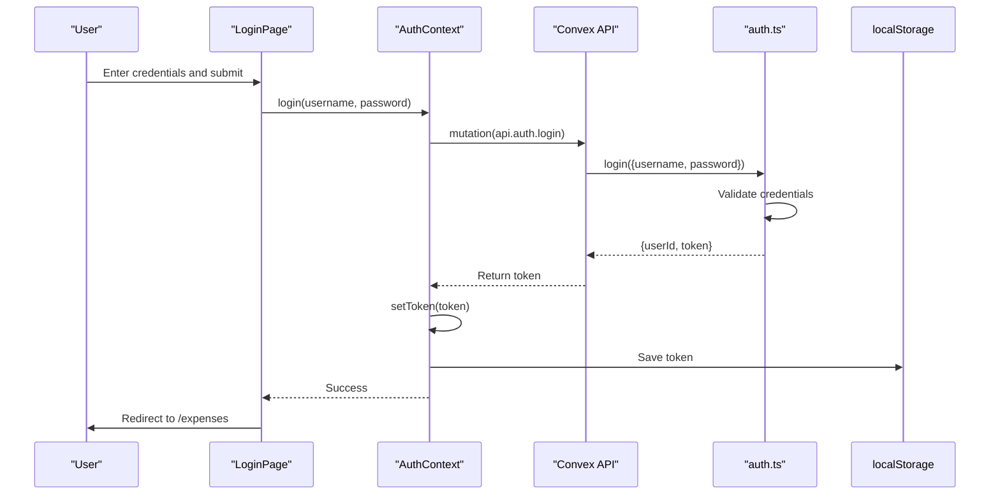
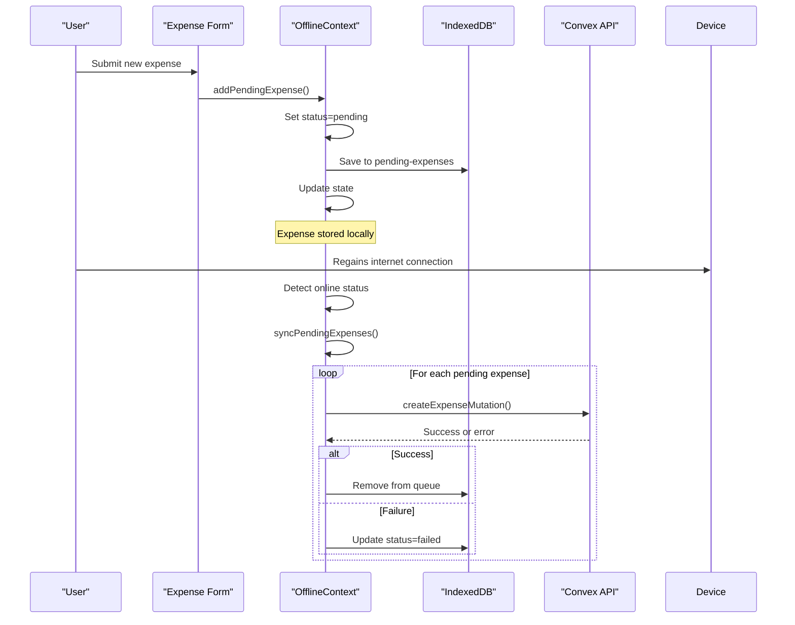
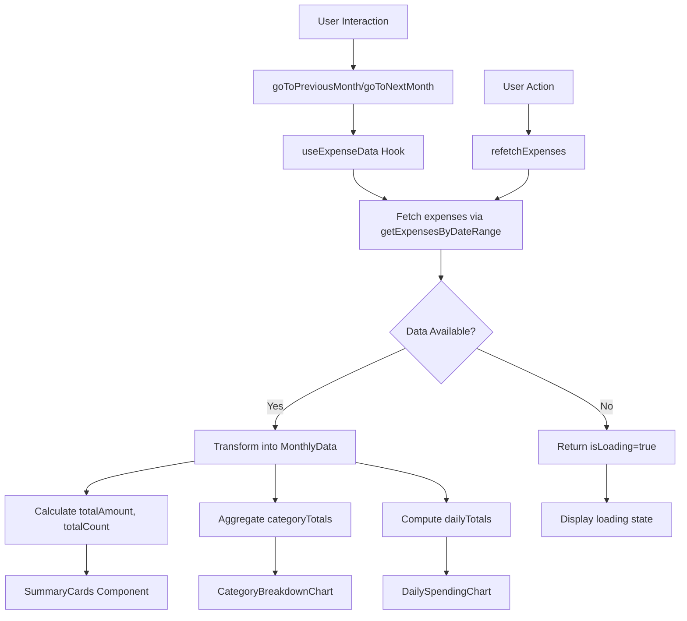
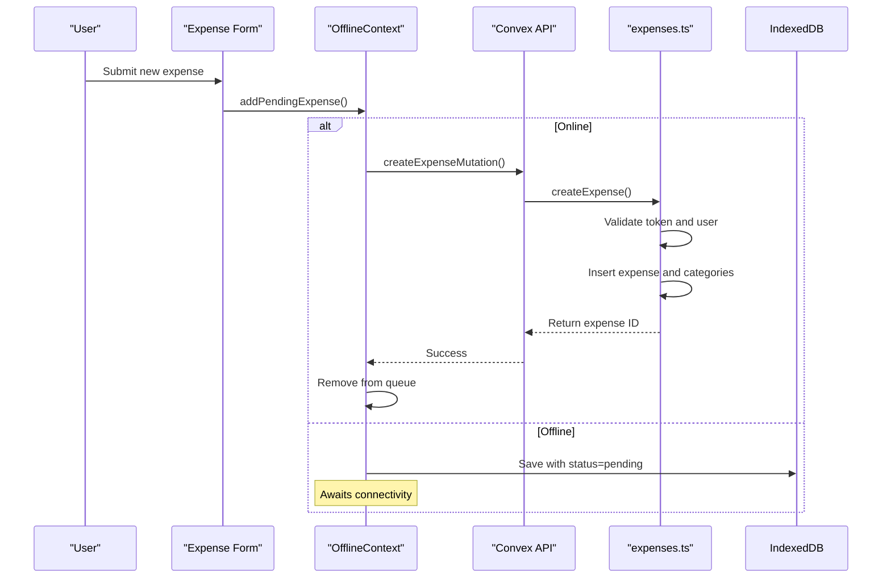
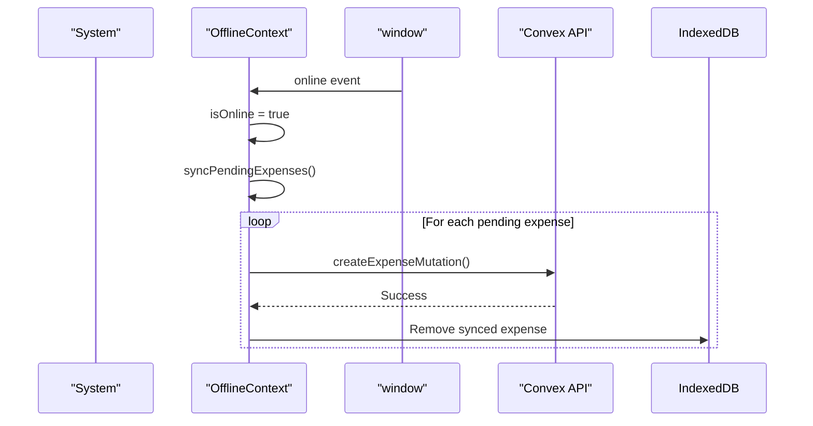

# Integration Points

<cite>
**Referenced Files in This Document**   
- [auth.ts](file://convex/auth.ts#L1-L131)
- [AuthContext.tsx](file://src/contexts/AuthContext.tsx#L1-L96)
- [expenses.ts](file://convex/expenses.ts#L1-L324)
- [useExpenseData.ts](file://src/features/dashboard/hooks/useExpenseData.ts#L1-L86)
- [OfflineContext.tsx](file://src/contexts/OfflineContext.tsx#L1-L171)
- [page.tsx](file://src/app/login/page.tsx#L1-L119)
- [api.d.ts](file://convex/_generated/api.d.ts#L1-L42)
- [CategoryBreakdownChart.tsx](file://src/features/dashboard/components/Charts/CategoryBreakdownChart.tsx#L1-L45)
</cite>

## Table of Contents
1. [Frontend-Backend Integration via Convex API](#frontend-backend-integration-via-convex-api)
2. [Authentication Flow and Token Management](#authentication-flow-and-token-management)
3. [Data Synchronization and Offline Support](#data-synchronization-and-offline-support)
4. [Dashboard Data Processing and Visualization](#dashboard-data-processing-and-visualization)
5. [Error Handling Across Application Layers](#error-handling-across-application-layers)
6. [Sequence Diagrams of Key Workflows](#sequence-diagrams-of-key-workflows)
7. [Best Practices for Adding New Integrations](#best-practices-for-adding-new-integrations)

## Frontend-Backend Integration via Convex API

The Expense-Tracker---Warp application leverages Convex as a backend-as-a-service platform, enabling seamless integration between the React frontend and server-side logic. The `api.d.ts` file in the `_generated` directory serves as the contract between frontend and backend, automatically exposing Convex functions for consumption in React components.

Convex functions defined in the `convex/` directory (e.g., `auth.ts`, `expenses.ts`) are automatically compiled and exposed through the generated `api` object. This allows React components to invoke backend functions using Convex's React hooks—`useMutation` for write operations and `useQuery` for read operations—without requiring manual API route definitions or HTTP client configuration.

For example, the login functionality uses:
```typescript
const loginMutation = useMutation(api.auth.login);
```
Here, `api.auth.login` refers to the `login` mutation defined in `convex/auth.ts`. The type safety is preserved through TypeScript definitions in `api.d.ts`, ensuring that arguments and return types are correctly inferred.

This integration pattern eliminates traditional REST boilerplate, providing a unified function-call-like interface across client and server while maintaining reactivity through Convex's real-time subscriptions.

**Section sources**
- [api.d.ts](file://convex/_generated/api.d.ts#L1-L42)
- [AuthContext.tsx](file://src/contexts/AuthContext.tsx#L1-L96)
- [expenses.ts](file://convex/expenses.ts#L1-L324)

## Authentication Flow and Token Management

The authentication system follows a token-based flow implemented across both frontend (`AuthContext.tsx`) and backend (`auth.ts`). Users authenticate via username and password, receiving a randomly generated token that is stored in `localStorage` for session persistence.

### Backend Authentication Endpoints

The backend exposes four key authentication functions:
- `register`: Creates a new user with hashed password and unique token
- `login`: Validates credentials and returns a new token
- `getCurrentUser`: Retrieves user data using the provided token
- `logout`: Invalidates the current token by regenerating it

Tokens are stored in the database under the `tokenIdentifier` field and indexed for fast lookup. Passwords are hashed using a simple deterministic algorithm (salted string hashing), though the code comments indicate this should be upgraded to bcrypt in production.

### Frontend Authentication Context

The `AuthContext` manages authentication state using React's Context API and Convex hooks:
- On mount, it checks `localStorage` for an existing `"auth-token"`
- The `login` function calls the `api.auth.login` mutation and stores the returned token
- The `getCurrentUser` query runs automatically when a token is present, keeping the user object synchronized
- The `loading` state accounts for both initialization and pending queries

The login page (`login/page.tsx`) integrates with this context by calling the `login` method from `useAuth()` upon form submission. It includes validation, loading states, and error handling with user-friendly toast notifications.



**Diagram sources**
- [auth.ts](file://convex/auth.ts#L1-L131)
- [AuthContext.tsx](file://src/contexts/AuthContext.tsx#L1-L96)
- [page.tsx](file://src/app/login/page.tsx#L1-L119)

**Section sources**
- [auth.ts](file://convex/auth.ts#L1-L131)
- [AuthContext.tsx](file://src/contexts/AuthContext.tsx#L1-L96)
- [page.tsx](file://src/app/login/page.tsx#L1-L119)

## Data Synchronization and Offline Support

The application implements a robust offline-first strategy using IndexedDB (via `localforage`) and Convex's mutation system to ensure data persistence and synchronization.

### Client-Server Data Flow

Data synchronization occurs through Convex's `useQuery` and `useMutation` hooks:
- `useQuery` establishes a real-time subscription to server data
- `useMutation` sends write operations to the backend
- Optimistic updates are handled automatically by Convex when supported

When online, all expense operations (create, update, delete) are immediately synchronized with the Convex database. The `expenses.ts` backend validates ownership and token authentication before processing any mutation.

### Offline Conflict Resolution

The `OfflineContext` provides a queue-based system for handling network failures:
- When offline, new expenses are stored in IndexedDB with status `'pending'`
- Upon reconnection, the `syncPendingExpenses` function automatically retries all pending operations
- Failed sync attempts are marked as `'failed'` and can be retried individually
- Each expense in the queue includes metadata like `id`, `status`, and full payload

This approach ensures no data loss during connectivity interruptions while providing users with visibility into sync status. The system avoids race conditions by processing the queue sequentially and updating IndexedDB after each operation.



**Diagram sources**
- [OfflineContext.tsx](file://src/contexts/OfflineContext.tsx#L1-L171)
- [expenses.ts](file://convex/expenses.ts#L1-L324)

**Section sources**
- [OfflineContext.tsx](file://src/contexts/OfflineContext.tsx#L1-L171)
- [expenses.ts](file://convex/expenses.ts#L1-L324)

## Dashboard Data Processing and Visualization

The dashboard integrates financial data through the `useExpenseData` custom hook, which orchestrates data fetching, transformation, and navigation for visualizations.

### Data Fetching Strategy

The hook uses `useQuery(api.expenses.getExpensesByDateRange)` to fetch expenses for the current month. It employs a cache-busting `key` state to force re-fetching when needed (e.g., after mutations). Date filtering leverages `date-fns` utilities to calculate month boundaries.

The backend query (`getExpensesByDateRange`) returns raw expense objects, which are then transformed into structured analytics data:
- Total amount and count calculations
- Category-wise spending aggregation
- Daily spending patterns by date key

### Visualization Components

The transformed data powers several visualization components:
- `CategoryBreakdownChart`: Renders a pie chart showing spending distribution across categories
- `DailySpendingChart`: Displays a line chart of daily expenses
- `SummaryCards`: Shows key metrics (total spent, transaction count)
- `CardBalances`: Tracks card-based spending limits

These components consume the `monthlyData` object from `useExpenseData`, ensuring consistent data representation across the dashboard. The hook also provides navigation functions (`goToPreviousMonth`, `goToNextMonth`) that update the date context and trigger refetching.



**Diagram sources**
- [useExpenseData.ts](file://src/features/dashboard/hooks/useExpenseData.ts#L1-L86)
- [CategoryBreakdownChart.tsx](file://src/features/dashboard/components/Charts/CategoryBreakdownChart.tsx#L1-L45)

**Section sources**
- [useExpenseData.ts](file://src/features/dashboard/hooks/useExpenseData.ts#L1-L86)
- [CategoryBreakdownChart.tsx](file://src/features/dashboard/components/Charts/CategoryBreakdownChart.tsx#L1-L45)

## Error Handling Across Application Layers

The application implements comprehensive error handling across frontend, backend, and network layers.

### Backend Error Strategy

Convex functions use `ConvexError` for domain-specific errors:
- Authentication failures return "Invalid username or password"
- Authorization checks prevent access to other users' data
- Validation errors catch empty fields or duplicates
- Token validation occurs in helper functions like `getUserByToken`

These errors are automatically serialized and sent to the client, preserving error messages for user display.

### Frontend Error Propagation

The frontend handles errors through:
- Try-catch blocks in async functions
- Error messages passed to toast notifications
- Loading states to prevent duplicate submissions
- Context-level error handling (e.g., AuthContext rethrows login errors)

Network failures are detected via the `OfflineContext`, which automatically queues operations during offline periods. The system distinguishes between:
- Permanent errors (invalid credentials): shown immediately
- Transient errors (network issues): handled via offline queue
- Sync failures: allow manual retry through `retryFailedExpense`

### Resilience Patterns

Key resilience patterns include:
- **Graceful degradation**: UI remains functional offline
- **Automatic recovery**: Background sync when connectivity resumes
- **User feedback**: Clear status indicators for pending/synced operations
- **Data consistency**: Token-based authentication ensures data isolation

**Section sources**
- [auth.ts](file://convex/auth.ts#L1-L131)
- [AuthContext.tsx](file://src/contexts/AuthContext.tsx#L1-L96)
- [OfflineContext.tsx](file://src/contexts/OfflineContext.tsx#L1-L171)

## Sequence Diagrams of Key Workflows

### Expense Creation Workflow



**Diagram sources**
- [expenses.ts](file://convex/expenses.ts#L1-L324)
- [OfflineContext.tsx](file://src/contexts/OfflineContext.tsx#L1-L171)

### Background Sync Process



**Diagram sources**
- [OfflineContext.tsx](file://src/contexts/OfflineContext.tsx#L1-L171)

## Best Practices for Adding New Integrations

When extending the application with new Convex integrations, follow these patterns:

### Creating New Convex Functions

1. **Define in appropriate module**: Place functions in relevant `.ts` files (e.g., new expense logic in `expenses.ts`)
2. **Use proper types**: Leverage `v.string()`, `v.number()`, etc., for input validation
3. **Implement authentication**: Use `getUserByToken` helper for token validation
4. **Handle errors appropriately**: Use `ConvexError` for user-facing messages

Example:
```typescript
export const newFunction = query({
  args: { token: v.string(), param: v.string() },
  handler: async (ctx, args) => {
    const user = await getUserByToken(ctx, args.token);
    // Business logic here
  }
});
```

### Exposing Through Context Providers

1. **Create or extend context**: Add new functions to existing contexts (e.g., `AuthContext`) or create feature-specific contexts
2. **Use Convex hooks**: Utilize `useMutation`/`useQuery` within context providers
3. **Manage loading states**: Include relevant loading indicators
4. **Handle errors gracefully**: Implement error boundaries or fallback UI

### Consuming in Components

1. **Use generated API**: Access functions via `api.module.functionName`
2. **Implement optimistic updates**: Where appropriate, update UI before server confirmation
3. **Handle loading states**: Disable controls during mutations
4. **Provide user feedback**: Use toast notifications for success/error states

These practices ensure consistency, type safety, and maintainability across the frontend-backend integration points.

**Section sources**
- [auth.ts](file://convex/auth.ts#L1-L131)
- [AuthContext.tsx](file://src/contexts/AuthContext.tsx#L1-L96)
- [expenses.ts](file://convex/expenses.ts#L1-L324)
- [OfflineContext.tsx](file://src/contexts/OfflineContext.tsx#L1-L171)