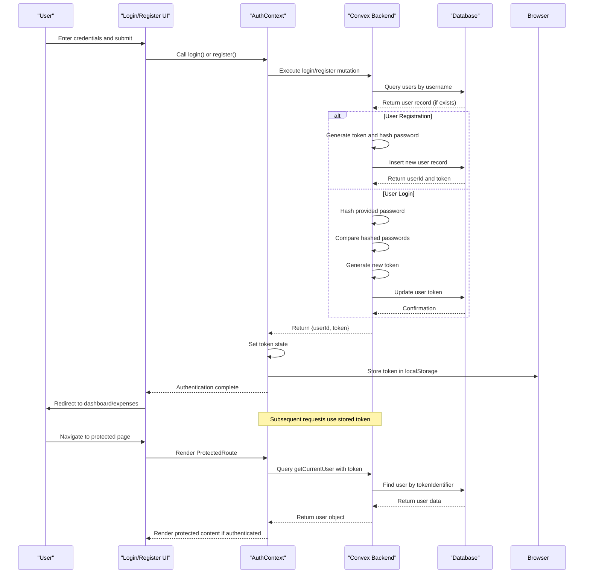

# Authentication System

<cite>
**Referenced Files in This Document**   
- [auth.ts](file://convex/auth.ts)
- [schema.ts](file://convex/schema.ts)
- [AuthContext.tsx](file://src/contexts/AuthContext.tsx)
- [ProtectedRoute.tsx](file://src/components/ProtectedRoute.tsx)
- [login/page.tsx](file://src/app/login/page.tsx)
- [register/page.tsx](file://src/app/register/page.tsx)
- [dashboard/page.tsx](file://src/app/dashboard/page.tsx)
- [expenses/page.tsx](file://src/app/expenses/page.tsx)
</cite>

## Table of Contents
1. [Authentication System Overview](#authentication-system-overview)
2. [User Registration Flow](#user-registration-flow)
3. [Login and Session Management](#login-and-session-management)
4. [User Data Model and Schema](#user-data-model-and-schema)
5. [Client-Side Authentication Context](#client-side-authentication-context)
6. [Protected Route Implementation](#protected-route-implementation)
7. [Frontend Authentication Pages](#frontend-authentication-pages)
8. [Security Practices and Error Handling](#security-practices-and-error-handling)
9. [Authentication Sequence Diagram](#authentication-sequence-diagram)

## Authentication System Overview

The Expense-Tracker---Warp application implements a secure authentication system using Convex's backend capabilities with email/password strategy (represented via username in this implementation). The system handles user registration, login, session persistence, and protected route access through a combination of server-side mutations and client-side context management.

The authentication flow is structured around token-based session management, where a randomly generated token identifier is stored both in the database and in the client's localStorage. This token is used to authenticate subsequent requests and maintain user sessions across application restarts.

Key components of the authentication system include:
- Server-side authentication logic in `auth.ts`
- User data model defined in `schema.ts`
- Client-side state management via `AuthContext.tsx`
- Route protection using `ProtectedRoute.tsx`
- User interface components in login and register pages

This document provides a comprehensive analysis of each component and their interactions.

**Section sources**
- [auth.ts](file://convex/auth.ts#L0-L131)
- [schema.ts](file://convex/schema.ts#L0-L61)
- [AuthContext.tsx](file://src/contexts/AuthContext.tsx#L0-L96)

## User Registration Flow

The user registration process begins with the client-side registration form and concludes with user creation in the Convex database. The flow involves validation, password hashing, and token generation to ensure secure account creation.

### Server-Side Registration Implementation

The registration process is handled by the `register` mutation in `auth.ts`, which performs the following steps:

1. Checks if a user with the provided username already exists
2. Hashes the password using a salted algorithm
3. Generates a unique token identifier
4. Creates a new user record in the database

```typescript
export const register = mutation({
  args: {
    username: v.string(),
    password: v.string(),
  },
  handler: async (ctx, args) => {
    // Check if user already exists
    const existingUser = await ctx.db
      .query("users")
      .withIndex("by_username", (q) => q.eq("username", args.username))
      .first();

    if (existingUser) {
      throw new ConvexError("Username already exists");
    }

    // Create new user
    const hashedPassword = hashPassword(args.password);
    const tokenIdentifier = generateToken();

    const userId = await ctx.db.insert("users", {
      username: args.username,
      hashedPassword,
      tokenIdentifier,
    });

    return { userId, token: tokenIdentifier };
  },
});
```

The system uses a simple hashing function for demonstration purposes, which adds a salt and applies a basic hash algorithm. In production environments, bcrypt or similar industry-standard libraries should be used.

### Client-Side Registration Handling

The registration form in `register/page.tsx` implements client-side validation before submitting to the server:

- Validates that all fields are filled
- Ensures password and confirmation match
- Enforces minimum password length (6 characters)
- Provides user feedback through toast notifications

```typescript
const handleSubmit = async (e: React.FormEvent) => {
  e.preventDefault();
  
  if (!username.trim() || !password.trim() || !confirmPassword.trim()) {
    toast.error("Please fill in all fields");
    return;
  }

  if (password !== confirmPassword) {
    toast.error("Passwords do not match");
    return;
  }

  if (password.length < 6) {
    toast.error("Password must be at least 6 characters");
    return;
  }

  setIsLoading(true);
  try {
    await register(username.trim(), password);
    toast.success("Account created successfully!");
    router.push("/expenses");
  } catch (error: unknown) {
    const message = error instanceof Error ? error.message : "Failed to create account";
    toast.error(message);
  } finally {
    setIsLoading(false);
  }
};
```

Upon successful registration, the user is automatically logged in, the authentication token is stored in localStorage, and they are redirected to the expenses page.

**Section sources**
- [auth.ts](file://convex/auth.ts#L45-L75)
- [register/page.tsx](file://src/app/register/page.tsx#L45-L120)

## Login and Session Management

The login system provides secure user authentication with proper error handling and session persistence. It follows a token-based approach where successful authentication returns a token that is used for subsequent requests.

### Server-Side Login Implementation

The login process is handled by the `login` mutation in `auth.ts`:

```typescript
export const login = mutation({
  args: {
    username: v.string(),
    password: v.string(),
  },
  handler: async (ctx, args) => {
    const user = await ctx.db
      .query("users")
      .withIndex("by_username", (q) => q.eq("username", args.username))
      .first();

    if (!user) {
      throw new ConvexError("Invalid username or password");
    }

    const hashedPassword = hashPassword(args.password);
    if (user.hashedPassword !== hashedPassword) {
      throw new ConvexError("Invalid username or password");
    }

    // Generate new token
    const tokenIdentifier = generateToken();
    await ctx.db.patch(user._id, { tokenIdentifier });

    return { userId: user._id, token: tokenIdentifier };
  },
});
```

Key aspects of the login implementation:
- Queries the database for a user by username
- Verifies the provided password by comparing hashed values
- Generates a new token identifier on each successful login (rotating tokens for security)
- Updates the user record with the new token
- Returns the user ID and token to the client

### Token-Based Session Management

The system uses token-based session management where:
- Each user has a `tokenIdentifier` field in their database record
- This token is generated using `Math.random().toString(36)` for sufficient entropy
- The token is returned to the client upon successful authentication
- The client stores this token in localStorage for persistence
- The token is sent with subsequent requests to verify identity

The `getCurrentUser` query verifies the token and returns user information:

```typescript
export const getCurrentUser = query({
  args: {
    token: v.string(),
  },
  handler: async (ctx, args) => {
    const user = await ctx.db
      .query("users")
      .withIndex("by_token", (q) => q.eq("tokenIdentifier", args.token))
      .first();

    if (!user) {
      return null;
    }

    return {
      _id: user._id,
      username: user.username,
    };
  },
});
```

### Logout Implementation

The logout functionality invalidates the current session by generating a new token for the user, effectively logging them out from all devices:

```typescript
export const logout = mutation({
  args: {
    token: v.string(),
  },
  handler: async (ctx, args) => {
    const user = await ctx.db
      .query("users")
      .withIndex("by_token", (q) => q.eq("tokenIdentifier", args.token))
      .first();

    if (user) {
      // Invalidate token
      await ctx.db.patch(user._id, { tokenIdentifier: generateToken() });
    }

    return { success: true };
  },
});
```

This approach ensures that the old token becomes invalid and cannot be used for future authentication attempts.

**Section sources**
- [auth.ts](file://convex/auth.ts#L77-L131)
- [AuthContext.tsx](file://src/contexts/AuthContext.tsx#L30-L65)

## User Data Model and Schema

The user data model is defined in `schema.ts` and represents the structure of user records in the Convex database. The schema includes essential fields for authentication and user management.

### User Schema Definition

```typescript
users: defineTable({
  username: v.string(),
  hashedPassword: v.string(),
  tokenIdentifier: v.string(),
  hasSeenOnboarding: v.optional(v.boolean()),
}).index("by_username", ["username"]).index("by_token", ["tokenIdentifier"]),
```

The user table includes the following fields:
- **username**: Unique identifier for the user (string)
- **hashedPassword**: Password stored in hashed format (string)
- **tokenIdentifier**: Current active session token (string)
- **hasSeenOnboarding**: Optional boolean flag for onboarding state

### Database Indexes

The schema defines two critical indexes for efficient querying:
- `by_username`: Index on the username field for fast user lookup during login
- `by_token`: Index on the tokenIdentifier field for session validation

These indexes ensure that authentication operations remain performant even as the user base grows. The `by_username` index enables O(log n) lookup time when authenticating users, while the `by_token` index allows for efficient session validation when retrieving the current user.

The schema also establishes relationships with other tables through foreign keys (e.g., `userId: v.id("users")` in expenses, categories, and other tables), ensuring data integrity across the application.

**Section sources**
- [schema.ts](file://convex/schema.ts#L3-L10)

## Client-Side Authentication Context

The `AuthContext.tsx` file implements a React Context for managing authentication state across the application. This context provides a centralized way to access user information and authentication functions from any component.

### AuthContext Implementation

```typescript
const AuthContext = createContext<AuthContextType | undefined>(undefined);

export function AuthProvider({ children }: { children: ReactNode }) {
  const [token, setToken] = useState<string | null>(null);
  const [loading, setLoading] = useState(true);

  const loginMutation = useMutation(api.auth.login);
  const registerMutation = useMutation(api.auth.register);
  const logoutMutation = useMutation(api.auth.logout);

  const user = useQuery(api.auth.getCurrentUser, token ? { token } : "skip");
```

The context maintains the following state:
- **token**: The current authentication token (null when logged out)
- **user**: The current user object (fetched from the server)
- **loading**: Loading state during initialization
- **login, register, logout**: Functions to perform authentication operations

### Context Initialization

On component mount, the context checks localStorage for a saved authentication token:

```typescript
useEffect(() => {
  // Load token from localStorage on mount
  const savedToken = localStorage.getItem("auth-token");
  if (savedToken) {
    setToken(savedToken);
  }
  setLoading(false);
}, []);
```

This ensures that users remain logged in between sessions. If a token exists in localStorage, it is set in the context state, triggering the `getCurrentUser` query to validate the session.

### Authentication Functions

The context provides three main functions for authentication operations:

**Login Function**
```typescript
const login = async (username: string, password: string) => {
  try {
    const result = await loginMutation({ username, password });
    setToken(result.token);
    localStorage.setItem("auth-token", result.token);
  } catch (error) {
    throw error;
  }
};
```

**Register Function**
```typescript
const register = async (username: string, password: string) => {
  try {
    const result = await registerMutation({ username, password });
    setToken(result.token);
    localStorage.setItem("auth-token", result.token);
  } catch (error) {
    throw error;
  }
};
```

**Logout Function**
```typescript
const logout = async () => {
  if (token) {
    try {
      await logoutMutation({ token });
    } catch (error) {
      console.error("Logout error:", error);
    }
  }
  setToken(null);
  localStorage.removeItem("auth-token");
};
```

All authentication functions follow the same pattern: call the Convex mutation, update the local token state, and persist the token to localStorage (for login/register) or remove it (for logout).

The context also handles loading states appropriately, including when the token is present but the user data is still being fetched from the server.

**Section sources**
- [AuthContext.tsx](file://src/contexts/AuthContext.tsx#L0-L96)

## Protected Route Implementation

The `ProtectedRoute.tsx` component implements route protection to ensure that only authenticated users can access certain pages like `/dashboard` and `/expenses`.

### ProtectedRoute Component

```typescript
export function ProtectedRoute({ children }: ProtectedRouteProps) {
  const { user, loading } = useAuth();
  const router = useRouter();

  useEffect(() => {
    if (!loading && !user) {
      router.replace("/login");
    }
  }, [user, loading, router]);

  if (loading) {
    return (
      <div className="min-h-screen flex items-center justify-center">
        <div className="text-lg">Loading...</div>
      </div>
    );
  }

  if (!user) {
    return null;
  }

  return <>{children}</>;
}
```

### Protection Logic

The component follows a three-stage process:

1. **Loading State**: When the authentication state is being initialized, it displays a loading indicator
2. **Authentication Check**: After loading, it verifies if a user is authenticated
3. **Redirection**: If no user is authenticated, it redirects to the login page

The `useEffect` hook monitors changes in the authentication state and automatically redirects unauthenticated users to the login page. This ensures that users cannot access protected content by manually navigating to the URL.

### Usage in Protected Pages

Protected pages like dashboard and expenses wrap their content with the `ProtectedRoute` component:

```typescript
// In dashboard/page.tsx
import { ProtectedRoute } from "@/components/ProtectedRoute";

export default function DashboardPage() {
  const { token } = useAuth();
  const router = useRouter();

  return (
    <ProtectedRoute>
      {/* Protected content */}
    </ProtectedRoute>
  );
}
```

This pattern ensures consistent protection across all authenticated routes in the application.

**Section sources**
- [ProtectedRoute.tsx](file://src/components/ProtectedRoute.tsx#L0-L34)
- [dashboard/page.tsx](file://src/app/dashboard/page.tsx#L0-L126)

## Frontend Authentication Pages

The application provides dedicated pages for user authentication, including login and registration interfaces with form validation and user feedback.

### Login Page Implementation

The login page (`login/page.tsx`) provides a clean interface for existing users to authenticate:

```typescript
export default function LoginPage() {
  const [username, setUsername] = useState("");
  const [password, setPassword] = useState("");
  const [isLoading, setIsLoading] = useState(false);
  const { login, user } = useAuth();
  const router = useRouter();

  useEffect(() => {
    if (user) {
      router.replace("/expenses");
    }
  }, [user, router]);

  const handleSubmit = async (e: React.FormEvent) => {
    e.preventDefault();
    
    if (!username.trim() || !password.trim()) {
      toast.error("Please fill in all fields");
      return;
    }

    setIsLoading(true);
    try {
      await login(username.trim(), password);
      toast.success("Welcome back!");
      router.push("/expenses");
    } catch (error: unknown) {
      const message = error instanceof Error ? error.message : "Failed to login";
      toast.error(message);
    } finally {
      setIsLoading(false);
    }
  };
```

Key features of the login page:
- Redirects authenticated users to the expenses page
- Validates that both username and password are provided
- Displays loading state during authentication
- Provides success/error feedback using toast notifications
- Handles errors gracefully with user-friendly messages

### Registration Page Implementation

The registration page (`register/page.tsx`) includes additional validation to ensure data quality:

```typescript
const handleSubmit = async (e: React.FormEvent) => {
  e.preventDefault();
  
  if (!username.trim() || !password.trim() || !confirmPassword.trim()) {
    toast.error("Please fill in all fields");
    return;
  }

  if (password !== confirmPassword) {
    toast.error("Passwords do not match");
    return;
  }

  if (password.length < 6) {
    toast.error("Password must be at least 6 characters");
    return;
  }

  setIsLoading(true);
  try {
    await register(username.trim(), password);
    toast.success("Account created successfully!");
    router.push("/expenses");
  } catch (error: unknown) {
    const message = error instanceof Error ? error.message : "Failed to create account";
    toast.error(message);
  } finally {
    setIsLoading(false);
  }
};
```

Validation rules include:
- All fields must be filled
- Password and confirmation must match
- Password must be at least 6 characters long

Both pages use consistent UI patterns with:
- Responsive form layouts
- Accessibility features (proper labels, ARIA attributes)
- Visual feedback (loading states, button states)
- Smooth transitions (using Framer Motion)
- Toast notifications for user feedback

**Section sources**
- [login/page.tsx](file://src/app/login/page.tsx#L0-L119)
- [register/page.tsx](file://src/app/register/page.tsx#L0-L146)

## Security Practices and Error Handling

The authentication system implements several security practices and robust error handling to protect user data and provide a good user experience.

### Security Practices

**Password Hashing**
The system implements password hashing using a custom function with salting:

```typescript
function hashPassword(password: string): string {
  let hash = 0;
  const saltedPassword = password + "expense-tracker-salt";
  // ... hash algorithm
  return hash.toString(36);
}
```

While this provides basic protection, the code includes a comment acknowledging that production systems should use bcrypt or similar libraries for stronger security.

**Token Management**
- Tokens are randomly generated with sufficient entropy
- Tokens are rotated on each login (old tokens become invalid)
- Tokens are stored securely in localStorage
- The `by_token` database index enables efficient token validation

**Input Validation**
- Server-side validation using Convex's type system (`v.string()`)
- Client-side form validation for better user experience
- Trimming of username input to prevent whitespace issues

### Error Handling

The system implements comprehensive error handling at multiple levels:

**Server-Side Errors**
- `ConvexError` is used to return user-friendly error messages
- Invalid credentials return the same error message to prevent username enumeration
- Username uniqueness is enforced at the database level

**Client-Side Error Handling**
- Try-catch blocks around authentication operations
- User-friendly error messages via toast notifications
- Loading state management to prevent multiple submissions
- Form validation to catch errors before server submission

**Common Issues and Solutions**

**Session Expiration**
When a token becomes invalid (e.g., after logout from another device), the `getCurrentUser` query returns null, which triggers the ProtectedRoute to redirect to the login page.

**Login Failures**
The system handles login failures gracefully:
- Invalid credentials show a generic "Invalid username or password" message
- Network errors are caught and displayed appropriately
- The form remains accessible for retry

**Security Recommendations**
For production deployment, the following improvements are recommended:
- Replace the custom password hashing with bcrypt
- Implement rate limiting on authentication endpoints
- Add support for refresh tokens
- Implement multi-factor authentication
- Use HTTP-only cookies for token storage (instead of localStorage)
- Add CSRF protection
- Implement password strength requirements

**Section sources**
- [auth.ts](file://convex/auth.ts#L0-L131)
- [login/page.tsx](file://src/app/login/page.tsx#L45-L119)
- [register/page.tsx](file://src/app/register/page.tsx#L45-L146)

## Authentication Sequence Diagram

The following sequence diagram illustrates the complete authentication flow from user interaction to backend processing and client-side state management.



**Diagram sources**
- [auth.ts](file://convex/auth.ts#L45-L131)
- [AuthContext.tsx](file://src/contexts/AuthContext.tsx#L0-L96)
- [ProtectedRoute.tsx](file://src/components/ProtectedRoute.tsx#L0-L34)

**Section sources**
- [auth.ts](file://convex/auth.ts#L45-L131)
- [AuthContext.tsx](file://src/contexts/AuthContext.tsx#L0-L96)
- [ProtectedRoute.tsx](file://src/components/ProtectedRoute.tsx#L0-L34)