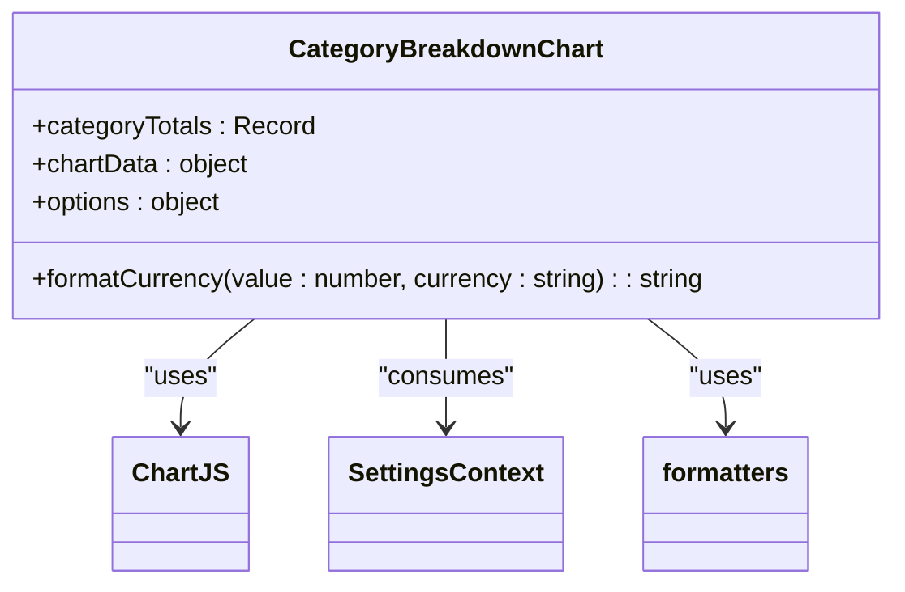

# Dashboard & Analytics

<cite>
**Referenced Files in This Document**   
- [DashboardPage.tsx](file://src/app/dashboard/page.tsx)
- [useDashboardData.ts](file://src/features/dashboard/hooks/useDashboardData.ts)
- [SummaryCards.tsx](file://src/features/dashboard/components/SummaryCards/SummaryCards.tsx)
- [CategoryBreakdownChart.tsx](file://src/features/dashboard/components/Charts/CategoryBreakdownChart.tsx)
- [DailySpendingChart.tsx](file://src/features/dashboard/components/Charts/DailySpendingChart.tsx)
- [TotalBalanceCard.tsx](file://src/features/dashboard/components/TotalBalanceCard/TotalBalanceCard.tsx)
- [expense.ts](file://src/features/dashboard/types/expense.ts)
- [expenses.ts](file://convex/expenses.ts)
- [cardsAndIncome.ts](file://convex/cardsAndIncome.ts)
- [OfflineContext.tsx](file://src/contexts/OfflineContext.tsx)
</cite>

## Update Summary
**Changes Made**   
- Updated SummaryCards component documentation to reflect new props and structure
- Corrected hook name from useExpenseData to useDashboardData based on actual implementation
- Added TotalBalanceCard component to referenced files and documentation
- Updated data flow description to include income data fetching
- Removed references to non-existent components (HeaderSection, CardBalances)
- Added documentation for card filtering functionality
- Updated project structure diagram to reflect actual file organization

## Table of Contents
1. [Introduction](#introduction)
2. [Project Structure](#project-structure)
3. [Core Components](#core-components)
4. [Architecture Overview](#architecture-overview)
5. [Detailed Component Analysis](#detailed-component-analysis)
6. [Data Flow and Processing](#data-flow-and-processing)
7. [Performance Considerations](#performance-considerations)
8. [Offline Functionality and Synchronization](#offline-functionality-and-synchronization)
9. [Edge Cases and UI States](#edge-cases-and-ui-states)
10. [Conclusion](#conclusion)

## Introduction
The Dashboard & Analytics feature serves as the central hub for financial insights in the expense tracking application. It provides users with a comprehensive overview of their spending patterns, income, and financial balances through interactive visualizations and summary metrics. Built using a modular component architecture under `src/features/dashboard`, the dashboard leverages Convex for real-time data fetching and synchronization, while implementing performance optimizations through React's memoization techniques. This document provides a detailed analysis of the dashboard's architecture, component structure, data flow, and key functionality.

## Project Structure
The dashboard feature is organized in a modular structure within the `src/features/dashboard` directory, separating components, hooks, and types into distinct subdirectories. This organization promotes reusability and maintainability across the application.


**Diagram sources**
- [project_structure](file://src/features/dashboard)

**Section sources**
- [project_structure](file://src/features/dashboard)

## Core Components
The dashboard is composed of several key components that work together to provide a cohesive financial overview. These components are organized under the `src/features/dashboard/components` directory and are imported into the main dashboard page.

**Section sources**
- [DashboardPage.tsx](file://src/app/dashboard/page.tsx)

## Architecture Overview
The dashboard follows a client-server architecture with React components on the frontend and Convex functions handling backend operations. Data flows from the Convex database through custom hooks to presentation components, with proper state management for loading, error, and empty states.


**Diagram sources**
- [DashboardPage.tsx](file://src/app/dashboard/page.tsx)
- [useDashboardData.ts](file://src/features/dashboard/hooks/useDashboardData.ts)
- [expenses.ts](file://convex/expenses.ts)
- [cardsAndIncome.ts](file://convex/cardsAndIncome.ts)
- [OfflineContext.tsx](file://src/contexts/OfflineContext.tsx)

## Detailed Component Analysis

### Dashboard Page Structure
The main dashboard page orchestrates all components and manages the overall layout and data flow.


**Diagram sources**
- [DashboardPage.tsx](file://src/app/dashboard/page.tsx)

**Section sources**
- [DashboardPage.tsx](file://src/app/dashboard/page.tsx)

### SummaryCards Component
The SummaryCards component displays key financial metrics including total income and total expenses for the selected month.


**Section sources**
- [SummaryCards.tsx](file://src/features/dashboard/components/SummaryCards/SummaryCards.tsx)

### Chart Components
The dashboard includes two primary chart components for visualizing spending patterns: CategoryBreakdownChart and DailySpendingChart.

#### Category Breakdown Chart


**Diagram sources**
- [CategoryBreakdownChart.tsx](file://src/features/dashboard/components/Charts/CategoryBreakdownChart.tsx)

#### Daily Spending Chart


**Diagram sources**
- [DailySpendingChart.tsx](file://src/features/dashboard/components/Charts/DailySpendingChart.tsx)

### TotalBalanceCard Component
The TotalBalanceCard component displays the user's total balance across all cards and provides navigation to the cards management page.


**Section sources**
- [TotalBalanceCard.tsx](file://src/features/dashboard/components/TotalBalanceCard/TotalBalanceCard.tsx)

### CardFilter Component
The CardFilter component allows users to filter dashboard data by specific card.


**Section sources**
- [CardFilter.tsx](file://src/components/DateFilterHeader.tsx)

## Data Flow and Processing

### Data Fetching Sequence
The dashboard follows a clear sequence for fetching and processing expense and income data, starting from the Convex backend and ending with rendered visualizations.


**Diagram sources**
- [DashboardPage.tsx](file://src/app/dashboard/page.tsx)
- [useDashboardData.ts](file://src/features/dashboard/hooks/useDashboardData.ts)
- [expenses.ts](file://convex/expenses.ts)
- [cardsAndIncome.ts](file://convex/cardsAndIncome.ts)

### Data Transformation Logic
The `useDashboardData` hook transforms raw expense and income data into structured summaries for display in charts and cards.


**Diagram sources**
- [useDashboardData.ts](file://src/features/dashboard/hooks/useDashboardData.ts)

**Section sources**
- [useDashboardData.ts](file://src/features/dashboard/hooks/useDashboardData.ts)

## Performance Considerations
The dashboard implements several performance optimizations to ensure efficient rendering and data processing.

### Memoization Implementation
The `useMemo` hook is used to prevent unnecessary recalculations of expensive operations when the component re-renders.

```mermaid
classDiagram
class useDashboardData {
+monthlyData : MonthlyData | null
+refetchExpenses : () => void
}
useDashboardData --> useMemo : "wraps monthlyData calculation"
useDashboardData --> useCallback : "wraps refetchExpenses"
note right of useDashboardData
monthlyData is memoized based on [expenses, income]
refetchExpenses is memoized with empty dependency array
end
```

**Section sources**
- [useDashboardData.ts](file://src/features/dashboard/hooks/useDashboardData.ts)

### Efficient Re-renders
The dashboard minimizes re-renders through proper state management and dependency tracking.

```typescript
// In useDashboardData.ts
const monthlyData = useMemo<MonthlyData | null>(() => {
  // Expensive data processing operations
  // Only recalculated when expenses or income change
}, [expenses, income]);

const refetchExpenses = useCallback(() => {
  setKey((prevKey) => prevKey + 1); // Force re-query by changing key
}, []);
```

The `refetchExpenses` function is wrapped in `useCallback` to maintain referential equality between renders, preventing unnecessary re-renders of child components that depend on this function. The `monthlyData` calculation is wrapped in `useMemo` to avoid recalculating the category and daily totals whenever the component re-renders due to other state changes.

## Offline Functionality and Synchronization
The application implements robust offline functionality, allowing users to continue adding expenses even without network connectivity.

### Offline Data Flow


**Diagram sources**
- [OfflineContext.tsx](file://src/contexts/OfflineContext.tsx)

### Offline Context Implementation
The `OfflineContext` manages the offline state and pending expenses queue using IndexedDB via localforage.

```mermaid
classDiagram
class OfflineContext {
+isOnline : boolean
+pendingExpenses : PendingExpense[]
+addPendingExpense(expense : Omit<PendingExpense, 'id' | 'status'>) : Promise<void>
+syncPendingExpenses() : Promise<void>
+retryFailedExpense(expenseId : string) : Promise<void>
}
OfflineContext --> localforage : "persists data"
OfflineContext --> window.online/offline : "listens to events"
OfflineContext --> createExpenseMutation : "syncs when online"
note right of OfflineContext
Uses IndexedDB to persist pending expenses
Automatically attempts sync when online
Manual retry available for failed expenses
end
```

**Section sources**
- [OfflineContext.tsx](file://src/contexts/OfflineContext.tsx)

When the dashboard reflects offline changes once synced, the `refetchExpenses` function in `useDashboardData` is automatically triggered through Convex's real-time subscriptions, ensuring the dashboard displays the latest data including the newly synced expenses.

## Edge Cases and UI States
The dashboard handles various edge cases and UI states to provide a robust user experience.

### Empty States
The dashboard displays appropriate messages when no data is available:


**Section sources**
- [DashboardPage.tsx](file://src/app/dashboard/page.tsx)

### Loading States
The dashboard implements loading states at multiple levels:

- **Global loading**: When authentication state is being determined
- **Data loading**: When expense and income data is being fetched from Convex
- **Component loading**: Individual components show loading states when waiting for data

```typescript
// In SummaryCards.tsx
if (isLoading) {
  return (
    <div className="grid grid-cols-2 gap-4">
      <div className="bg-gray-100 p-4 rounded-xl animate-pulse h-[90px]" />
      <div className="bg-gray-100 p-4 rounded-xl animate-pulse h-[90px]" />
    </div>
  );
}
```

### Error Handling
While not explicitly shown in the provided code, the application likely handles errors through Convex's error handling mechanisms and React's error boundaries. The offline context also includes error handling for failed sync attempts, logging errors to the console and updating the expense status to 'failed'.

## Conclusion
The Dashboard & Analytics feature provides a comprehensive financial overview through a well-structured, modular architecture. By leveraging Convex for real-time data access and implementing performance optimizations through React's memoization hooks, the dashboard delivers a responsive user experience. The component-based design promotes reusability and maintainability, while the offline-first approach ensures users can continue managing their finances even without network connectivity. Key strengths include the efficient data processing in `useDashboardData`, the clear separation of concerns between components, and the robust handling of edge cases and loading states. Future enhancements could include more sophisticated analytics, customizable date ranges, and enhanced offline conflict resolution.