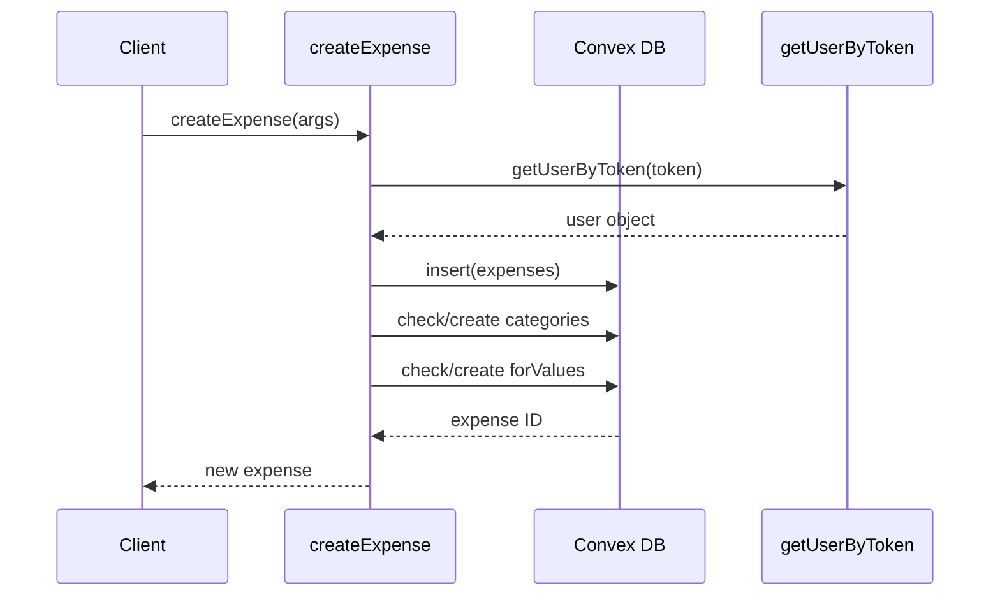
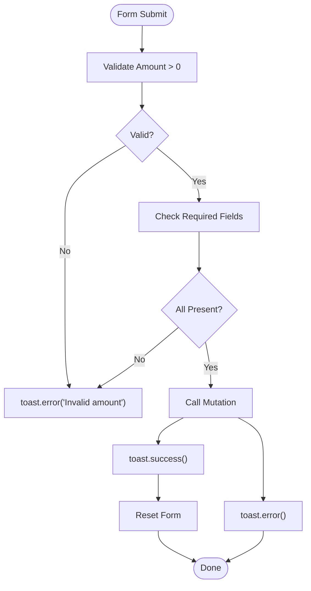
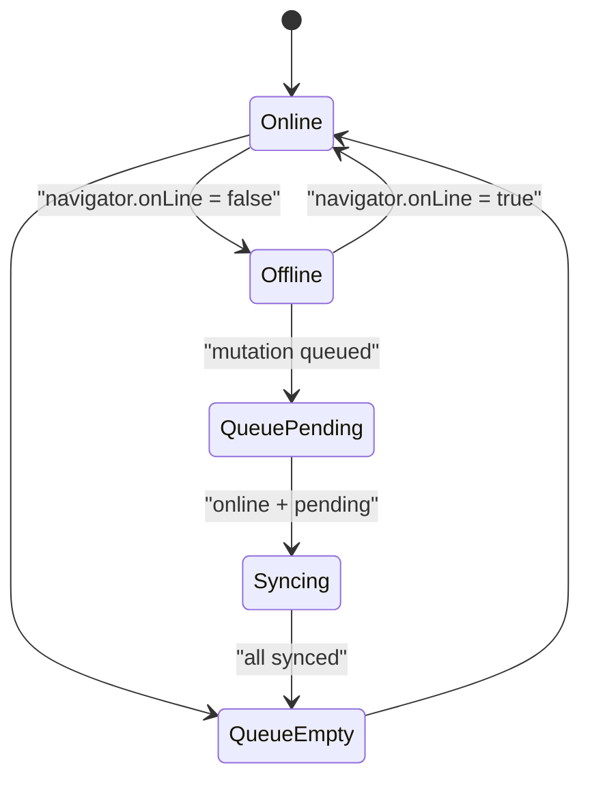

# Expense Management

<cite>
**Referenced Files in This Document**   
- [expenses.ts](file://convex/expenses.ts#L1-L324)
- [schema.ts](file://convex/schema.ts#L1-L62)
- [page.tsx](file://src/app/expenses/page.tsx#L1-L352)
- [edit/[id]/page.tsx](file://src/app/expenses/edit/[id]/page.tsx#L1-L395)
- [ExpenseCard.tsx](file://src/components/cards/ExpenseCard.tsx)
- [ExpenseList.tsx](file://src/features/dashboard/components/Expenses/ExpenseList.tsx)
- [SmartSelectInput.tsx](file://src/components/SmartSelectInput.tsx)
- [CustomDatePicker.tsx](file://src/components/CustomDatePicker.tsx)
- [useExpenseData.ts](file://src/features/dashboard/hooks/useExpenseData.ts)
- [useExpenseActions.ts](file://src/features/dashboard/hooks/useExpenseActions.ts)
- [OfflineContext.tsx](file://src/contexts/OfflineContext.tsx)
- [expense.ts](file://src/features/dashboard/types/expense.ts#L1-L21)
</cite>

## Table of Contents
1. [Introduction](#introduction)
2. [Data Model](#data-model)
3. [Backend CRUD Operations](#backend-crud-operations)
4. [UI Flow and Components](#ui-flow-and-components)
5. [Form Handling and Validation](#form-handling-and-validation)
6. [State Management and Hooks](#state-management-and-hooks)
7. [Offline Behavior and Syncing](#offline-behavior-and-syncing)
8. [API Payload Examples](#api-payload-examples)

## Introduction
The Expense Management feature enables users to track, manage, and analyze their financial expenses. Built on a Convex backend with a Next.js frontend, the system supports full CRUD operations for expenses, including creation, retrieval, updating, and deletion. The UI is designed for mobile-first interaction, with dynamic routing for editing and robust form handling using smart inputs and date pickers. Real-time feedback is provided via Sonner toast notifications, and offline support ensures data persistence through IndexedDB.

**Section sources**
- [expenses.ts](file://convex/expenses.ts#L1-L324)
- [page.tsx](file://src/app/expenses/page.tsx#L1-L352)

## Data Model
The Expense data model defines the structure of expense records stored in the Convex database. Each expense includes financial details, categorization, temporal data, and user association.

### Expense Interface
```typescript
interface Expense {
  _id: Id<"expenses">;
  _creationTime: number;
  title: string;
  amount: number;
  category: string[];
  date: number;
  for?: string;
}
```

### Database Schema
The schema in `schema.ts` defines the `expenses` table with indexed fields for efficient querying by user and date.

```mermaid
erDiagram
expenses {
number amount
string title
array category
array for
number date
number createdAt
id userId FK
optional id cardId FK
}
users {
string username
string tokenIdentifier
}
cards {
string name
id userId FK
}
expenses ||--o{ users : "belongs to"
expenses }o--|| cards : "charged to"
```

**Diagram sources**
- [schema.ts](file://convex/schema.ts#L15-L25)

**Section sources**
- [schema.ts](file://convex/schema.ts#L15-L25)
- [expense.ts](file://src/features/dashboard/types/expense.ts#L3-L11)

## Backend CRUD Operations
CRUD operations are implemented as Convex mutations and queries in `expenses.ts`, secured by token-based authentication.

### Create Operation
**Mutation**: `createExpense`  
Inserts a new expense and ensures referenced categories and "for" values exist in the user's context.



**Diagram sources**
- [expenses.ts](file://convex/expenses.ts#L15-L60)

### Read Operations
**Query**: `getExpenses`  
Retrieves all expenses for a user, optionally filtered by month/year.

**Query**: `getExpenseById`  
Fetches a single expense by ID with ownership verification.

### Update Operation
**Mutation**: `updateExpense`  
Modifies an existing expense after verifying ownership. Also ensures new categories and "for" values are persisted.

### Delete Operation
**Mutation**: `deleteExpense`  
Removes an expense only if the authenticated user is the owner.

**Section sources**
- [expenses.ts](file://convex/expenses.ts#L15-L324)

## UI Flow and Components
The UI flow begins at `/expenses` for listing and creation, with navigation to `/expenses/edit/[id]` for editing.

### Expenses Listing Page
The `page.tsx` component renders a form for adding new expenses and displays existing ones using `ExpenseCard`.

**Key Features**:
- Form with amount, title, category, "for", date, and card selection
- Dynamic card selection based on user's cards
- Monthly filtering via `DateFilterHeader`
- Real-time expense list updated via `useTimeFramedData`

### Edit Expense Page
The dynamic route `edit/[id]/page.tsx` loads an existing expense and allows modification.

**Key Features**:
- Pre-filled form with current expense data
- Back navigation via `router.back()`
- Success redirection to `/expenses`

### Display Components
#### ExpenseCard
Renders a single expense with title, amount, date, and card name.

#### ExpenseList
Not directly used in `/expenses` but available in dashboard for grouped display.

```mermaid
flowchart TD
A[/expenses] --> B[Form Input]
A --> C[ExpenseList]
C --> D[ExpenseCard]
E[/expenses/edit/[id]] --> F[Pre-filled Form]
F --> G[Update Mutation]
G --> H[Redirect to /expenses]
```

**Diagram sources**
- [page.tsx](file://src/app/expenses/page.tsx#L1-L352)
- [edit/[id]/page.tsx](file://src/app/expenses/edit/[id]/page.tsx#L1-L395)
- [ExpenseCard.tsx](file://src/components/cards/ExpenseCard.tsx)

**Section sources**
- [page.tsx](file://src/app/expenses/page.tsx#L1-L352)
- [edit/[id]/page.tsx](file://src/app/expenses/edit/[id]/page.tsx#L1-L395)
- [ExpenseCard.tsx](file://src/components/cards/ExpenseCard.tsx)

## Form Handling and Validation
Forms use controlled components with validation and smart inputs for enhanced UX.

### SmartSelectInput
Enables selection from existing options or creation of new ones (e.g., categories, "for" values).

**Features**:
- Async suggestion fetching
- On-the-fly creation via `onCreateNew`
- Input formatting with `formatNewItem`

### CustomDatePicker
Provides a user-friendly date selection interface with formatted display.

### Validation Logic
Client-side validation includes:
- Required fields: amount, title, category, card
- Numeric validation for amount
- Toast feedback for errors and success



**Diagram sources**
- [page.tsx](file://src/app/expenses/page.tsx#L150-L200)
- [SmartSelectInput.tsx](file://src/components/SmartSelectInput.tsx)
- [CustomDatePicker.tsx](file://src/components/CustomDatePicker.tsx)

**Section sources**
- [page.tsx](file://src/app/expenses/page.tsx#L150-L200)
- [SmartSelectInput.tsx](file://src/components/SmartSelectInput.tsx)
- [CustomDatePicker.tsx](file://src/components/CustomDatePicker.tsx)

## State Management and Hooks
Custom hooks abstract business logic for reusability and separation of concerns.

### useExpenseData
Retrieves expense data with time-based filtering using `useTimeFramedData`.

### useExpenseActions
Not directly used in current files but designed to encapsulate create, update, delete operations.

**Hook Usage**:
```typescript
const { data: expenses, refetch } = useTimeFramedData('expense', token);
const createExpenseMutation = useMutation(api.expenses.createExpense);
```

**Section sources**
- [useExpenseData.ts](file://src/features/dashboard/hooks/useExpenseData.ts)
- [page.tsx](file://src/app/expenses/page.tsx#L1-L352)

## Offline Behavior and Syncing
The application supports offline operation via IndexedDB and service workers.

### OfflineContext
Manages offline state and queues mutations when disconnected.

### Syncing Mechanism
- Outgoing mutations are stored in IndexedDB when offline
- Service worker (`sw.js`) detects online status
- Queued operations are automatically synced upon reconnection



**Diagram sources**
- [OfflineContext.tsx](file://src/contexts/OfflineContext.tsx)
- [sw.js](file://public/sw.js)

**Section sources**
- [OfflineContext.tsx](file://src/contexts/OfflineContext.tsx)

## API Payload Examples
### Create Expense Request
```json
{
  "token": "usr_abc123",
  "amount": 25.50,
  "title": "Coffee",
  "category": ["Food"],
  "for": ["John"],
  "date": 1701388800000,
  "cardId": "doc_xyz789"
}
```

### Create Expense Response
```json
{
  "_id": "doc_abc123",
  "amount": 25.5,
  "title": "Coffee",
  "category": ["Food"],
  "for": ["John"],
  "date": 1701388800000,
  "createdAt": 1701390000000,
  "userId": "usr_abc123",
  "cardId": "doc_xyz789"
}
```

### Error Response
```json
{
  "error": "Expense not found or not authorized"
}
```

**Section sources**
- [expenses.ts](file://convex/expenses.ts#L15-L60)
- [page.tsx](file://src/app/expenses/page.tsx#L180-L200)