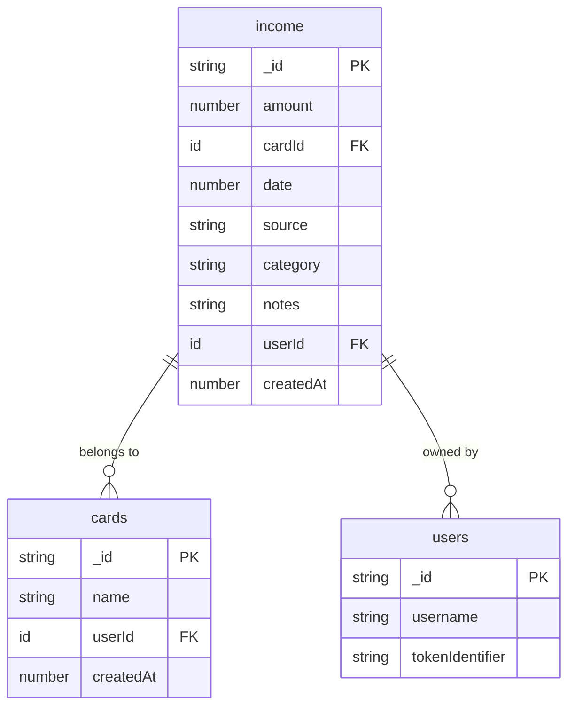
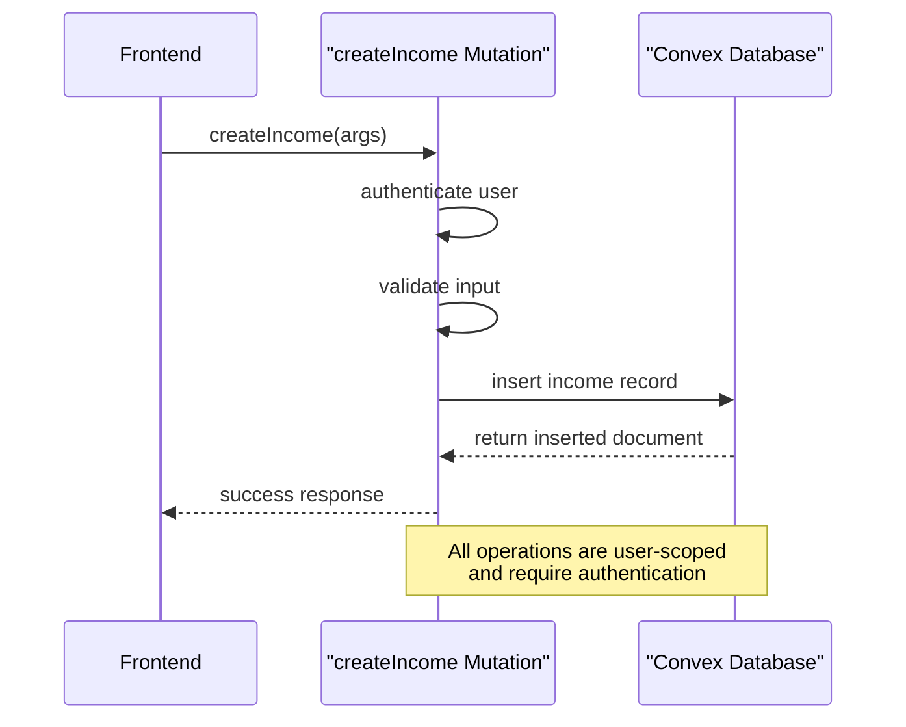
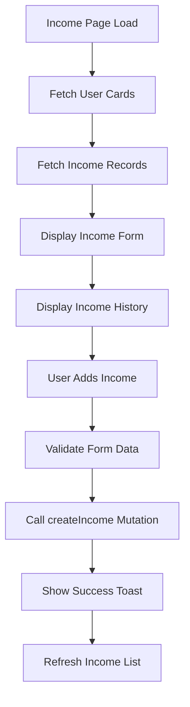
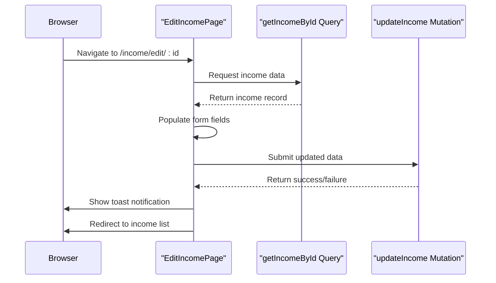
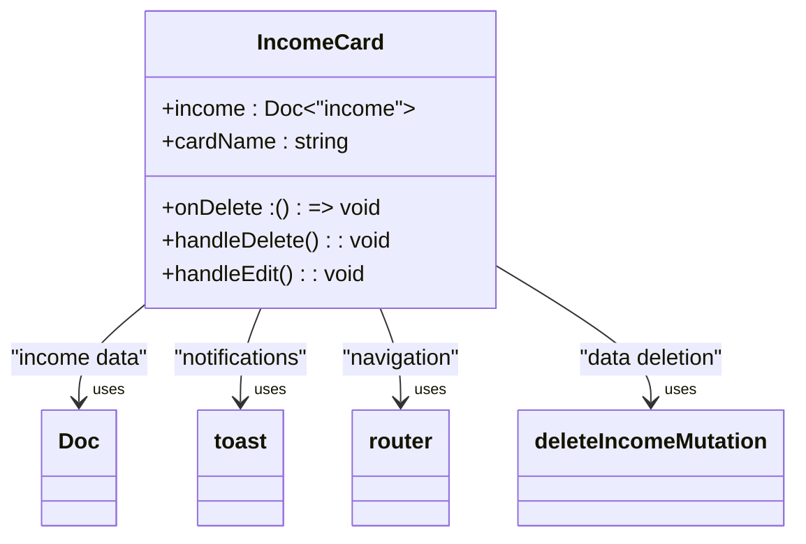
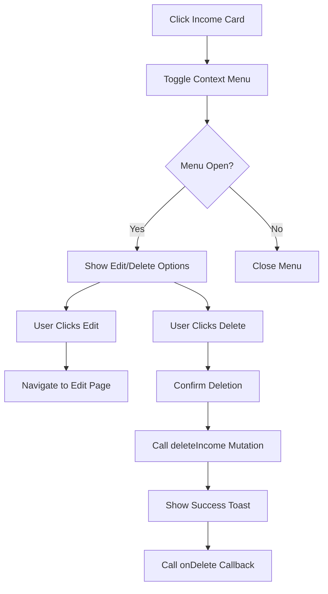
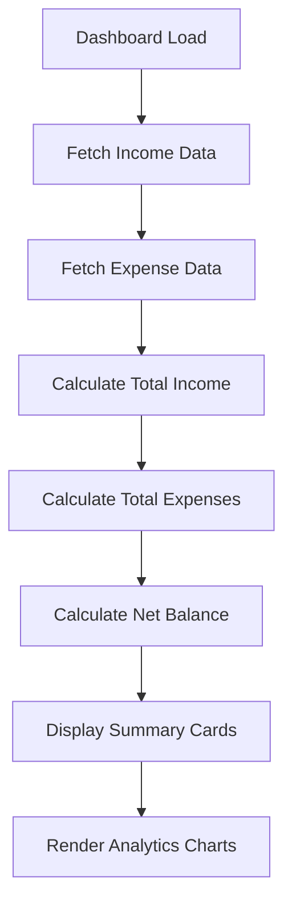
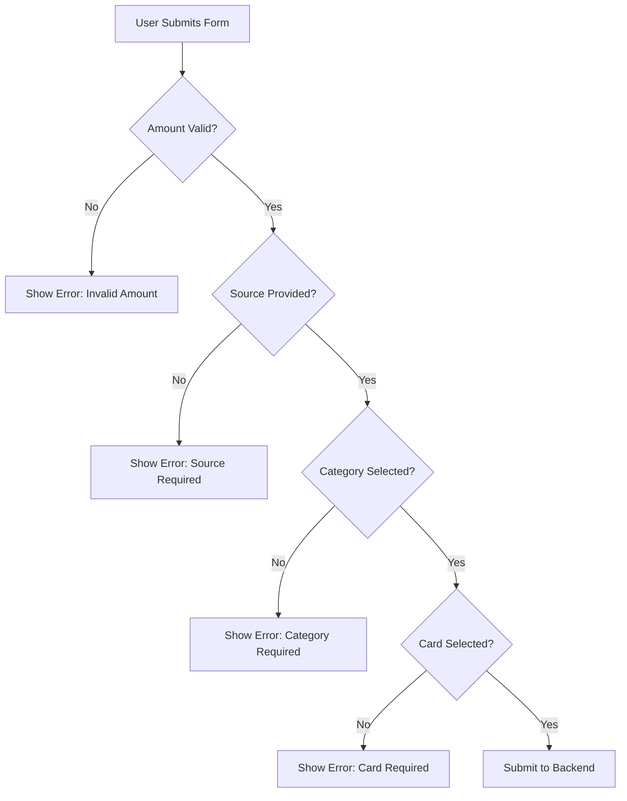
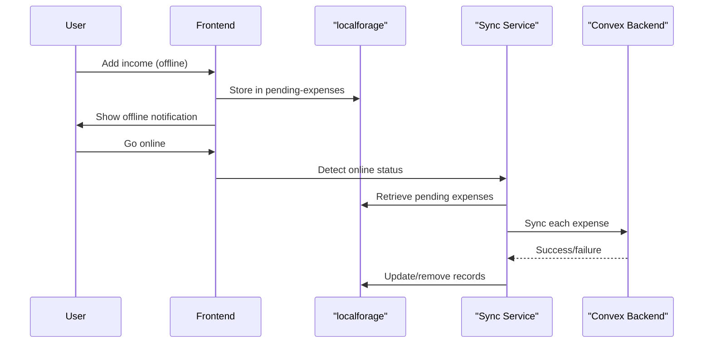

# Income Tracking

<cite>
**Referenced Files in This Document**   
- [cardsAndIncome.ts](file://convex/cardsAndIncome.ts)
- [schema.ts](file://convex/schema.ts)
- [page.tsx](file://src/app/income/page.tsx)
- [edit/[id]/page.tsx](file://src/app/income/edit/[id]/page.tsx)
- [IncomeCard.tsx](file://src/components/cards/IncomeCard.tsx)
- [dashboard/page.tsx](file://src/app/dashboard/page.tsx)
- [OfflineContext.tsx](file://src/contexts/OfflineContext.tsx)
</cite>

## Table of Contents
1. [Income Tracking](#income-tracking)
2. [Data Structure and Schema](#data-structure-and-schema)
3. [Backend Implementation](#backend-implementation)
4. [Frontend Interface](#frontend-interface)
5. [IncomeCard Component](#incomecard-component)
6. [Dashboard Integration](#dashboard-integration)
7. [Validation and User Constraints](#validation-and-user-constraints)
8. [Offline and Synchronization](#offline-and-synchronization)
9. [Usage Examples](#usage-examples)

## Data Structure and Schema

The income tracking system is built around a well-defined data model that captures essential financial information. The schema defines the structure of income records stored in the database, ensuring consistency and enabling efficient querying.



**Diagram sources**  
- [schema.ts](file://convex/schema.ts#L45-L58)

**Section sources**  
- [schema.ts](file://convex/schema.ts#L45-L58)

## Backend Implementation

The backend implementation of income tracking is centered in the `cardsAndIncome.ts` file, which contains Convex functions for managing income sources. These functions provide a secure and type-safe API for creating, retrieving, updating, and deleting income records.

### Income Management Functions

The income management system exposes several Convex functions that handle different aspects of income record manipulation:

- **createIncome**: Creates a new income record with validation
- **getIncome**: Retrieves all income records for a user
- **getIncomeById**: Retrieves a specific income record by ID
- **updateIncome**: Updates an existing income record
- **deleteIncome**: Deletes an income record with dependency checks



**Diagram sources**  
- [cardsAndIncome.ts](file://convex/cardsAndIncome.ts#L100-L130)

**Section sources**  
- [cardsAndIncome.ts](file://convex/cardsAndIncome.ts#L100-L285)

### Data Structure for Income Records

The income records follow a consistent structure with the following fields:

- **amount**: :number: The monetary value of the income
- **source**: :string: The source of income (e.g., "Salary", "Freelance")
- **category**: :string: The income category for organization
- **date**: :number: Unix timestamp of when the income was received
- **cardId**: :id: Reference to the card where income was deposited
- **userId**: :id: Reference to the owner user
- **notes**: :string: Optional additional information
- **createdAt**: :number: Unix timestamp of record creation

The system ensures data integrity through Convex's type system and validation mechanisms. Each operation verifies user authentication and authorization before proceeding.

## Frontend Interface

The frontend interface for income tracking is implemented across two main pages: the income listing page and the income editing page. These pages provide a user-friendly interface for managing income sources.

### Income Listing Page

The income listing page (`/income/page.tsx`) serves as the primary interface for viewing and adding income records. It features a form for adding new income and a list of existing income records.



**Diagram sources**  
- [page.tsx](file://src/app/income/page.tsx#L1-L300)

**Section sources**  
- [page.tsx](file://src/app/income/page.tsx#L1-L300)

### Income Editing Page

The income editing page (`/income/edit/[id]/page.tsx`) allows users to modify existing income records. It pre-fills the form with current income data and submits updates through the `updateIncome` mutation.

The editing interface includes:
- Pre-populated form fields with existing income data
- Real-time validation of user inputs
- Loading state management during submission
- Success/error feedback through toast notifications



**Diagram sources**  
- [edit/[id]/page.tsx](file://src/app/income/edit/[id]/page.tsx#L1-L242)

**Section sources**  
- [edit/[id]/page.tsx](file://src/app/income/edit/[id]/page.tsx#L1-L242)

## IncomeCard Component

The `IncomeCard` component provides a consistent and interactive UI for displaying income records throughout the application. It is used in the income listing page to present each income entry.

### Component Features

The `IncomeCard` component includes the following features:
- Display of income source, amount, category, and date
- Card name associated with the income
- Context menu for editing or deleting the income record
- Responsive design with motion animations
- Proper formatting of currency and dates based on user settings



**Diagram sources**  
- [IncomeCard.tsx](file://src/components/cards/IncomeCard.tsx#L1-L107)

**Section sources**  
- [IncomeCard.tsx](file://src/components/cards/IncomeCard.tsx#L1-L107)

### User Interaction Flow

The component implements a clean interaction flow for managing income records:



## Dashboard Integration

The income tracking system integrates with the dashboard to provide comprehensive financial insights, including net balance calculations and spending analytics.

### Net Balance Calculation

The dashboard calculates net balance by combining income and expense data:



The `CardBalances` component in the dashboard uses the `getCardBalances` query to calculate the balance for each card by subtracting total expenses from total income associated with that card.

**Section sources**  
- [dashboard/page.tsx](file://src/app/dashboard/page.tsx#L1-L127)

## Validation and User Constraints

The income tracking system implements comprehensive validation to ensure data quality and prevent errors.

### Input Validation Rules

The system enforces the following validation rules:

- **Amount**: Must be a positive number greater than zero
- **Source**: Required field, cannot be empty
- **Category**: Required field, must have at least one category selected
- **Card**: Required field, must select a valid card
- **Date**: Must be a valid date

These validations are implemented both on the frontend and backend to ensure data integrity even if the frontend validation is bypassed.



**Section sources**  
- [page.tsx](file://src/app/income/page.tsx#L150-L180)
- [edit/[id]/page.tsx](file://src/app/income/edit/[id]/page.tsx#L120-L140)

## Offline and Synchronization

The income tracking system supports offline functionality through localForage, allowing users to add income records even when disconnected from the internet.

### Offline Data Handling

When the application is offline, income records are stored locally using IndexedDB via localForage:



**Diagram sources**  
- [OfflineContext.tsx](file://src/contexts/OfflineContext.tsx#L1-L172)

**Section sources**  
- [OfflineContext.tsx](file://src/contexts/OfflineContext.tsx#L1-L172)

The synchronization process automatically detects when the device comes back online and attempts to sync pending income records with the backend. Failed sync attempts are retried, and users can manually retry individual records.

## Usage Examples

### Adding a Monthly Salary

To add a monthly salary, a user would:

1. Navigate to the income page
2. Fill out the form with:
   - **Amount**: 5000.00
   - **Source**: "Monthly Salary"
   - **Category**: "Employment"
   - **Card**: "Primary Checking Account"
   - **Date**: Current date
3. Submit the form

API request:
```json
{
  "token": "user-auth-token",
  "amount": 5000,
  "source": "Monthly Salary",
  "category": "Employment",
  "date": 1704067200000,
  "cardId": "doc123",
  "notes": "January salary payment"
}
```

API response:
```json
{
  "success": true,
  "_id": "inc456",
  "createdAt": 1704067200000
}
```

### Adding Freelance Income

For freelance income, a user might:

1. Navigate to the income page
2. Fill out the form with:
   - **Amount**: 1250.75
   - **Source**: "Web Development Project"
   - **Category**: "Freelance"
   - **Card**: "Business Account"
   - **Date**: Project completion date
   - **Notes**: "Client: Acme Corp, Project: Website redesign"

The system would validate the inputs, create the income record, and display it in the income history list with proper formatting based on the user's currency settings.