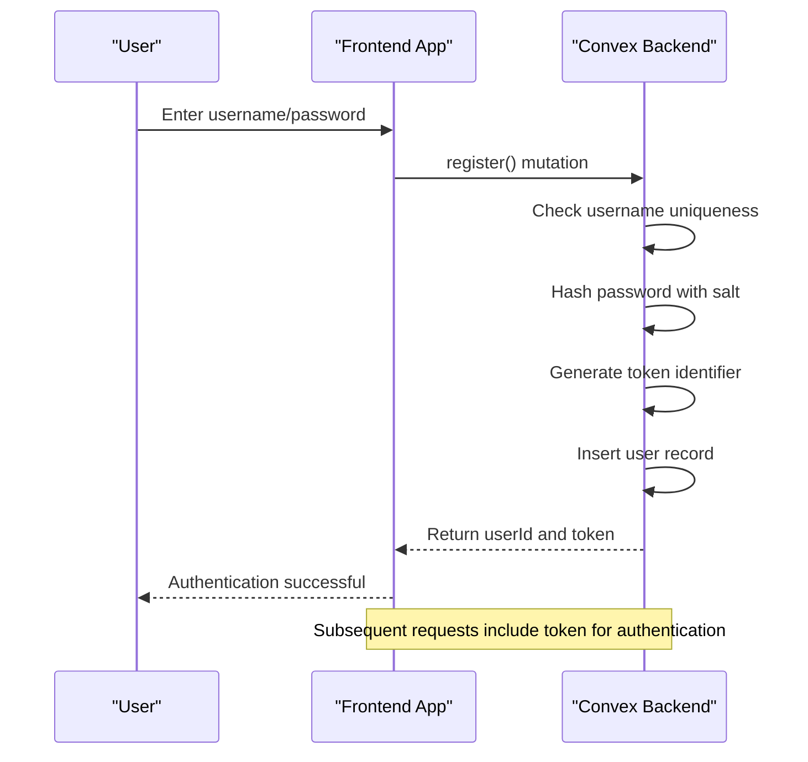
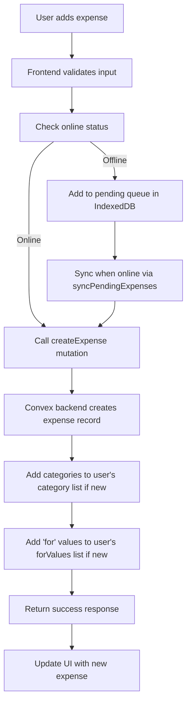
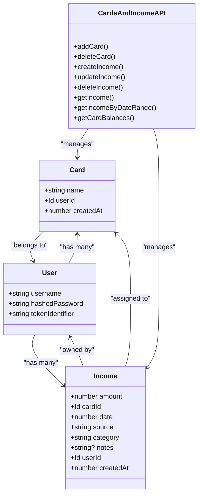
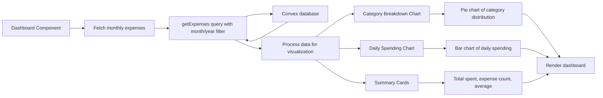
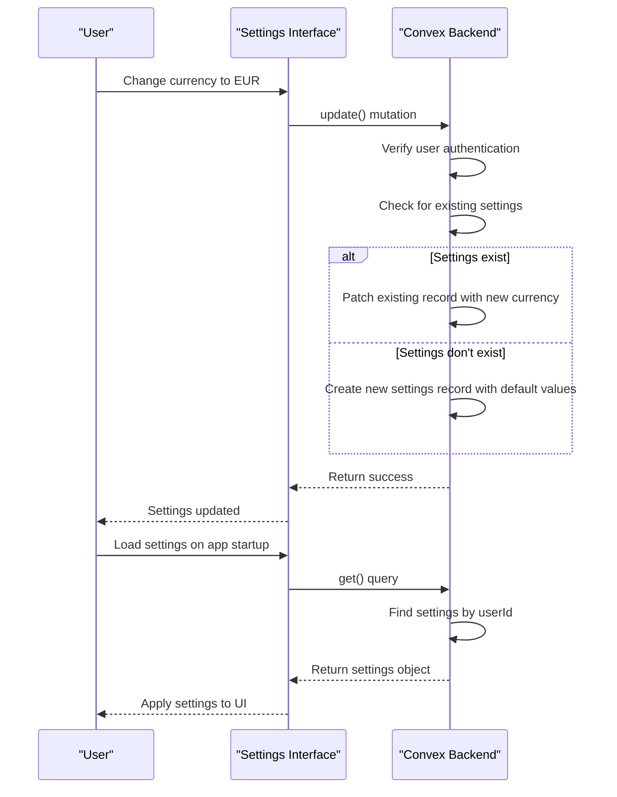
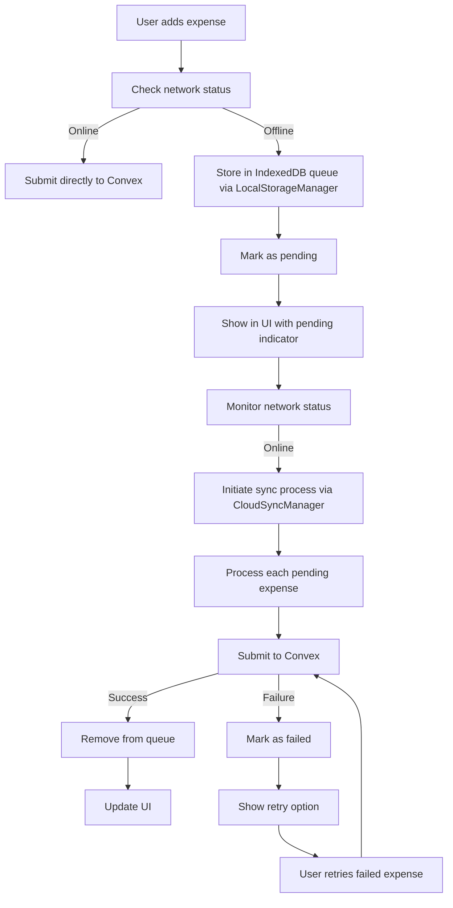
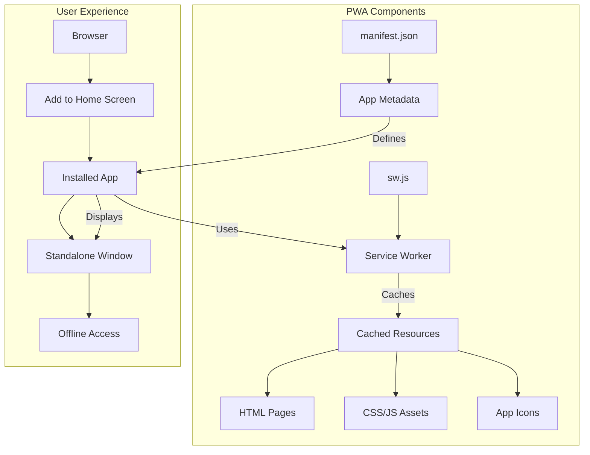
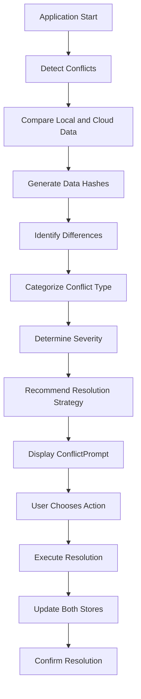
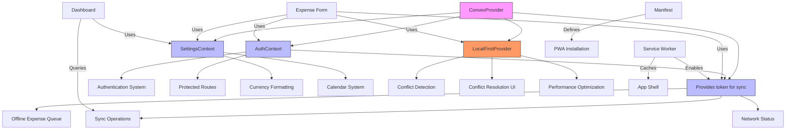

# Key Features

<cite>
**Referenced Files in This Document**   
- [auth.ts](file://convex/auth.ts#L1-L131)
- [expenses.ts](file://convex/expenses.ts#L1-L324)
- [userSettings.ts](file://convex/userSettings.ts#L1-L59)
- [cardsAndIncome.ts](file://convex/cardsAndIncome.ts#L1-L285)
- [schema.ts](file://convex/schema.ts#L1-L61)
- [sw.js](file://public/sw.js#L1-L49)
- [manifest.json](file://public/manifest.json#L1-L24)
- [OfflineContext.tsx](file://src/contexts/OfflineContext.tsx#L1-L171)
- [AuthContext.tsx](file://src/contexts/AuthContext.tsx#L1-L105)
- [ConvexProvider.tsx](file://src/providers/ConvexProvider.tsx#L1-L15)
- [LocalStorageManager.ts](file://src/lib/storage/LocalStorageManager.ts) - *Added in recent commit*
- [CloudSyncManager.ts](file://src/lib/sync/CloudSyncManager.ts) - *Added in recent commit*
- [ConflictDetector.ts](file://src/lib/sync/ConflictDetector.ts) - *Added in recent commit*
- [LocalFirstProvider.tsx](file://src/providers/LocalFirstProvider.tsx) - *Added in recent commit*
- [ConflictPrompt.tsx](file://src/components/ConflictPrompt.tsx) - *Added in recent commit*
- [useLocalFirst.ts](file://src/hooks/useLocalFirst.ts) - *Added in recent commit*
- [LOCAL_FIRST_IMPLEMENTATION.md](file://docs/LOCAL_FIRST_IMPLEMENTATION.md) - *Added in recent commit*
</cite>

## Update Summary
**Changes Made**   
- Updated Offline-First Functionality section to reflect new local-first architecture
- Added new section for Conflict Resolution System
- Enhanced Feature Interdependencies with new components
- Updated diagram sources to include new implementation files
- Added references to new local-first implementation documentation

## Table of Contents
1. [Authentication System](#authentication-system)
2. [Expense Management](#expense-management)
3. [Income Tracking](#income-tracking)
4. [Dashboard Analytics](#dashboard-analytics)
5. [User Settings](#user-settings)
6. [Offline-First Functionality](#offline-first-functionality)
7. [PWA Support](#pwa-support)
8. [Conflict Resolution System](#conflict-resolution-system)
9. [Feature Interdependencies](#feature-interdependencies)

## Authentication System

The application implements a custom username/password authentication system using Convex as the backend. The authentication flow is managed through dedicated Convex mutations and queries, with user state maintained via React Context.

Key components:
- **Registration**: Creates a new user with hashed password and unique token identifier
- **Login**: Validates credentials and returns authentication token
- **Session Management**: Uses token-based authentication stored in browser
- **Logout**: Invalidates the current session token

The system uses a simple hashing mechanism (with salt) for password storage, suitable for demonstration purposes. In production environments, bcrypt or similar secure hashing algorithms should be used.

**Section sources**
- [auth.ts](file://convex/auth.ts#L1-L131)
- [AuthContext.tsx](file://src/contexts/AuthContext.tsx#L1-L105)

## Expense Management

The expense management system provides full CRUD (Create, Read, Update, Delete) operations for tracking expenses with rich metadata including categories and attribution ("for" field).

### Core Functionality
- **Create Expense**: Add new expenses with amount, title, categories, date, and optional "for" field
- **Category System**: Tag-based categorization with auto-suggestions from user's history
- **Multiple Categories**: Support for assigning multiple categories to a single expense
- **Optimistic Updates**: UI updates immediately with local state, synchronized with backend
- **Data Validation**: Server-side validation ensures data integrity

### Implementation Details
Expenses are stored in the Convex database with the following schema:
- **amount**: Numeric value of the expense
- **title**: Descriptive title
- **category**: Array of category strings
- **for**: Array of attribution strings
- **date**: Unix timestamp
- **createdAt**: Record creation timestamp
- **userId**: Reference to owner
- **cardId**: Optional reference to payment card

When a new expense is created, the system automatically adds any new categories or "for" values to the user's personal dictionary for future auto-suggestions.

**Section sources**
- [expenses.ts](file://convex/expenses.ts#L1-L324)
- [schema.ts](file://convex/schema.ts#L1-L61)

## Income Tracking

The income tracking system allows users to record income from various sources, associated with specific payment cards. This functionality is implemented in the `cardsAndIncome.ts` file with dedicated mutations and queries.

### Card Management
Users can create multiple cards (e.g., bank accounts, credit cards) to track income and expenses by source:
- **Add Card**: Create new card with name
- **Delete Card**: Remove card (prevented if used in transactions)
- **Card Balances**: Calculate net balance by card

### Income Operations
- **Create Income**: Record income with amount, source, category, date, and optional notes
- **Update Income**: Modify existing income records
- **Delete Income**: Remove income records
- **Retrieve Income**: Query income by date range or individual record

The system enforces referential integrity by preventing deletion of cards that have associated income or expense records.

**Section sources**
- [cardsAndIncome.ts](file://convex/cardsAndIncome.ts#L1-L285)

## Dashboard Analytics

The dashboard provides comprehensive financial analytics through interactive visualizations and summary cards. Built using Chart.js with react-chartjs-2, the dashboard offers insights into spending patterns and financial health.

### Key Components
- **Monthly Summaries**: Total spending, number of expenses, and average daily spending
- **Category Breakdown**: Pie chart showing distribution of expenses by category
- **Daily Spending Pattern**: Bar chart displaying expenses by day of the month
- **Responsive Design**: Charts adapt to mobile and desktop viewports

### Data Flow
The dashboard retrieves expense data through Convex queries, filtering by month and year. The data is then processed to generate the visualizations:
- **Category Breakdown**: Aggregates expenses by category and calculates percentages
- **Daily Spending**: Groups expenses by date and creates time series data
- **Summary Cards**: Computes totals, averages, and other metrics

The dashboard supports month navigation with previous/next buttons, allowing users to analyze financial data across different periods.

**Section sources**
- [expenses.ts](file://convex/expenses.ts#L1-L324)

## User Settings

The user settings system allows customization of application preferences, currently supporting currency selection and calendar system preferences.

### Available Settings
- **Currency**: Choose from USD, EUR, GBP, or IRR for display formatting
- **Calendar**: Select between Gregorian and Jalali calendar systems
- **Profile Information**: View username and account details

### Implementation
Settings are stored in the Convex database with a dedicated `userSettings` table that includes:
- **userId**: Reference to the user
- **currency**: Selected currency code
- **calendar**: Selected calendar system
- **updatedAt**: Timestamp of last update

The system uses a simple upsert pattern: if settings exist, they are updated; otherwise, a new settings record is created.

**Section sources**
- [userSettings.ts](file://convex/userSettings.ts#L1-L59)

## Offline-First Functionality

The application implements a robust offline-first architecture using IndexedDB (via localforage) and a sync queue system, ensuring uninterrupted functionality regardless of network connectivity.

### Core Components
- **IndexedDB Storage**: Uses LocalStorageManager for structured data storage
- **Sync Queue**: Manages pending operations with CloudSyncManager
- **Network Detection**: Monitors online/offline status changes
- **Automatic Sync**: Attempts to sync queued operations when connection is restored
- **Performance Optimization**: Background sync with exponential backoff retry mechanism

### Workflow
When a user attempts to add an expense while offline:
1. The expense is added to a pending queue in IndexedDB via LocalStorageManager
2. The UI shows the expense with a "pending" status
3. When the device comes online, the sync process automatically attempts to submit queued expenses
4. Successfully synced expenses are removed from the queue
5. Failed sync attempts are marked as "failed" with option to retry

The system also provides a manual sync option in the settings for user-initiated synchronization.

**Section sources**
- [LocalStorageManager.ts](file://src/lib/storage/LocalStorageManager.ts) - *Added in recent commit*
- [CloudSyncManager.ts](file://src/lib/sync/CloudSyncManager.ts) - *Added in recent commit*
- [OfflineContext.tsx](file://src/contexts/OfflineContext.tsx#L1-L171)

## PWA Support

The application is implemented as a Progressive Web App (PWA), providing native app-like experiences including installability, offline support, and home screen integration.

### Key PWA Features
- **Installable**: Can be added to home screen on mobile devices
- **Offline Support**: Service worker caches essential resources
- **Standalone Display**: Opens in standalone window without browser UI
- **Mobile-First Design**: Responsive layout optimized for touch interfaces
- **Bottom Navigation**: Mobile-friendly navigation pattern

### Technical Implementation
The PWA functionality is enabled through two key files:

**manifest.json**: Defines the application metadata for installation:
- Name and short name
- Display mode (standalone)
- Background and theme colors
- App icons in multiple sizes

**sw.js (Service Worker)**: Implements offline caching strategy:
- Caches essential application routes and assets
- Serves cached content when offline
- Implements cache versioning and cleanup

**Section sources**
- [manifest.json](file://public/manifest.json#L1-L24)
- [sw.js](file://public/sw.js#L1-L49)

## Conflict Resolution System

The application features an advanced conflict resolution system that detects and resolves data inconsistencies between local and cloud storage.

### Core Components
- **ConflictDetector**: Analyzes data differences using hash-based comparison
- **ConflictPrompt**: User interface for conflict resolution decisions
- **Merge Strategies**: Multiple resolution approaches (local wins, cloud wins, merge)
- **Automatic Detection**: Periodic checks and event-triggered detection

### Conflict Detection
The system uses a multi-layered approach to detect conflicts:
1. **Hash Comparison**: Compares data hashes between local and cloud storage
2. **Entity-Level Analysis**: Identifies specific records with divergent data
3. **Schema Validation**: Ensures compatibility between data structures
4. **Timestamp Analysis**: Determines data freshness based on modification times

### Resolution Workflow
When conflicts are detected:
1. The ConflictDetector analyzes the nature and severity of conflicts
2. The ConflictPrompt displays a user-friendly interface with recommended actions
3. Users can choose to upload local data, download cloud data, or manually resolve
4. The system executes the chosen resolution strategy and updates both stores

**Section sources**
- [ConflictDetector.ts](file://src/lib/sync/ConflictDetector.ts) - *Added in recent commit*
- [ConflictPrompt.tsx](file://src/components/ConflictPrompt.tsx) - *Added in recent commit*
- [LOCAL_FIRST_IMPLEMENTATION.md](file://docs/LOCAL_FIRST_IMPLEMENTATION.md) - *Added in recent commit*

## Feature Interdependencies

The application's features are interconnected through shared data models, context providers, and backend services. Understanding these relationships is crucial for maintaining and extending the system.

### Data Model Relationships
The core data entities are related through foreign key references:
- **Users** own Expenses, Categories, ForValues, Cards, Income, and Settings
- **Expenses** and **Income** records are associated with specific Cards
- **Categories** and **ForValues** are user-specific for personalized auto-suggestions

### Context Provider Hierarchy
The application uses React Context for global state management with the following hierarchy:
- **ConvexProvider**: Top-level provider for Convex client
- **AuthContext**: Manages user authentication state and token
- **OfflineContext**: Handles offline queue and sync operations
- **SettingsContext**: Stores user preferences
- **LocalFirstProvider**: Integrates local-first architecture components

These contexts are composed in the application layout, allowing child components to access the necessary state and functions.

### Integration Points
Key integration points between features:
- **Authentication → Offline**: Auth token is required for sync operations
- **Expense → Category**: New categories are automatically added to user's dictionary
- **Offline → PWA**: Service worker enables offline caching while OfflineContext manages data sync
- **Income → Dashboard**: Income data contributes to card balances and financial summaries
- **Conflict Resolution → Offline**: ConflictDetector monitors sync state and triggers resolution UI

**Section sources**
- [ConvexProvider.tsx](file://src/providers/ConvexProvider.tsx#L1-L15)
- [AuthContext.tsx](file://src/contexts/AuthContext.tsx#L1-L105)
- [OfflineContext.tsx](file://src/contexts/OfflineContext.tsx#L1-L171)
- [LocalFirstProvider.tsx](file://src/providers/LocalFirstProvider.tsx) - *Added in recent commit*