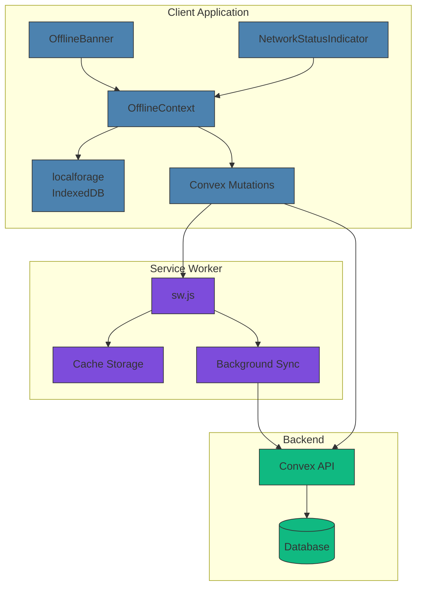
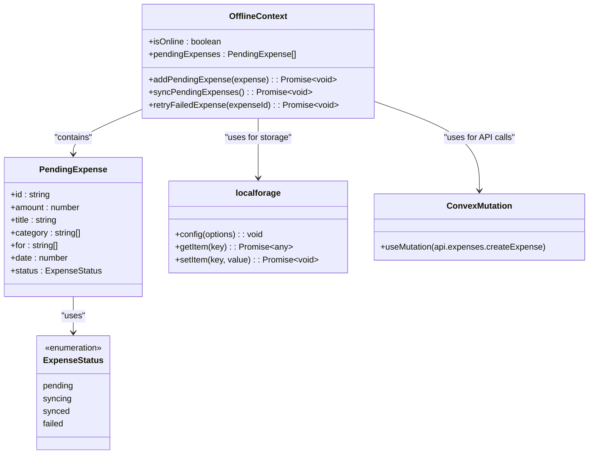
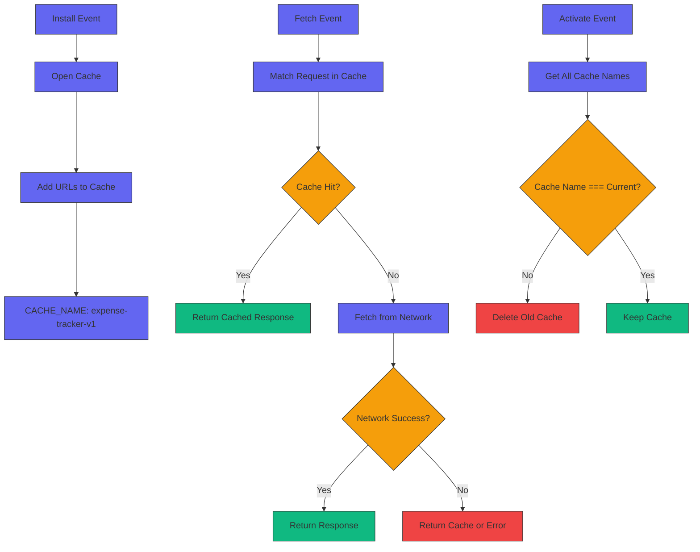
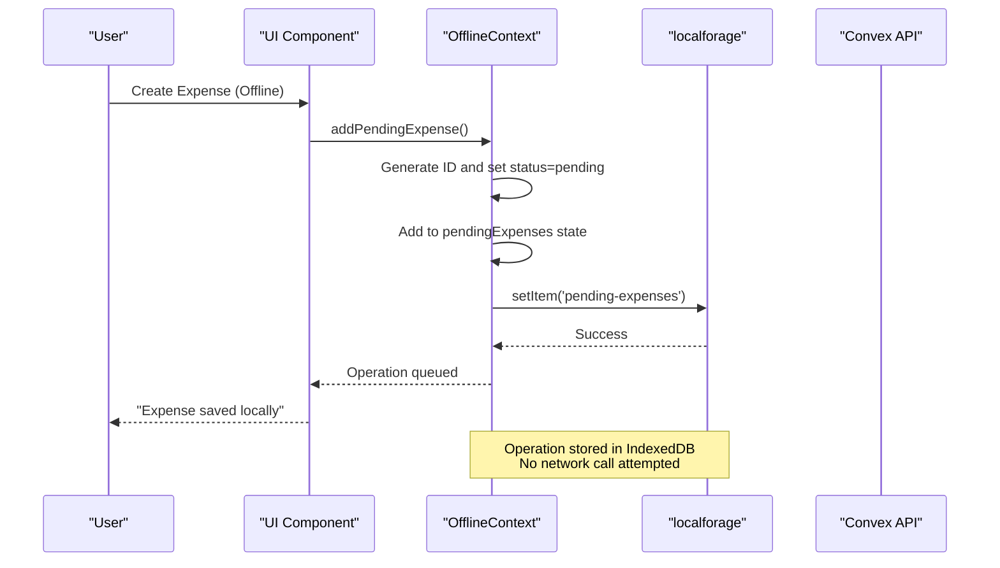
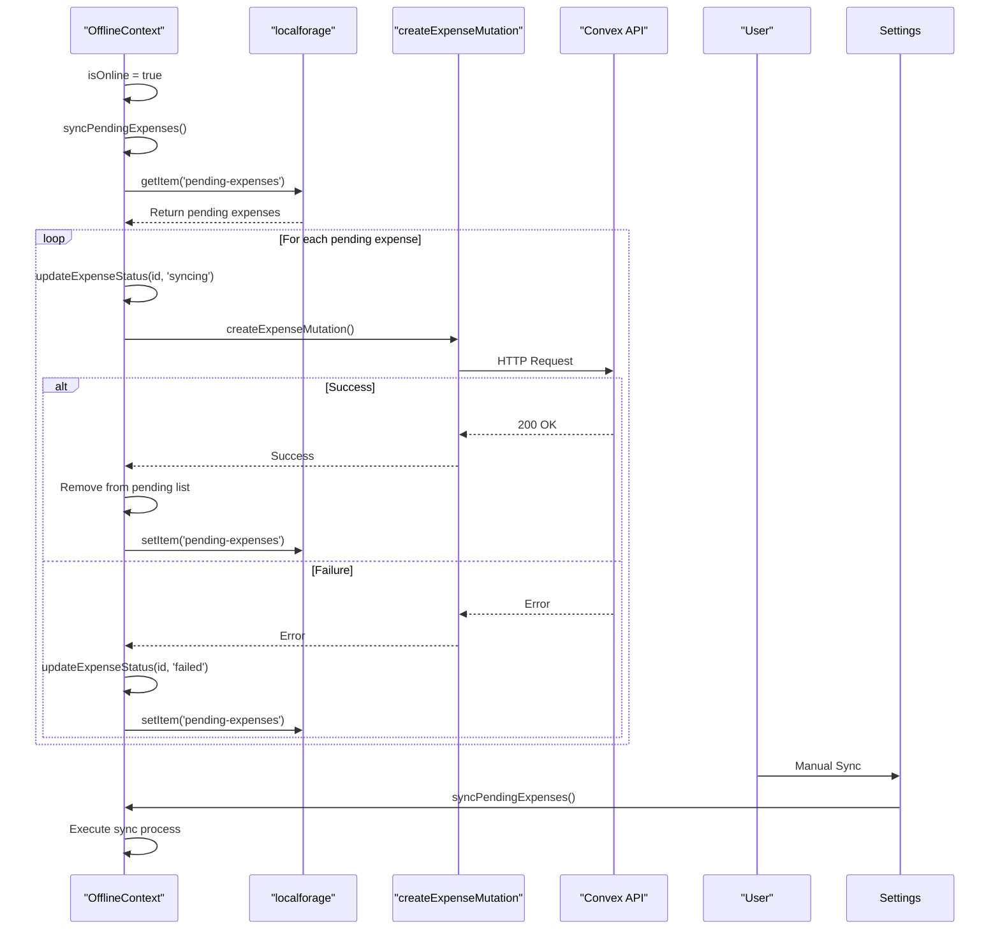
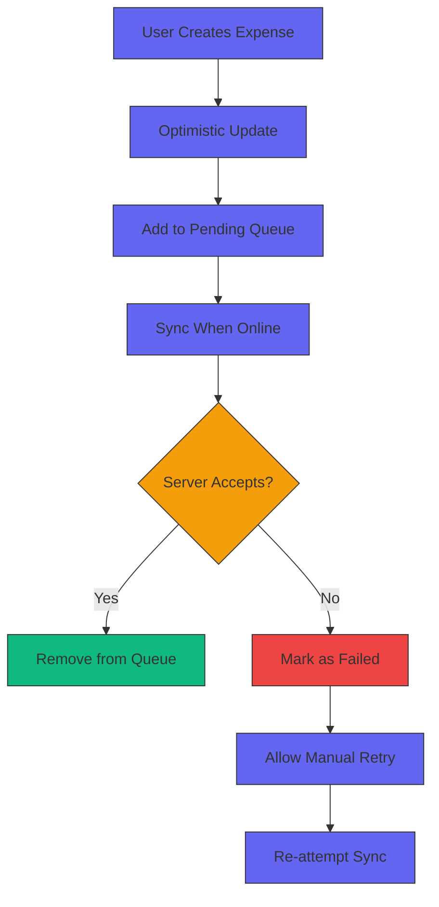
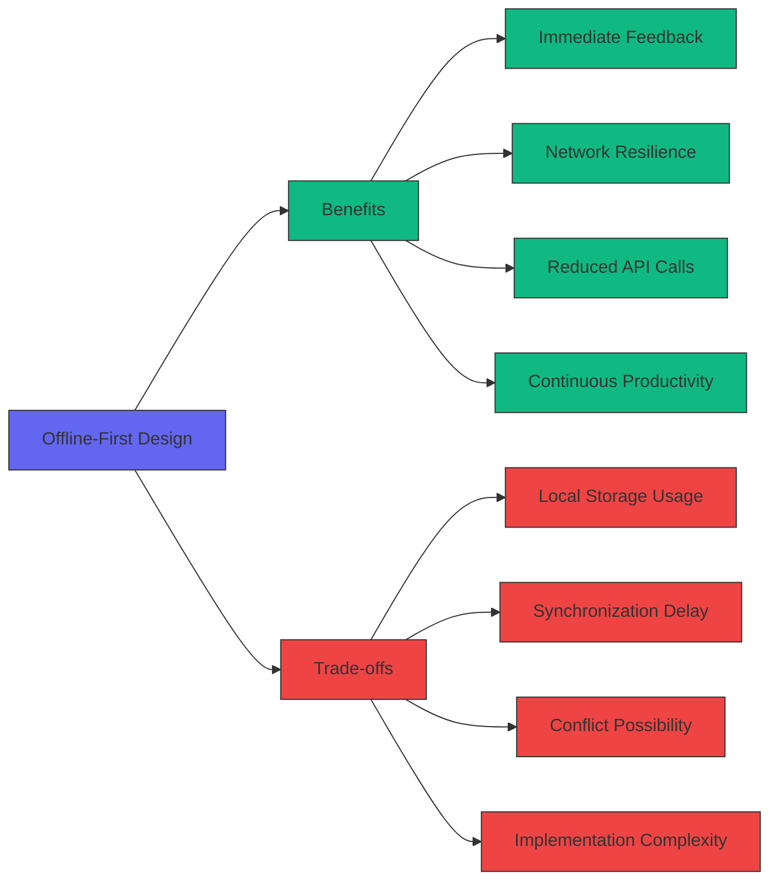
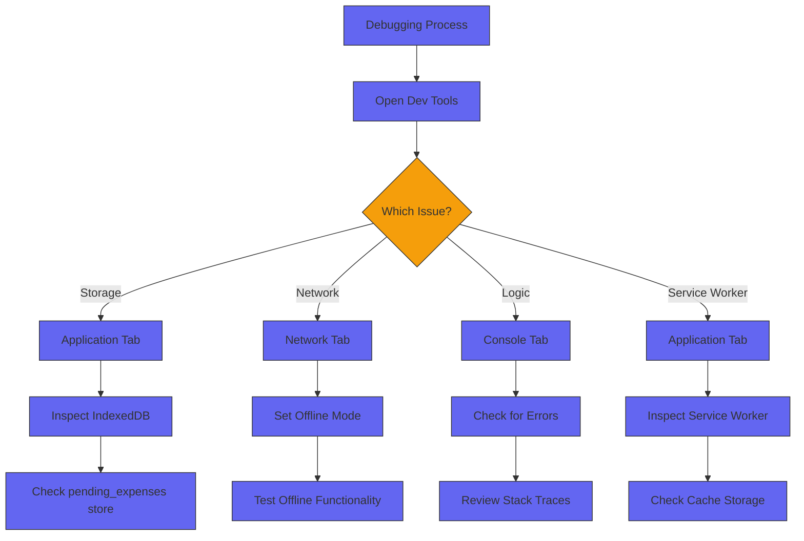

# Offline Functionality

<cite>
**Referenced Files in This Document**   
- [OfflineContext.tsx](file://src/contexts/OfflineContext.tsx)
- [sw.js](file://public/sw.js)
- [OfflineBanner.tsx](file://src/components/OfflineBanner.tsx)
- [NetworkStatusIndicator.tsx](file://src/components/NetworkStatusIndicator.tsx)
- [expenses.ts](file://convex/expenses.ts)
- [userSettings.ts](file://convex/userSettings.ts)
- [settings/page.tsx](file://src/app/settings/page.tsx)
- [next.config.mjs](file://next.config.mjs)
</cite>

## Table of Contents
1. [Architecture Overview](#architecture-overview)
2. [Core Components](#core-components)
3. [Offline Write Process](#offline-write-process)
4. [Sync Process](#sync-process)
5. [User Experience Components](#user-experience-components)
6. [Data Consistency and Conflict Resolution](#data-consistency-and-conflict-resolution)
7. [Performance Benefits and Trade-offs](#performance-benefits-and-trade-offs)
8. [Debugging and Testing](#debugging-and-testing)

## Architecture Overview

The offline-first architecture of the Expense Tracker application combines client-side storage with service worker caching to provide seamless functionality regardless of network connectivity. The system uses a dual-layer approach: localforage for IndexedDB storage of pending mutations and a service worker for caching static assets and API responses.



**Diagram sources**
- [OfflineContext.tsx](file://src/contexts/OfflineContext.tsx)
- [sw.js](file://public/sw.js)
- [next.config.mjs](file://next.config.mjs)

**Section sources**
- [OfflineContext.tsx](file://src/contexts/OfflineContext.tsx#L1-L171)
- [sw.js](file://public/sw.js#L1-L49)

## Core Components

The offline functionality is built around several key components that work together to provide a seamless offline experience. The OfflineContext manages the application's offline state and pending operations, while the service worker handles caching and background synchronization.

### OfflineContext Implementation

The OfflineContext is a React context that tracks network status and manages the queue of pending operations. It uses localforage to persist pending expenses in IndexedDB and provides methods to add and sync pending operations.



**Diagram sources**
- [OfflineContext.tsx](file://src/contexts/OfflineContext.tsx#L1-L171)

**Section sources**
- [OfflineContext.tsx](file://src/contexts/OfflineContext.tsx#L1-L171)

### Service Worker Configuration

The service worker (sw.js) implements caching strategies for different types of resources. It precaches essential application routes and uses runtime caching for API calls, with background sync capabilities for failed mutations.



**Diagram sources**
- [sw.js](file://public/sw.js#L1-L49)

**Section sources**
- [sw.js](file://public/sw.js#L1-L49)
- [next.config.mjs](file://next.config.mjs#L1-L74)

## Offline Write Process

When a user creates an expense while offline, the application intercepts the Convex API call and queues the operation for later synchronization. This process ensures that no data is lost during network outages.



**Diagram sources**
- [OfflineContext.tsx](file://src/contexts/OfflineContext.tsx#L90-L108)
- [expenses.ts](file://convex/expenses.ts#L1-L324)

**Section sources**
- [OfflineContext.tsx](file://src/contexts/OfflineContext.tsx#L90-L108)
- [expenses.ts](file://convex/expenses.ts#L1-L324)

## Sync Process

The synchronization process automatically attempts to send pending operations to the server when connectivity is restored. Users can also manually trigger synchronization from the settings page.



**Diagram sources**
- [OfflineContext.tsx](file://src/contexts/OfflineContext.tsx#L110-L154)
- [settings/page.tsx](file://src/app/settings/page.tsx#L17-L37)

**Section sources**
- [OfflineContext.tsx](file://src/contexts/OfflineContext.tsx#L110-L154)
- [settings/page.tsx](file://src/app/settings/page.tsx#L17-L37)

## User Experience Components

The application provides clear visual feedback about the network status and pending operations through two key components: OfflineBanner and NetworkStatusIndicator.

### OfflineBanner

The OfflineBanner displays a prominent notification when the application is offline, showing the number of pending expenses that will be synced when connectivity is restored.

```mermaid
flowchart TD
A[isOnline = false] --> B[Render Banner]
B --> C[Orange Background]
C --> D[Alert Icon]
D --> E[Text: "You are offline.<br/>X pending expense(s)"]
E --> F[Display on Screen]
style A fill:#F59E0B,stroke:#333
style B fill:#F59E0B,stroke:#333
style C fill:#F59E0B,stroke:#333
style D fill:#F59E0B,stroke:#333
style E fill:#F59E0B,stroke:#333
style F fill:#F59E0B,stroke:#333
```

**Diagram sources**
- [OfflineBanner.tsx](file://src/components/OfflineBanner.tsx#L1-L26)

**Section sources**
- [OfflineBanner.tsx](file://src/components/OfflineBanner.tsx#L1-L26)

### NetworkStatusIndicator

The NetworkStatusIndicator provides a subtle, persistent visual cue in the corner of the screen indicating the current network status with a color-coded dot.

```mermaid
flowchart TD
A[isOnline = true] --> B[Green Dot]
A --> C[Red Dot]
B --> D[Position: top-4 right-4]
C --> D
D --> E[Size: 16x16px]
E --> F[Border: white]
F --> G[Shadow]
G --> H[Title: "Online"/"Offline"]
style A fill:#6366F1,stroke:#333
style B fill:#10B981,stroke:#333
style C fill:#EF4444,stroke:#333
style D fill:#6366F1,stroke:#333
style E fill:#6366F1,stroke:#333
style F fill:#6366F1,stroke:#333
style G fill:#6366F1,stroke:#333
style H fill:#6366F1,stroke:#333
```

**Diagram sources**
- [NetworkStatusIndicator.tsx](file://src/components/NetworkStatusIndicator.tsx#L1-L22)

**Section sources**
- [NetworkStatusIndicator.tsx](file://src/components/NetworkStatusIndicator.tsx#L1-L22)

## Data Consistency and Conflict Resolution

The application employs several strategies to ensure data consistency and handle potential conflicts that may arise during offline operation and synchronization.

### Optimistic Updates

The application uses optimistic updates to provide immediate feedback to users when creating or modifying expenses. The UI is updated immediately, assuming the operation will succeed, and only rolls back if the server rejects the request.

### Conflict Resolution

The current implementation uses a "last write wins" strategy for conflict resolution. When multiple clients modify the same expense while offline, the last one to sync will overwrite previous changes. This is managed by the server-side mutation handlers in Convex.

### Data Validation

All mutations include validation to ensure data integrity:
- Expense amounts must be numbers
- Titles must be non-empty strings
- Categories and "for" values are normalized (capitalized)
- User authentication is verified for all operations



**Diagram sources**
- [expenses.ts](file://convex/expenses.ts#L1-L324)
- [userSettings.ts](file://convex/userSettings.ts#L1-L59)

**Section sources**
- [expenses.ts](file://convex/expenses.ts#L1-L324)
- [userSettings.ts](file://convex/userSettings.ts#L1-L59)

## Performance Benefits and Trade-offs

The offline-first design provides significant performance benefits but also introduces certain trade-offs that must be considered.

### Benefits

- **Improved Responsiveness**: Operations complete immediately without waiting for network round-trips
- **Reliability**: Application remains functional during network outages
- **Reduced Server Load**: Batched synchronization reduces the number of individual API calls
- **Better User Experience**: Users can continue working without interruption

### Trade-offs

- **Storage Usage**: Pending operations consume local storage space
- **Data Synchronization Delay**: Changes are not immediately visible to other devices
- **Conflict Potential**: Concurrent modifications can lead to data conflicts
- **Complexity**: Additional code is required to manage offline state and synchronization



**Section sources**
- [OfflineContext.tsx](file://src/contexts/OfflineContext.tsx#L1-L171)
- [sw.js](file://public/sw.js#L1-L49)

## Debugging and Testing

Effective debugging and testing are essential for maintaining the reliability of the offline functionality.

### Debugging Tips

- **Inspect IndexedDB**: Use browser developer tools to view the "ExpenseTracker" database and "pending_expenses" store
- **Simulate Offline Mode**: Use the Network tab in developer tools to throttle to "Offline"
- **Monitor Console Logs**: Check for error messages from localforage and API calls
- **Service Worker Inspection**: Use the Application tab to view service worker status and cache storage

### Testing Strategies

- **Manual Testing**: Test creating expenses while offline and verify they sync when online
- **Edge Cases**: Test with large numbers of pending operations
- **Error Conditions**: Simulate API failures to verify retry logic
- **Storage Limits**: Test behavior when IndexedDB quota is exceeded



**Section sources**
- [OfflineContext.tsx](file://src/contexts/OfflineContext.tsx#L1-L171)
- [sw.js](file://public/sw.js#L1-L49)
- [next.config.mjs](file://next.config.mjs#L1-L74)