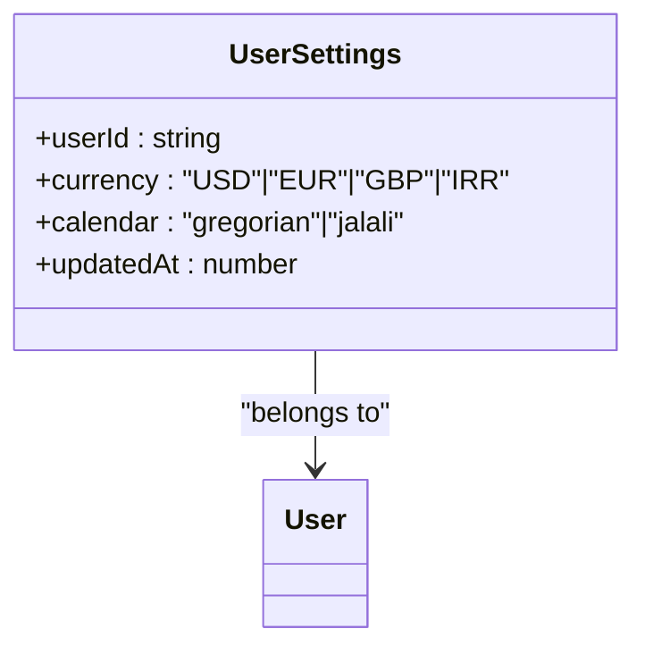
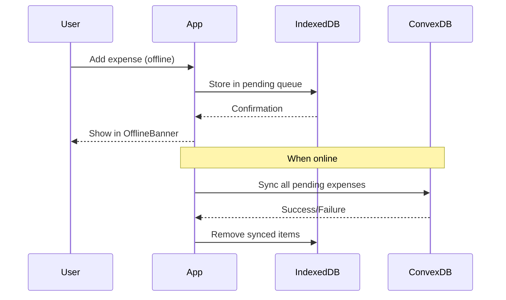
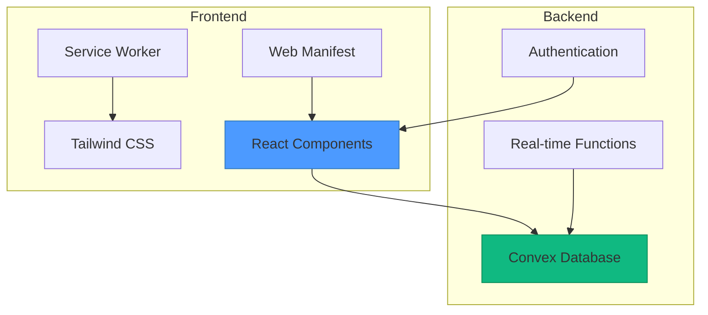

# Purpose and Goals

<cite>
**Referenced Files in This Document**   
- [schema.ts](file://convex/schema.ts#L1-L61)
- [AuthContext.tsx](file://src/contexts/AuthContext.tsx#L1-L96)
- [OfflineContext.tsx](file://src/contexts/OfflineContext.tsx#L1-L171)
- [SettingsContext.tsx](file://src/contexts/SettingsContext.tsx#L1-L57)
- [userSettings.ts](file://convex/userSettings.ts#L1-L59)
- [sw.js](file://public/sw.js#L1-L49)
- [OfflineBanner.tsx](file://src/components/OfflineBanner.tsx#L1-L26)
- [settings/page.tsx](file://src/app/settings/page.tsx#L1-L234)
- [page.tsx](file://src/app/page.tsx#L1-L30)
</cite>

## Table of Contents
1. [Core Purpose and Strategic Goals](#core-purpose-and-strategic-goals)
2. [Primary Functional Objectives](#primary-functional-objectives)
3. [User Personas and Use Cases](#user-personas-and-use-cases)
4. [Technology Alignment with Goals](#technology-alignment-with-goals)
5. [Scope Boundaries and Non-Goals](#scope-boundaries-and-non-goals)

## Core Purpose and Strategic Goals

The **Expense-Tracker---Warp** application is designed to empower individuals with intuitive, reliable tools for personal financial management in both online and offline environments. Its mission centers on enabling users to maintain control over their finances regardless of connectivity status, with a strong emphasis on accessibility, data integrity, and user experience.

The strategic goals of the application are:
- **Universal Accessibility**: Ensure the app is usable across devices with a mobile-first design, leveraging Progressive Web App (PWA) capabilities for installability and native-like performance.
- **Data Resilience**: Guarantee financial data persistence and synchronization across network interruptions using robust offline-first architecture.
- **Actionable Insights**: Transform raw expense and income data into meaningful analytics that help users understand spending patterns and make informed decisions.
- **User Empowerment**: Balance simplicity for novice users with advanced features for power users, ensuring broad usability without sacrificing functionality.

These goals are reflected in the application’s architecture, which integrates Convex for real-time data synchronization and integrity, while utilizing local storage mechanisms to maintain functionality during offline use.

**Section sources**
- [page.tsx](file://src/app/page.tsx#L1-L30)
- [AuthContext.tsx](file://src/contexts/AuthContext.tsx#L1-L96)

## Primary Functional Objectives

The application is built around several core functional objectives that directly support its overarching mission.

### Seamless Expense and Income Tracking
Users can record expenses and income with essential details such as amount, title, categories, date, and attribution. The system supports multiple categories per transaction and optional "for" fields to enhance tracking precision.

**Data Model:**
```typescript
// Expense Record
{
  amount: number,
  title: string,
  category: string[],
  for?: string[],
  date: number,
  createdAt: number,
  userId: Id<"users">,
  cardId: Id<"cards"> | null
}

// Income Record
{
  amount: number,
  cardId: Id<"cards">,
  date: number,
  source: string,
  category: string,
  notes?: string,
  userId: Id<"users">,
  createdAt: number
}
```

**Section sources**
- [schema.ts](file://convex/schema.ts#L1-L61)

### Real-Time Analytics and Insights
The dashboard provides real-time visualizations including:
- Monthly summaries with total spending and transaction counts
- Category breakdown via interactive pie charts
- Daily spending trends using bar charts
- Navigation between months for historical analysis

These insights are updated in real time as new data is added or synchronized, ensuring users always have current information.

### Multi-Currency and Calendar System Support
To accommodate global users, the application supports multiple currencies and calendar systems:
- **Currencies**: USD, EUR, GBP, IRR
- **Calendars**: Gregorian, Jalali

User preferences are stored in the database and applied consistently across the UI.



**Diagram sources**
- [schema.ts](file://convex/schema.ts#L50-L61)
- [userSettings.ts](file://convex/userSettings.ts#L1-L59)
- [SettingsContext.tsx](file://src/contexts/SettingsContext.tsx#L1-L57)

**Section sources**
- [settings/page.tsx](file://src/app/settings/page.tsx#L1-L234)

### Data Persistence and Offline Access
The application ensures data persistence through a comprehensive offline strategy:
- **Service Worker**: Caches core assets for offline access
- **IndexedDB via localforage**: Stores pending expenses when offline
- **Automatic Sync**: Queued transactions are synced when connectivity is restored
- **Manual Sync Option**: Users can trigger synchronization from the settings page



**Diagram sources**
- [sw.js](file://public/sw.js#L1-L49)
- [OfflineContext.tsx](file://src/contexts/OfflineContext.tsx#L1-L171)
- [OfflineBanner.tsx](file://src/components/OfflineBanner.tsx#L1-L26)

**Section sources**
- [OfflineContext.tsx](file://src/contexts/OfflineContext.tsx#L1-L171)
- [sw.js](file://public/sw.js#L1-L49)

## User Personas and Use Cases

The application serves diverse user personas with distinct financial tracking needs:

### Budget-Conscious Individuals
- Track daily expenses to stay within monthly budgets
- Use dashboard analytics to identify spending patterns
- Rely on mobile access for real-time tracking while shopping

### Freelancers with Irregular Income
- Record variable income amounts and sources
- Monitor cash flow across different payment methods (cards)
- Analyze income trends over time to forecast earnings

### Travelers Managing Multi-Currency Expenses
- Switch between currencies based on location
- Track expenses in local currency while maintaining home currency reference
- Use calendar system preferences (e.g., Jalali) for cultural alignment

These personas benefit from the application’s flexibility in data entry, visualization, and personalization options.

## Technology Alignment with Goals

The technology stack is carefully chosen to align with the application’s strategic goals.

### Convex for Real-Time Synchronization
Convex provides:
- Real-time database updates across devices
- Serverless functions for business logic
- Type-safe API generation
- Built-in authentication integration

This ensures data integrity and seamless synchronization, critical for maintaining trust in financial data.

### PWA and Mobile-First UX
The application leverages:
- **Next.js App Router**: For SSR and routing
- **Tailwind CSS**: Responsive, mobile-optimized design
- **Service Worker**: Offline asset caching
- **Web App Manifest**: Installability on home screens



**Diagram sources**
- [page.tsx](file://src/app/page.tsx#L1-L30)
- [sw.js](file://public/sw.js#L1-L49)
- [tailwind.config.ts](file://tailwind.config.ts#L1-L10)

### Offline-First Architecture
The offline strategy combines:
- **localforage**: Simplified IndexedDB access for storing pending expenses
- **Network Event Listeners**: Detect online/offline status changes
- **Manual Sync Button**: User-initiated synchronization in settings

This architecture ensures users never lose data due to connectivity issues.

## Scope Boundaries and Non-Goals

To maintain focus and ensure quality, the application explicitly excludes certain features:

### Non-Goals
- **Banking Integration**: No direct bank account linking or transaction imports
- **Tax Calculation**: No automated tax reporting or calculations
- **Expense Editing/Deletion**: Current version does not support modifying or removing recorded expenses
- **Recurring Transactions**: No support for automatic recurring expense/income entries
- **Budget Alerts**: No threshold-based notifications or warnings

These exclusions help maintain a clean, focused user experience while allowing for future expansion.

### Future Enhancements (Planned but Not Implemented)
As noted in the README, planned future features include:
- Expense editing and deletion
- Recurring expense tracking
- Search and filtering capabilities
- Data export functionality
- Enhanced offline sync with conflict resolution

These will be added iteratively while preserving the core principles of simplicity and reliability.

**Section sources**
- [README.md](file://README.md#L200-L263)