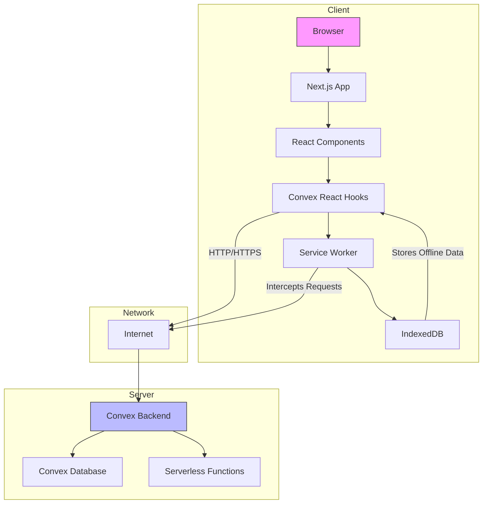
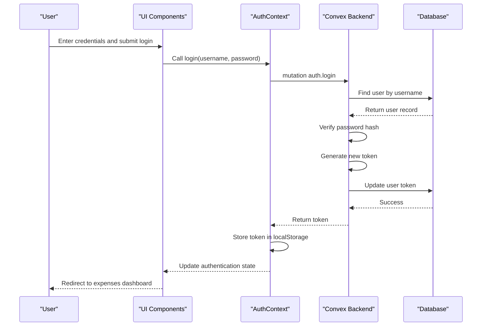
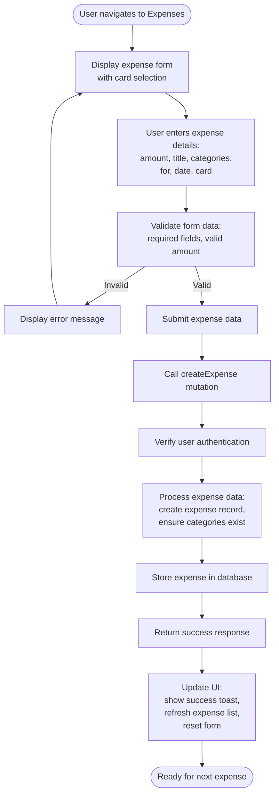
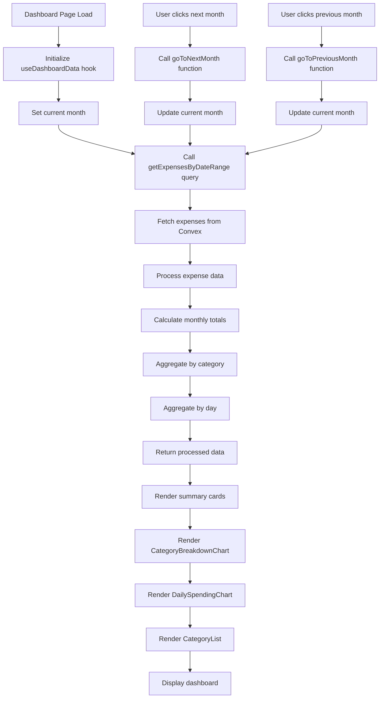
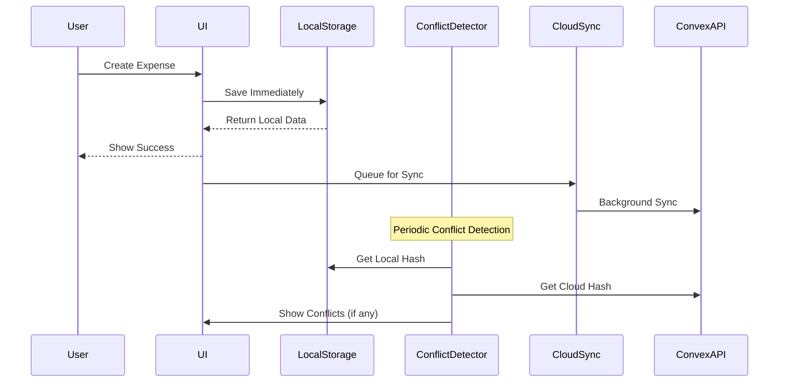
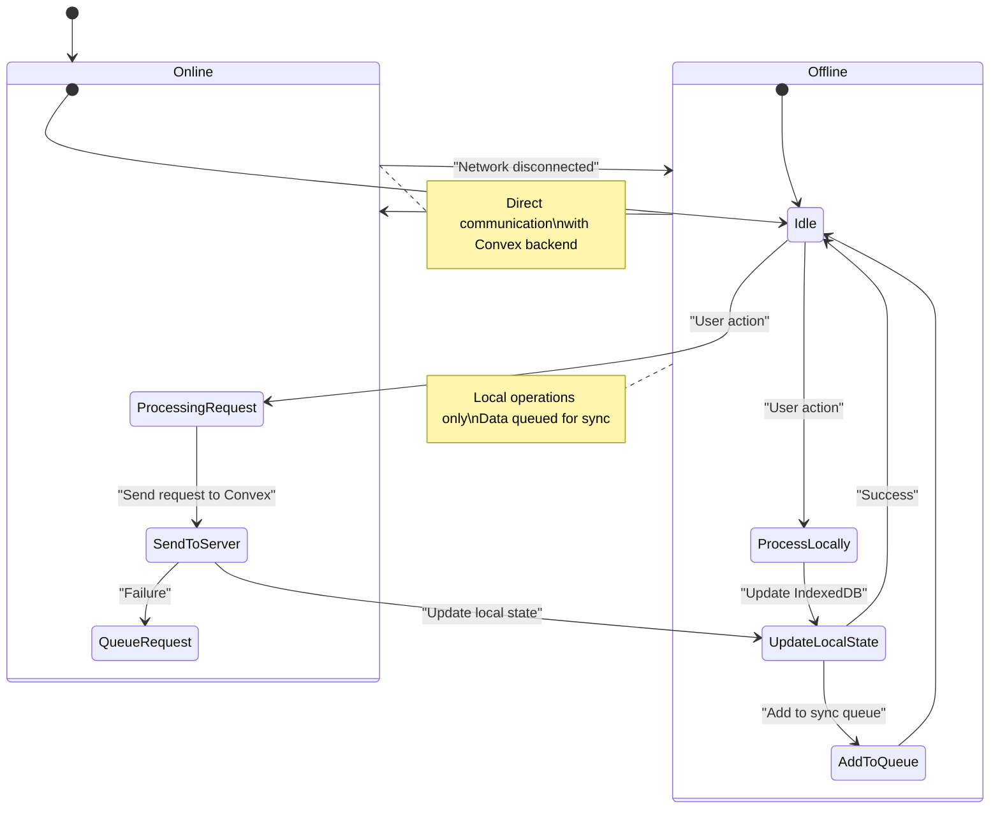
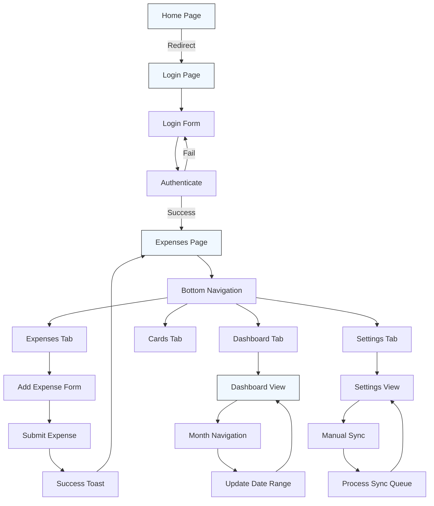
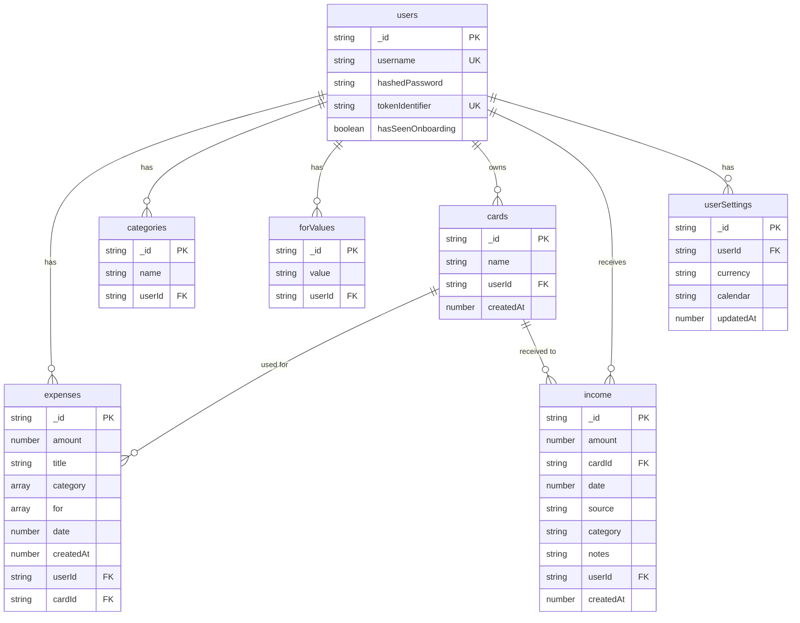

# System Overview

<cite>
**Referenced Files in This Document**   
- [README.md](file://README.md)
- [convex/schema.ts](file://convex/schema.ts)
- [src/app/page.tsx](file://src/app/page.tsx)
- [src/contexts/AuthContext.tsx](file://src/contexts/AuthContext.tsx)
- [convex/auth.ts](file://convex/auth.ts)
- [src/app/dashboard/page.tsx](file://src/app/dashboard/page.tsx)
- [src/features/dashboard/hooks/useDashboardData.ts](file://src/features/dashboard/hooks/useDashboardData.ts)
- [convex/expenses.ts](file://convex/expenses.ts)
- [src/app/expenses/page.tsx](file://src/app/expenses/page.tsx)
- [src/components/ProtectedRoute.tsx](file://src/components/ProtectedRoute.tsx)
- [next.config.js](file://next.config.js)
- [next.config.mjs](file://next.config.mjs)
- [src/app/settings/page.tsx](file://src/app/settings/page.tsx)
- [src/hooks/useTimeFramedData.ts](file://src/hooks/useTimeFramedData.ts)
- [docs/LOCAL_FIRST_IMPLEMENTATION.md](file://docs/LOCAL_FIRST_IMPLEMENTATION.md) - *Updated in recent commit*
- [src/lib/storage/LocalStorageManager.ts](file://src/lib/storage/LocalStorageManager.ts) - *Updated in recent commit*
- [src/lib/sync/CloudSyncManager.ts](file://src/lib/sync/CloudSyncManager.ts) - *Updated in recent commit*
- [src/providers/LocalFirstProvider.tsx](file://src/providers/LocalFirstProvider.tsx) - *Updated in recent commit*
- [src/hooks/useLocalFirst.ts](file://src/hooks/useLocalFirst.ts) - *Updated in recent commit*
</cite>

## Update Summary
**Changes Made**   
- Updated documentation to reflect enhanced offline-first implementation and PWA configuration
- Added details about manual sync functionality in settings interface
- Clarified data caching and synchronization behavior in offline mode
- Enhanced description of time-framed data handling with calendar system support
- Updated architecture overview with service worker caching strategies
- Integrated comprehensive local-first architecture documentation including new components and data flow
- Added detailed explanation of LocalStorageManager, CloudSyncManager, and conflict resolution system
- Updated diagrams to reflect new local-first data flow and component interactions

## Table of Contents
1. [Introduction](#introduction)
2. [Project Structure](#project-structure)
3. [Core Functionality](#core-functionality)
4. [Architecture Overview](#architecture-overview)
5. [Authentication System](#authentication-system)
6. [Expense Management](#expense-management)
7. [Dashboard and Analytics](#dashboard-and-analytics)
8. [Offline-First Implementation](#offline-first-implementation)
9. [User Interface and Navigation](#user-interface-and-navigation)
10. [Data Model](#data-model)

## Introduction

The Expense-Tracker---Warp application is a mobile-first, offline-capable Progressive Web App (PWA) designed for personal expense tracking with comprehensive analytics and user settings. This system enables individuals managing personal finances to track expenses, manage income, view financial insights through an interactive dashboard, and maintain data integrity across both online and offline states.

Built with Next.js 14 (App Router) and TypeScript on the frontend, and powered by Convex as a backend-as-a-service, this application follows an offline-first architectural philosophy. The integration between the frontend and backend is seamless, providing both developers and end-users with a reliable experience. Key features include secure authentication, real-time dashboard analytics, category-based spending breakdowns, and automatic synchronization when reconnecting to the internet after offline usage.

The target audience consists of individuals seeking to manage their personal finances effectively through a mobile-friendly interface that works reliably even without internet connectivity. The application's design emphasizes usability, with touch-friendly components, bottom navigation for mobile devices, and smooth animations powered by Framer Motion.

**Section sources**
- [README.md](file://README.md)

## Project Structure

The project follows a well-organized structure that separates concerns between frontend, backend, and shared components. The architecture is divided into three main directories: `src` for frontend code, `convex` for backend functions and schema, and `public` for static assets.

The `src` directory contains the Next.js application with the App Router pattern, organizing pages by feature (expenses, dashboard, settings). Components are organized by type and feature, with reusable UI components in the `components` directory, React contexts for state management in `contexts`, and feature-specific components in `features`. The `lib` directory contains utility functions, while `providers` includes wrappers for global state management.

The `convex` directory houses the backend implementation, including the database schema (`schema.ts`) and serverless functions for authentication, expense management, and user settings. Convex automatically generates type definitions and API clients, enabling type-safe communication between frontend and backend.

The `public` directory contains essential PWA assets, including the service worker (`sw.js`) for offline functionality and the web app manifest (`manifest.json`) for installability.

```mermaid
graph TB
subgraph "Frontend"
A[src/app] --> B[Pages: expenses, dashboard, settings]
C[src/components] --> D[Reusable UI Components]
E[src/contexts] --> F[Auth, Offline, Settings Contexts]
G[src/features] --> H[Dashboard Components]
end
subgraph "Backend"
I[convex] --> J[schema.ts: Data Model]
I --> K[auth.ts: Authentication]
I --> L[expenses.ts: Expense Management]
I --> M[cardsAndIncome.ts: Financial Accounts]
end
subgraph "Static Assets"
N[public] --> O[sw.js: Service Worker]
N --> P[manifest.json: PWA Manifest]
end
Frontend --> Backend
Frontend --> Static Assets
```

**Diagram sources**
- [README.md](file://README.md)
- [convex/schema.ts](file://convex/schema.ts)

## Core Functionality

The Expense-Tracker---Warp application provides a comprehensive suite of features for personal financial management. At its core, the system enables users to track expenses with detailed information including amount, title, categories, attribution ("for" field), date, and associated financial card. The application supports multiple categories per expense and provides auto-suggestions based on previously used categories.

Users can view their financial data through an interactive dashboard that provides monthly expense summaries, category breakdowns via pie charts, and daily spending patterns through bar charts. The dashboard supports month navigation, allowing users to analyze their spending habits over time.

The application implements a robust authentication system with user registration, login, and logout functionality. Authentication tokens are stored in localStorage for persistent sessions, and the system verifies user identity on each request to protected resources.

A key differentiator of this application is its offline-first design. The system works seamlessly without internet connectivity, allowing users to add expenses that are queued locally and automatically synchronized when the connection is restored. An offline status banner provides visual feedback about the current network state.

The application is designed as a Progressive Web App, making it installable on both mobile and desktop devices. It features a mobile-first responsive design with touch-friendly UI elements (minimum 44px touch targets), bottom navigation for easy access on mobile devices, and smooth animations for enhanced user experience.

**Section sources**
- [README.md](file://README.md)

## Architecture Overview

The Expense-Tracker---Warp application follows a full-stack architecture with a clear separation between frontend and backend concerns, connected through Convex as a backend-as-a-service platform. This architecture enables rapid development with type safety and real-time capabilities while maintaining the offline-first principle essential for mobile financial tracking.

The frontend is built with Next.js 14 using the App Router pattern, providing server-side rendering capabilities and optimized performance. React is used for building the user interface, with TypeScript ensuring type safety throughout the codebase. State management is handled through React Context API for global state (authentication, offline status, settings) and Convex's real-time queries for data synchronization.

The backend is implemented using Convex, which provides a serverless functions platform with a built-in database and real-time capabilities. Convex automatically generates type definitions and API clients, creating a seamless developer experience between frontend and backend code. The database schema is defined in `schema.ts`, with indexes optimized for common query patterns.

Communication between frontend and backend occurs through Convex's mutation and query system, which provides a clean API for data operations. Mutations are used for write operations (creating expenses, authentication), while queries retrieve data with automatic reactivity.

The application implements an offline-first strategy using IndexedDB for local data caching, a service worker for asset caching and network interception, and optimistic updates for improved user experience. When offline, data modifications are queued and synchronized automatically when connectivity is restored.

The PWA configuration in `next.config.js` and `next.config.mjs` defines runtime caching strategies for different routes and API calls. The service worker uses NetworkFirst strategy for expense and dashboard pages, StaleWhileRevalidate for dashboard data, and CacheFirst for static assets. All Convex API calls are intercepted with NetworkFirst strategy and include background sync capability to retry failed mutations when connectivity is restored.



**Diagram sources**
- [README.md](file://README.md)
- [convex/schema.ts](file://convex/schema.ts)
- [next.config.js](file://next.config.js)
- [next.config.mjs](file://next.config.mjs)

## Authentication System

The authentication system in Expense-Tracker---Warp implements a custom username/password authentication mechanism with secure session management. This system is designed to be simple yet effective for personal finance tracking, with considerations for security and user experience.

The authentication flow begins with the `AuthContext` component, which manages the authentication state across the application. When a user visits the application, the context checks for an existing authentication token in localStorage. If a token exists, it attempts to retrieve the current user; otherwise, it redirects to the login page.

The authentication process involves two primary operations: registration and login. During registration, the user provides a username and password. The password is hashed using a simple algorithm (with salt) before being stored in the database. In production environments, this would typically be replaced with a more secure hashing algorithm like bcrypt. The system checks for existing usernames to prevent duplicates.

During login, the provided credentials are validated against the stored user data. If the credentials are correct, a new authentication token is generated and stored both in the database (associated with the user record) and in the client's localStorage. This token is used for subsequent requests to verify the user's identity.

The backend implementation in `auth.ts` exposes several endpoints through Convex's mutation and query system:
- `register`: Creates a new user with hashed password and unique token
- `login`: Validates credentials and returns a new authentication token
- `getCurrentUser`: Retrieves user information based on the provided token
- `logout`: Invalidates the current token, effectively logging out the user

The system uses React Context to provide authentication state and functions to all components through the `useAuth` hook. Protected routes are implemented using the `ProtectedRoute` component, which checks the authentication state and redirects unauthenticated users to the login page.



**Diagram sources**
- [src/contexts/AuthContext.tsx](file://src/contexts/AuthContext.tsx)
- [convex/auth.ts](file://convex/auth.ts)

**Section sources**
- [src/contexts/AuthContext.tsx](file://src/contexts/AuthContext.tsx)
- [convex/auth.ts](file://convex/auth.ts)

## Expense Management

The expense management system forms the core functionality of the Expense-Tracker---Warp application, enabling users to record, view, and organize their financial transactions. This system is designed with a focus on usability, data integrity, and offline capability.

The expense creation interface, located at `/expenses`, provides a comprehensive form for entering expense details. Users can specify the amount, title, one or more categories, optional attribution ("for" field), date, and associated financial card. The form includes validation to ensure required fields are completed and amounts are valid numbers.

A key feature of the expense management system is the smart select input component, which provides auto-suggestions for categories and "for" values based on previously entered data. Users can also create new categories or attribution values on-the-fly, which are then stored for future use. This dynamic categorization system helps users maintain consistency in their expense tracking while allowing flexibility for new expense types.

When a user submits a new expense, the frontend calls the `createExpense` mutation in the Convex backend. This mutation performs several operations:
1. Verifies the user's authentication token
2. Creates a new expense record with the provided details
3. Ensures associated categories and "for" values exist in the user's collection, creating them if necessary
4. Returns confirmation of the successful creation

The expenses page also displays a history of past expenses, filtered by month. Each expense is presented in a card format showing key details, with the ability to edit or delete entries. The system uses the `useTimeFramedData` hook to manage date-based filtering and data fetching.

The backend implementation in `expenses.ts` provides a comprehensive API for expense management:
- `createExpense`: Adds a new expense with associated metadata
- `getExpensesByDateRange`: Retrieves expenses within a specified date range
- `updateExpense`: Modifies an existing expense
- `deleteExpense`: Removes an expense from the system
- `getCategories` and `getForValues`: Retrieves available categorization options



**Diagram sources**
- [src/app/expenses/page.tsx](file://src/app/expenses/page.tsx)
- [convex/expenses.ts](file://convex/expenses.ts)

**Section sources**
- [src/app/expenses/page.tsx](file://src/app/expenses/page.tsx)
- [convex/expenses.ts](file://convex/expenses.ts)

## Dashboard and Analytics

The dashboard component provides users with comprehensive financial insights through interactive visualizations and summary statistics. Located at `/dashboard`, this page serves as the central hub for understanding spending patterns and financial health.

The dashboard interface is organized into several key sections. At the top, users can navigate between months using arrow buttons, enabling analysis of spending patterns over time. Below this navigation, summary cards display key metrics for the selected month: total amount spent and total number of expenses.

The primary analytics visualizations include:
1. **Category Breakdown Chart**: A pie chart showing the distribution of spending across different categories, helping users identify where their money is going
2. **Daily Spending Chart**: A bar chart displaying spending patterns by day, revealing temporal trends in expenditure
3. **Category List**: A detailed breakdown of spending by category, showing both amounts and percentages

The dashboard data is powered by the `useDashboardData` custom hook, which orchestrates data fetching and processing. This hook uses Convex's real-time query capabilities to retrieve expenses for the current month, then processes this data to generate the analytics displayed in the charts.

The data processing flow involves several steps:
1. Fetching expenses within the current month's date range using the `getExpensesByDateRange` query
2. Calculating the total amount spent and number of expenses
3. Aggregating spending by category to create the category breakdown
4. Aggregating spending by day to create the daily spending pattern
5. Memoizing the results to avoid recalculation on every render

The dashboard also includes the `CardBalances` component, which displays the current balances of the user's financial cards. This provides a quick overview of available funds across different accounts.

The implementation leverages Chart.js with react-chartjs-2 for rendering the visualizations, ensuring responsive and interactive charts that work well on both mobile and desktop devices. Framer Motion is used for entrance animations, providing a smooth user experience when the dashboard loads.



**Diagram sources**
- [src/app/dashboard/page.tsx](file://src/app/dashboard/page.tsx)
- [src/features/dashboard/hooks/useDashboardData.ts](file://src/features/dashboard/hooks/useDashboardData.ts)

**Section sources**
- [src/app/dashboard/page.tsx](file://src/app/dashboard/page.tsx)
- [src/features/dashboard/hooks/useDashboardData.ts](file://src/features/dashboard/hooks/useDashboardData.ts)

## Offline-First Implementation

The Expense-Tracker---Warp application implements a robust offline-first architecture, ensuring uninterrupted functionality even when internet connectivity is unavailable. This design philosophy prioritizes local data access and operation, with network synchronization handled as a background process.

The offline capability is achieved through a combination of technologies and patterns:
1. **Service Worker**: Registered from `sw.js` in the public directory, the service worker caches essential application assets and intercepts network requests
2. **IndexedDB**: Used as the local storage mechanism for queuing offline operations and caching data
3. **Convex Offline Support**: Leverages Convex's built-in offline capabilities for data synchronization
4. **Optimistic Updates**: Provides immediate user feedback by updating the UI before server confirmation

When the application detects a loss of network connectivity, it displays an `OfflineBanner` component to inform the user. Despite this status, all core functionality remains available. Users can continue to add expenses, which are stored locally and automatically synchronized when connectivity is restored.

The synchronization process is transparent to the user. When the application detects a return to online status, it automatically processes the queue of offline operations, sending them to the Convex backend. The system handles potential conflicts and ensures data consistency across devices.

The `OfflineContext` component manages the network status and provides this information to other components through the React context API. This allows various parts of the application to adapt their behavior based on connectivity status—for example, showing a manual sync option in the settings page when offline.

The service worker configuration ensures that the application shell and critical assets are cached, enabling the app to launch even without network access. This, combined with the web app manifest in `manifest.json`, makes the application installable as a Progressive Web App on both mobile and desktop platforms.

The settings page includes a manual sync button that allows users to initiate synchronization of pending expenses when online. This feature is particularly useful when users want to ensure their data is up-to-date before switching to offline mode or when they have a limited connectivity window.

The local-first architecture has been enhanced with a comprehensive system of components that work together to ensure data integrity and seamless user experience:



The core components of the local-first system include:

- **LocalStorageManager**: Handles all local data operations using IndexedDB with comprehensive CRUD operations for expenses, income, categories, and cards
- **CloudSyncManager**: Manages cloud synchronization with retry mechanisms, exponential backoff, and batch processing
- **ConflictDetector**: Identifies and analyzes data conflicts through hash-based comparison of local and cloud data
- **ConflictPrompt**: User interface for conflict resolution with options for local wins, cloud wins, or manual resolution
- **LocalFirstProvider**: Integrates all local-first components and provides a unified interface for the application
- **useLocalFirst hooks**: Custom React hooks that provide data management capabilities with automatic local storage and background sync

The LocalStorageManager class provides a comprehensive interface for local data operations using IndexedDB via localforage abstraction. It handles all CRUD operations, data export/import, and storage management. The manager maintains metadata about the device and user, tracks sync state, and manages pending operations.

The CloudSyncManager handles all cloud synchronization operations with robust error handling and retry mechanisms. It implements exponential backoff with jitter to prevent thundering herd problems and categorizes errors to determine retryability. Network errors, rate limiting, server errors, and timeouts are considered retryable, while authentication, authorization, and bad request errors are not.

Conflict detection is performed by comparing data hashes generated from both local and cloud data. When conflicts are detected, the ConflictPrompt component is displayed to the user, allowing them to choose between uploading local data (local wins), downloading cloud data (cloud wins), or dismissing the conflict for manual resolution later.



**Diagram sources**
- [README.md](file://README.md)
- [public/sw.js](file://public/sw.js)
- [src/app/settings/page.tsx](file://src/app/settings/page.tsx)
- [docs/LOCAL_FIRST_IMPLEMENTATION.md](file://docs/LOCAL_FIRST_IMPLEMENTATION.md)
- [src/lib/storage/LocalStorageManager.ts](file://src/lib/storage/LocalStorageManager.ts)
- [src/lib/sync/CloudSyncManager.ts](file://src/lib/sync/CloudSyncManager.ts)
- [src/providers/LocalFirstProvider.tsx](file://src/providers/LocalFirstProvider.tsx)
- [src/hooks/useLocalFirst.ts](file://src/hooks/useLocalFirst.ts)

**Section sources**
- [README.md](file://README.md)
- [public/sw.js](file://public/sw.js)
- [src/app/settings/page.tsx](file://src/app/settings/page.tsx)
- [docs/LOCAL_FIRST_IMPLEMENTATION.md](file://docs/LOCAL_FIRST_IMPLEMENTATION.md)
- [src/lib/storage/LocalStorageManager.ts](file://src/lib/storage/LocalStorageManager.ts)
- [src/lib/sync/CloudSyncManager.ts](file://src/lib/sync/CloudSyncManager.ts)
- [src/providers/LocalFirstProvider.tsx](file://src/providers/LocalFirstProvider.tsx)
- [src/hooks/useLocalFirst.ts](file://src/hooks/useLocalFirst.ts)

## User Interface and Navigation

The user interface of Expense-Tracker---Warp follows a mobile-first design philosophy with a focus on usability and accessibility. The application employs a clean, minimalist aesthetic with ample whitespace, clear typography, and intuitive navigation patterns.

Navigation is primarily handled through a bottom navigation bar (`BottomNav` component) on mobile devices, providing quick access to key sections: expenses, dashboard, cards, and settings. This placement follows mobile design best practices, making these controls easily reachable with a user's thumb.

The application uses a consistent header pattern across pages, implemented by the `HeaderRow` component. This header displays the current page title and can include additional controls as needed. On mobile devices, the content area is constrained to a maximum width of 414px (typical iPhone width) with horizontal padding, creating a native app feel.

Form inputs follow accessibility guidelines with proper labeling, sufficient touch targets (minimum 44px height), and visual feedback for interactions. The `SmartSelectInput` component enhances the user experience by providing auto-suggestions and inline creation of new categories or attribution values.

The application leverages Framer Motion for subtle animations that provide feedback and enhance the user experience. These include entrance animations for pages and components, as well as tap animations for interactive elements.

Protected routes are implemented using the `ProtectedRoute` component, which checks authentication status and redirects unauthenticated users to the login page. This ensures that sensitive financial data is only accessible to authorized users.

The color scheme uses a light gray background (#f9fafb) with white cards and subtle shadows to create depth. Primary actions use blue (#2563eb) for high visibility, while secondary elements use neutral grays. Error states are indicated with red, and success messages with green.



**Diagram sources**
- [src/app/page.tsx](file://src/app/page.tsx)
- [src/components/BottomNav.tsx](file://src/components/BottomNav.tsx)
- [src/components/ProtectedRoute.tsx](file://src/components/ProtectedRoute.tsx)

**Section sources**
- [src/app/page.tsx](file://src/app/page.tsx)
- [src/components/BottomNav.tsx](file://src/components/BottomNav.tsx)
- [src/components/ProtectedRoute.tsx](file://src/components/ProtectedRoute.tsx)

## Data Model

The data model for Expense-Tracker---Warp is defined in the `schema.ts` file within the convex directory, using Convex's type-safe schema definition system. The model represents a personal finance tracking system with entities for users, expenses, categories, financial cards, income, and user settings.

The core entity is the `expenses` table, which stores individual financial transactions. Each expense includes:
- **amount**: Numeric value representing the expense amount
- **title**: Descriptive title for the expense
- **category**: Array of strings representing one or more categories
- **for**: Array of strings indicating who or what the expense was for
- **date**: Timestamp of when the expense occurred
- **createdAt**: Timestamp of when the record was created
- **userId**: Reference to the owning user
- **cardId**: Optional reference to the financial card used

The `users` table stores authentication and profile information, including username, hashed password, and authentication token. Indexes are defined on username and token fields to optimize lookup performance.

Categories are stored in a separate `categories` table to enable autocomplete suggestions and maintain consistency across expenses. Each category is associated with a specific user, allowing for personalized categorization systems.

Financial cards are represented in the `cards` table, storing the card name and owner. This allows users to track expenses by funding source and calculate card balances. The `income` table follows a similar structure to expenses but is dedicated to recording income transactions.

User settings are stored in the `userSettings` table, currently supporting currency selection (USD, EUR, GBP, IRR) and calendar system (gregorian, jalali). This extensible design allows for additional preferences to be added in the future.

All tables include appropriate indexes to optimize common query patterns, such as retrieving all expenses for a user or finding expenses within a date range.



**Diagram sources**
- [convex/schema.ts](file://convex/schema.ts)

**Section sources**
- [convex/schema.ts](file://convex/schema.ts)