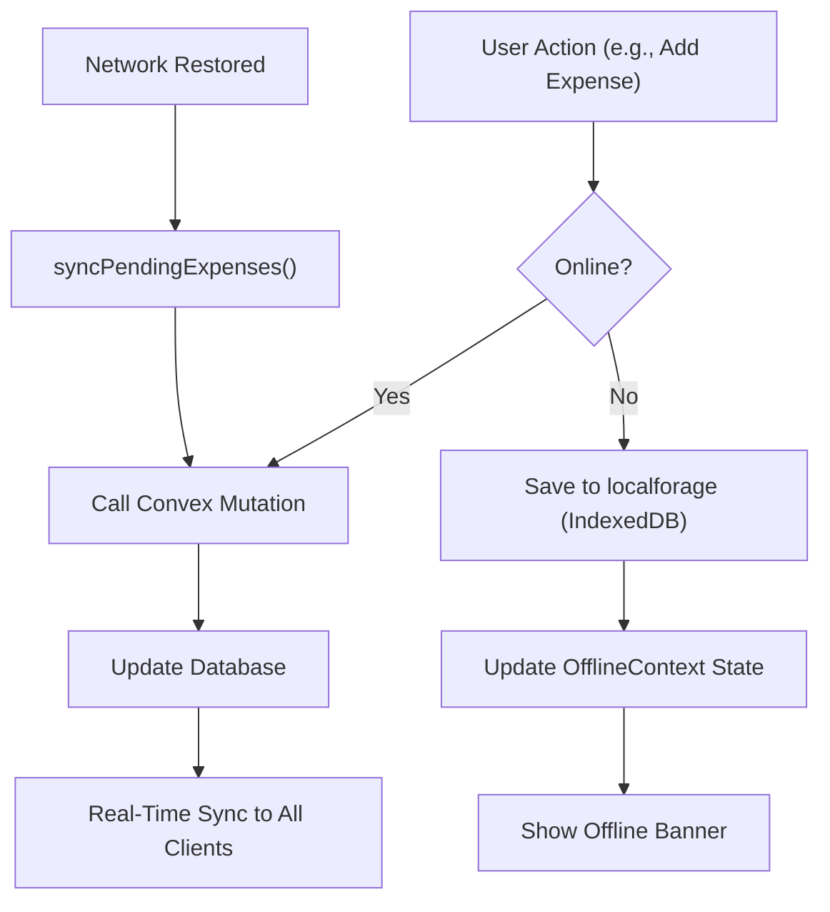

# Technology Stack

<cite>
**Referenced Files in This Document**   
- [next.config.js](file://next.config.js) - *Updated in recent commit*
- [tailwind.config.ts](file://tailwind.config.ts)
- [sw.js](file://public/sw.js)
- [ConvexProvider.tsx](file://src/providers/ConvexProvider.tsx)
- [manifest.json](file://public/manifest.json)
- [OfflineContext.tsx](file://src/contexts/OfflineContext.tsx)
- [OfflineFirstProvider.tsx](file://src/providers/OfflineFirstProvider.tsx)
- [OfflineFirstWrapper.tsx](file://src/providers/OfflineFirstWrapper.tsx)
- [package.json](file://package.json)
- [layout.tsx](file://src/app/layout.tsx)
</cite>

## Update Summary
- Updated PWA configuration section to reflect migration from `next.config.mjs` to `next.config.js`
- Removed references to non-existent `next.config.mjs` file
- Enhanced offline support documentation with details from `OfflineFirstProvider` and `OfflineFirstWrapper`
- Added new section sources for updated files
- Updated service worker documentation with comprehensive caching strategies from `sw.js`

## Table of Contents
1. [Technology Stack Overview](#technology-stack-overview)
2. [Core Frameworks and Libraries](#core-frameworks-and-libraries)
3. [Frontend Architecture and UI Components](#frontend-architecture-and-ui-components)
4. [Backend and Data Management with Convex](#backend-and-data-management-with-convex)
5. [Offline Support and PWA Implementation](#offline-support-and-pwa-implementation)
6. [Styling with Tailwind CSS](#styling-with-tailwind-css)
7. [Configuration and Build Setup](#configuration-and-build-setup)
8. [Integration Patterns and Application Flow](#integration-patterns-and-application-flow)
9. [Performance and Best Practices](#performance-and-best-practices)

## Technology Stack Overview

The Expense-Tracker---Warp application leverages a modern full-stack technology stack designed for high developer velocity, robust type safety, responsive design, and seamless offline functionality. The architecture combines Next.js for server-side rendering and routing, React 18 for component-based UI development, and TypeScript for end-to-end type safety. Styling is handled via Tailwind CSS's utility-first approach, while Convex provides a unified backend solution with real-time sync, database, and serverless functions. Offline capabilities are enhanced through localforage for IndexedDB-backed storage and Workbox-managed service workers, enabling PWA installability and reliable operation in poor network conditions. Additionally, the stack includes Vercel Analytics for user behavior tracking and Vercel Speed Insights for performance monitoring.

**Section sources**
- [package.json](file://package.json#L1-L49)

## Core Frameworks and Libraries

### Next.js App Router and React 18

The application uses **Next.js 14.2.30** with the App Router for server-side rendering (SSR), file-based routing, and optimized performance. This enables fast initial loads, SEO-friendly pages, and efficient data fetching patterns. The framework integrates seamlessly with React 18, which powers the UI through concurrent rendering, suspense, and modern hooks.

React 18's component model allows for reusable, composable UI elements such as `ExpenseCard`, `HeaderRow`, and `CustomDatePicker`. These components are organized under `/src/components` and feature-specific directories like `/src/features/dashboard/components`.

TypeScript (`^5`) ensures type safety across both frontend and backend code, reducing runtime errors and improving code maintainability. It is used throughout the project, including in Convex-generated types and React components.

```json
"dependencies": {
  "next": "14.2.30",
  "react": "^18",
  "react-dom": "^18",
  "typescript": "^5"
}
```

**Section sources**
- [package.json](file://package.json#L10-L15)

### Convex for Full-Stack Backend Services

Convex serves as the full-stack backend, providing a unified solution for database operations, serverless functions, and real-time synchronization. It eliminates the need for traditional REST or GraphQL APIs by allowing direct function calls from the frontend.

The `ConvexProvider` wraps the entire application, injecting the Convex client and enabling real-time data subscriptions:

```tsx
// src/providers/ConvexProvider.tsx
const convex = new ConvexReactClient(process.env.NEXT_PUBLIC_CONVEX_URL!);

export function ConvexProvider({ children }: { children: ReactNode }) {
  return (
    <ConvexReactProvider client={convex}>
      {children}
    </ConvexReactProvider>
  );
}
```

Convex functions (e.g., `expenses.createExpense`) are called using `useMutation` and `useQuery` hooks, ensuring type-safe interactions via generated API types in `convex/_generated/api`.

**Section sources**
- [ConvexProvider.tsx](file://src/providers/ConvexProvider.tsx#L1-L16)
- [package.json](file://package.json#L10-L11)

### Vercel Analytics and Speed Insights

The application integrates **Vercel Analytics (`^1.5.0`)** and **Vercel Speed Insights (`^1.2.0`)** for monitoring user behavior and application performance. These tools are added as dependencies and implemented directly in the root layout component.

```json
"@vercel/analytics": "^1.5.0",
"@vercel/speed-insights": "^1.2.0"
```

In `layout.tsx`, both analytics components are imported and rendered at the root level:

```tsx
// src/app/layout.tsx
import { Analytics } from "@vercel/analytics/next";
import { SpeedInsights } from "@vercel/speed-insights/next";

// ... in the body
<Analytics />
<SpeedInsights />
```

This implementation provides automatic tracking of page views, user interactions, and performance metrics without requiring manual instrumentation. The integration is lightweight and respects user privacy by default.

**Section sources**
- [layout.tsx](file://src/app/layout.tsx#L10-L11, L67-L68)
- [package.json](file://package.json#L10-L11)

## Frontend Architecture and UI Components

### Component Organization and Reusability

Components are structured by feature and utility:
- `/src/components`: Shared UI elements (e.g., `BottomNav`, `SmartSelectInput`)
- `/src/features/dashboard/components`: Dashboard-specific components grouped into modular directories
- `/src/hooks`: Custom hooks like `useDebounce` and `useExpenseActions` for logic reuse

This modular structure enhances maintainability and scalability.

### User Feedback with Sonner

Although no direct usage was found in the codebase, **Sonner (`^2.0.6`)** is listed as a dependency and is intended for displaying toast notifications. It likely supports user feedback for actions like expense creation or sync status, though its integration may be pending or conditionally rendered.

```json
"sonner": "^2.0.6"
```

**Section sources**
- [package.json](file://package.json#L10-L11)

## Backend and Data Management with Convex

### Schema and Function Structure

The backend logic resides in the `/convex` directory:
- `schema.ts`: Defines data models and indexes
- `expenses.ts`, `cardsAndIncome.ts`: Business logic for CRUD operations
- `auth.ts`: Authentication handling
- `_generated/api.d.ts`: Auto-generated types for type-safe frontend access

Convex functions are written in TypeScript and deployed as serverless functions, callable directly from React components using hooks.

### Real-Time Sync and Type Safety

By using `useQuery` and `useMutation`, the frontend automatically re-renders when data changes, thanks to Convex's real-time subscriptions. The generated API ensures complete type alignment between client and server.

**Section sources**
- [convex/schema.ts](file://convex/schema.ts)
- [convex/expenses.ts](file://convex/expenses.ts)

## Offline Support and PWA Implementation

### Service Worker and Workbox via sw.js

The service worker (`public/sw.js`) implements comprehensive caching and offline support with multiple caching strategies:

```js
// public/sw.js
const CACHE_VERSION = 'expense-tracker-v3';
const STATIC_CACHE = `${CACHE_VERSION}-static`;
const DYNAMIC_CACHE = `${CACHE_VERSION}-dynamic`;

// Essential resources that must be cached for offline functionality
const ESSENTIAL_CACHE = [
  '/',
  '/login',
  '/register', 
  '/expenses',
  '/dashboard',
  '/settings',
  '/offline',
  '/income',
  '/cards',
  '/manifest.json',
  '/icon-192.png',
  '/icon-512.png',
  '/favicon.ico'
];

// Handle navigation requests with smart offline fallback
async function handleNavigationRequest(request) {
  try {
    const response = await fetch(request);
    if (response.ok) {
      const cache = await caches.open(DYNAMIC_CACHE);
      cache.put(request, response.clone());
      return response;
    }
  } catch (error) {
    console.log('Network request failed, serving offline content');
  }

  // Serve appropriate offline content based on route
  const url = new URL(request.url);
  const pathname = url.pathname;

  let cachedResponse = await caches.match(request);
  if (cachedResponse) {
    return cachedResponse;
  }

  // Fallback to offline page or root
  return (await caches.match('/offline')) || 
         (await caches.match('/')) || 
         new Response('Offline - Please check your connection', { 
           status: 503,
           headers: { 'Content-Type': 'text/html' }
         });
}
```

This ensures core app pages are available offline with intelligent fallback strategies.

### Enhanced Caching with next-pwa

The `next.config.js` configures advanced PWA behavior using `next-pwa`:

```js
// next.config.js
const withPWA = require('next-pwa')({
  dest: 'public',
  register: true,
  skipWaiting: true,
  disable: process.env.NODE_ENV === 'development',
  runtimeCaching: [
    {
      urlPattern: /^https?.*/,
      handler: 'NetworkFirst',
      options: {
        cacheName: 'offlineCache',
        expiration: {
          maxEntries: 200,
          maxAgeSeconds: 24 * 60 * 60, // 1 day
        },
        cacheableResponse: {
          statuses: [0, 200],
        },
      },
    },
  ],
});
```

This setup implements a network-first strategy for all HTTPS requests with comprehensive caching policies.

### Offline Data Persistence with localforage

`localforage` provides a simple key-value interface over IndexedDB for storing pending expenses:

```ts
// src/contexts/OfflineContext.tsx
localforage.config({
  name: 'ExpenseTracker',
  storeName: 'pending_expenses',
  description: 'Queue for offline expense submissions',
});

await localforage.setItem('pending-expenses', updated);
```

The `OfflineContext` tracks online status and manages a queue of unsynced expenses, syncing them when connectivity is restored.

### Advanced Offline Architecture with OfflineFirstProvider

The application implements a sophisticated offline-first architecture using `OfflineFirstProvider` and `OfflineFirstWrapper`:

```tsx
// src/providers/OfflineFirstWrapper.tsx
export function OfflineFirstWrapper({ children }: OfflineFirstWrapperProps) {
  const { user } = useAuth();
  
  return (
    <OfflineFirstProvider userId={user?._id}>
      {children}
    </OfflineFirstProvider>
  );
}
```

The `OfflineFirstProvider` manages:
- Local storage manager for IndexedDB operations
- Cloud sync manager for background synchronization
- Conflict detector for resolving data conflicts
- Performance optimizer for efficient sync operations

```ts
// src/providers/OfflineFirstProvider.tsx
export function OfflineFirstProvider({ children, userId }: OfflineFirstProviderProps) {
  // Initialize local storage manager
  const localManager = new LocalStorageManager();
  await localManager.initialize(currentUserId);
  
  // Initialize cloud sync manager
  const syncManager = new CloudSyncManager(localManager, detector);
  
  // Initialize performance optimizer
  const optimizer = new PerformanceOptimizer(
    localManager,
    syncManager,
    detector,
    {
      syncInterval: 30000, // 30 seconds
      enableQueryCaching: true,
      syncOnNetworkChange: true,
      syncOnVisibilityChange: true
    }
  );
}
```

This architecture provides comprehensive offline capabilities with automatic sync, conflict detection, and performance optimization.

### Visual Feedback with NetworkStatusIndicator

The `EnhancedNetworkStatusIndicator` component displays real-time connection status:

```tsx
// src/components/EnhancedNetworkStatusIndicator.tsx
export function EnhancedNetworkStatusIndicator() {
  const { isOnline } = useOffline();
  return (
    <motion.div
      style={{ backgroundColor: isOnline ? '#22c55e' : '#ef4444' }}
      title={isOnline ? "Online" : "Offline"}
    />
  );
}
```

It uses framer-motion for smooth transitions and integrates with `OfflineContext`.

**Section sources**
- [sw.js](file://public/sw.js#L1-L289)
- [next.config.js](file://next.config.js#L1-L38)
- [OfflineContext.tsx](file://src/contexts/OfflineContext.tsx#L1-L428)
- [OfflineFirstProvider.tsx](file://src/providers/OfflineFirstProvider.tsx#L1-L326)
- [OfflineFirstWrapper.tsx](file://src/providers/OfflineFirstWrapper.tsx#L1-L19)

## Styling with Tailwind CSS

Tailwind CSS (`^3.4.1`) enables utility-first styling with a responsive, customizable design system.

The configuration in `tailwind.config.ts` extends the default theme:

```ts
// tailwind.config.ts
const config: Config = {
  content: [
    "./src/pages/**/*.{js,ts,jsx,tsx,mdx}",
    "./src/components/**/*.{js,ts,jsx,tsx,mdx}",
    "./src/app/**/*.{js,ts,jsx,tsx,mdx}",
  ],
  theme: {
    extend: {
      colors: {
        background: "var(--background)",
        foreground: "var(--foreground)",
      },
    },
  },
  plugins: [],
};
```

CSS variables allow dynamic theming, while the content configuration ensures all component classes are included in the build.

**Section sources**
- [tailwind.config.ts](file://tailwind.config.ts#L1-L20)

## Configuration and Build Setup

### PWA Manifest

The `manifest.json` defines installability and appearance:

```json
{
  "name": "Expense Tracker",
  "short_name": "ExpenseTracker",
  "display": "standalone",
  "background_color": "#000000",
  "theme_color": "#000000",
  "icons": [
    { "src": "/icon-192.png", "sizes": "192x192" },
    { "src": "/icon-512.png", "sizes": "512x512" }
  ]
}
```

This enables the app to be installed on mobile devices with a native-like experience.

### Build and Development Scripts

```json
"scripts": {
  "dev": "next dev",
  "build": "next build",
  "start": "next start",
  "lint": "next lint",
  "build:pwa": "next build && echo 'PWA build complete'"
}
```

These scripts streamline development, building, and deployment.

**Section sources**
- [manifest.json](file://public/manifest.json#L1-L25)
- [package.json](file://package.json#L5-L9)

## Integration Patterns and Application Flow

### Provider-Based State Management

The app uses React Context providers for global state:
- `ConvexProvider`: Manages backend connection
- `AuthProvider`: Handles authentication tokens
- `OfflineFirstProvider`: Manages offline-first architecture with user-specific data
- `OfflineFirstWrapper`: Conditional wrapper that provides user ID to OfflineFirstProvider

These are wrapped in `layout.tsx` or root components to ensure availability.

### Analytics Integration in Layout

The root layout component includes Vercel Analytics and Speed Insights components, which are rendered after the main application providers:

```tsx
// src/app/layout.tsx
<ConvexProvider>
  <AuthProvider>
    <OfflineFirstWrapper>
      <SettingsProvider>
        <OfflineProvider>
          {children}
          <div id="modal-root"></div>
          <EnhancedNetworkStatusIndicator />
          <OfflineModeIndicator />
          <Toaster position="top-center" />
        </OfflineProvider>
      </SettingsProvider>
    </OfflineFirstWrapper>
  </AuthProvider>
</ConvexProvider>
<Analytics />
<SpeedInsights />
```

This ensures that analytics are available across all pages while maintaining proper component hierarchy.

**Section sources**
- [layout.tsx](file://src/app/layout.tsx#L10-L11, L67-L68)

### Data Flow Diagram



**Diagram sources**
- [OfflineContext.tsx](file://src/contexts/OfflineContext.tsx#L1-L428)
- [ConvexProvider.tsx](file://src/providers/ConvexProvider.tsx#L1-L16)

## Performance and Best Practices

### Performance Implications

- **Next.js SSR**: Improves initial load time and SEO
- **Tailwind JIT**: Reduces CSS bundle size
- **Convex Real-Time**: Minimizes polling; efficient WebSocket-based updates
- **Workbox Caching**: Reduces network requests and improves offline UX
- **Vercel Speed Insights**: Provides real-time performance monitoring and optimization suggestions
- **OfflineFirst Architecture**: Enables seamless offline operation with automatic sync and conflict resolution

### Best Practices

- **Type Safety**: Use TypeScript and Convex-generated types consistently
- **Offline-First**: Queue mutations when offline and sync automatically
- **Modular Components**: Group by feature and use index exports
- **PWA Optimization**: Precache critical assets and use CacheFirst for static resources
- **Error Handling**: Log sync failures and allow manual retry via `retryFailedExpense`
- **Analytics**: Monitor user behavior and performance with Vercel tools
- **Conflict Resolution**: Implement robust conflict detection and resolution strategies
- **Performance Monitoring**: Use performance optimizer to track sync operations and metrics

The stack balances developer experience with end-user reliability, making it ideal for a mobile-first expense tracking application.

**Section sources**
- [next.config.js](file://next.config.js#L1-L38)
- [OfflineContext.tsx](file://src/contexts/OfflineContext.tsx#L1-L428)
- [package.json](file://package.json#L1-L49)
- [layout.tsx](file://src/app/layout.tsx#L10-L11, L67-L68)