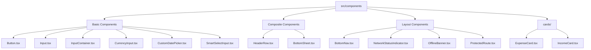
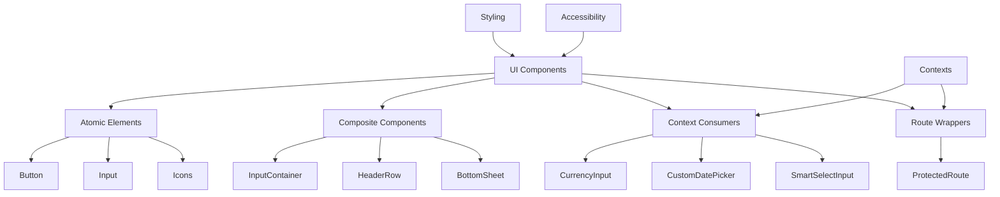
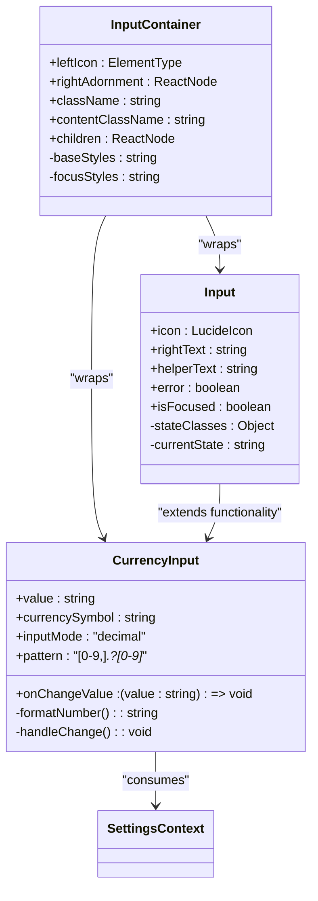
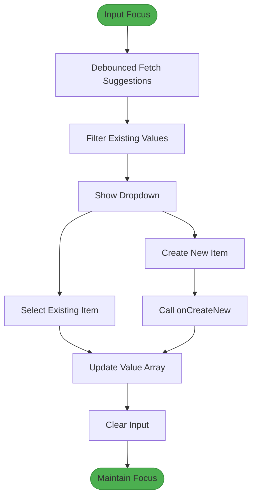
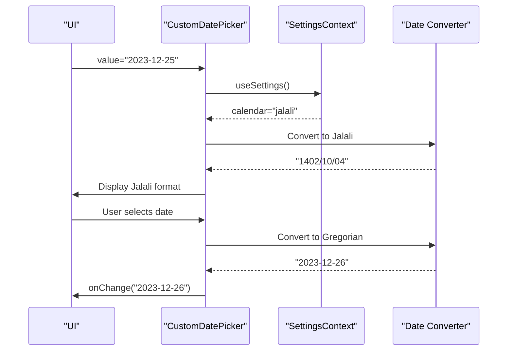
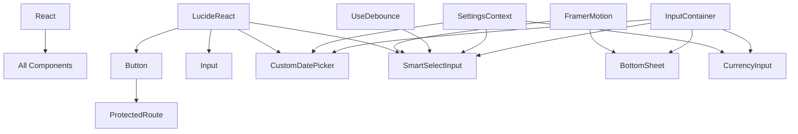

# UI Component Library

<cite>
**Referenced Files in This Document**   
- [Button.tsx](file://src/components/Button.tsx)
- [Input.tsx](file://src/components/Input.tsx)
- [InputContainer.tsx](file://src/components/InputContainer.tsx)
- [CurrencyInput.tsx](file://src/components/CurrencyInput.tsx) - *Updated to enable mobile numeric keyboard*
- [CustomDatePicker.tsx](file://src/components/CustomDatePicker.tsx)
- [SmartSelectInput.tsx](file://src/components/SmartSelectInput.tsx)
- [BottomSheet.tsx](file://src/components/BottomSheet.tsx)
- [HeaderRow.tsx](file://src/components/HeaderRow.tsx)
- [BottomNav.tsx](file://src/components/BottomNav.tsx)
- [NetworkStatusIndicator.tsx](file://src/components/NetworkStatusIndicator.tsx)
- [OfflineBanner.tsx](file://src/components/OfflineBanner.tsx)
- [ProtectedRoute.tsx](file://src/components/ProtectedRoute.tsx)
- [ExpenseCard.tsx](file://src/components/cards/ExpenseCard.tsx)
- [IncomeCard.tsx](file://src/components/cards/IncomeCard.tsx)
</cite>

## Update Summary
**Changes Made**   
- Updated CurrencyInput component documentation to reflect mobile keyboard optimization
- Added detailed explanation of inputMode and pattern attributes for mobile UX
- Enhanced Input System Analysis section with new implementation details
- Updated section sources to reflect changes in CurrencyInput.tsx
- Added troubleshooting guidance for mobile input issues

## Table of Contents
1. [Introduction](#introduction)
2. [Project Structure](#project-structure)
3. [Core Components](#core-components)
4. [Architecture Overview](#architecture-overview)
5. [Detailed Component Analysis](#detailed-component-analysis)
6. [Dependency Analysis](#dependency-analysis)
7. [Performance Considerations](#performance-considerations)
8. [Troubleshooting Guide](#troubleshooting-guide)
9. [Conclusion](#conclusion)

## Introduction
The UI Component Library is a collection of reusable React components designed for the Expense Tracker application. These components provide consistent styling, behavior, and accessibility across the entire application. The library includes form controls, navigation elements, data display components, and utility wrappers that follow modern React patterns such as composition, hooks integration, and responsive design principles.

## Project Structure
The component library is organized within the `src/components` directory, with subdirectories for specialized component groups. The structure follows a feature-based organization with atomic design principles, separating basic inputs from composite components.



**Diagram sources**
- [Button.tsx](file://src/components/Button.tsx)
- [Input.tsx](file://src/components/Input.tsx)
- [InputContainer.tsx](file://src/components/InputContainer.tsx)
- [CurrencyInput.tsx](file://src/components/CurrencyInput.tsx)
- [CustomDatePicker.tsx](file://src/components/CustomDatePicker.tsx)
- [SmartSelectInput.tsx](file://src/components/SmartSelectInput.tsx)
- [BottomSheet.tsx](file://src/components/BottomSheet.tsx)
- [HeaderRow.tsx](file://src/components/HeaderRow.tsx)
- [BottomNav.tsx](file://src/components/BottomNav.tsx)
- [NetworkStatusIndicator.tsx](file://src/components/NetworkStatusIndicator.tsx)
- [OfflineBanner.tsx](file://src/components/OfflineBanner.tsx)
- [ProtectedRoute.tsx](file://src/components/ProtectedRoute.tsx)
- [ExpenseCard.tsx](file://src/components/cards/ExpenseCard.tsx)
- [IncomeCard.tsx](file://src/components/cards/IncomeCard.tsx)

**Section sources**
- [Button.tsx](file://src/components/Button.tsx)
- [Input.tsx](file://src/components/Input.tsx)

## Core Components
The core components form the foundation of the UI library, providing essential building blocks for forms and user interaction. These include Button, Input, InputContainer, CurrencyInput, CustomDatePicker, and SmartSelectInput, which are designed to work together seamlessly while maintaining individual reusability.

**Section sources**
- [Button.tsx](file://src/components/Button.tsx#L1-L106)
- [Input.tsx](file://src/components/Input.tsx#L1-L78)
- [InputContainer.tsx](file://src/components/InputContainer.tsx#L1-L39)

## Architecture Overview
The component library follows a layered architecture with clear separation of concerns. Basic components handle visual presentation and user interaction, while container components manage layout and composition. Context consumers like CurrencyInput and CustomDatePicker integrate with application state, and higher-order components like ProtectedRoute handle routing logic.



**Diagram sources**
- [Button.tsx](file://src/components/Button.tsx)
- [Input.tsx](file://src/components/Input.tsx)
- [CurrencyInput.tsx](file://src/components/CurrencyInput.tsx)
- [CustomDatePicker.tsx](file://src/components/CustomDatePicker.tsx)
- [SmartSelectInput.tsx](file://src/components/SmartSelectInput.tsx)
- [ProtectedRoute.tsx](file://src/components/ProtectedRoute.tsx)

## Detailed Component Analysis

### Button Component Analysis
The Button component provides a styled, interactive element with support for different variants, sizes, and states. It handles loading states with animated spinners and disabled states with appropriate visual feedback.

```mermaid
classDiagram
class Button {
+variant : 'default' | 'pressed' | 'hover'
+buttonType : 'text' | 'icon'
+size : 'large' | 'medium'
+disabled : boolean
+loading : boolean
+icon : ReactNode
+children : ReactNode
-buttonVariants() : string
-LucideLoaderCircle() : JSX.Element
}
Button --> InputContainer : "uses styling principles"
Button --> "framer-motion" : "potential animation"
```

**Diagram sources**
- [Button.tsx](file://src/components/Button.tsx#L1-L106)

**Section sources**
- [Button.tsx](file://src/components/Button.tsx#L1-L106)

### Input System Analysis
The input system consists of three cooperating components: Input, InputContainer, and specialized inputs. InputContainer provides the outer styling and focus states, Input handles the inner field with icon support, and specialized inputs like CurrencyInput build upon this foundation.

#### InputContainer Class Diagram


**Updated** Enhanced CurrencyInput documentation to reflect mobile keyboard optimization

**Diagram sources**
- [InputContainer.tsx](file://src/components/InputContainer.tsx#L1-L39)
- [Input.tsx](file://src/components/Input.tsx#L1-L78)
- [CurrencyInput.tsx](file://src/components/CurrencyInput.tsx#L1-L95) - *Updated to enable mobile numeric keyboard*

**Section sources**
- [InputContainer.tsx](file://src/components/InputContainer.tsx#L1-L39)
- [Input.tsx](file://src/components/Input.tsx#L1-L78)
- [CurrencyInput.tsx](file://src/components/CurrencyInput.tsx#L1-L95) - *Updated to enable mobile numeric keyboard*

### SmartSelectInput Workflow
The SmartSelectInput component implements an advanced autocomplete pattern with dynamic suggestions, creation of new items, and keyboard navigation support.



**Diagram sources**
- [SmartSelectInput.tsx](file://src/components/SmartSelectInput.tsx#L1-L245)

**Section sources**
- [SmartSelectInput.tsx](file://src/components/SmartSelectInput.tsx#L1-L245)

### Date Picker Integration Flow
The CustomDatePicker component handles calendar system conversion between Gregorian and Jalali calendars based on user settings.



**Diagram sources**
- [CustomDatePicker.tsx](file://src/components/CustomDatePicker.tsx#L1-L79)
- [SettingsContext.tsx](file://src/contexts/SettingsContext.tsx)

**Section sources**
- [CustomDatePicker.tsx](file://src/components/CustomDatePicker.tsx#L1-L79)

## Dependency Analysis
The component library has a clear dependency hierarchy with atomic components depending only on React and basic utilities, while composite components depend on both atomic components and application contexts.



**Diagram sources**
- [package.json](file://package.json)
- [Button.tsx](file://src/components/Button.tsx)
- [CurrencyInput.tsx](file://src/components/CurrencyInput.tsx)
- [CustomDatePicker.tsx](file://src/components/CustomDatePicker.tsx)
- [SmartSelectInput.tsx](file://src/components/SmartSelectInput.tsx)
- [BottomSheet.tsx](file://src/components/BottomSheet.tsx)
- [useDebounce.ts](file://src/hooks/useDebounce.ts)
- [SettingsContext.tsx](file://src/contexts/SettingsContext.tsx)

**Section sources**
- [package.json](file://package.json)
- [Button.tsx](file://src/components/Button.tsx)
- [CurrencyInput.tsx](file://src/components/CurrencyInput.tsx)
- [CustomDatePicker.tsx](file://src/components/CustomDatePicker.tsx)
- [SmartSelectInput.tsx](file://src/components/SmartSelectInput.tsx)

## Performance Considerations
The component library implements several performance optimizations:
- Debounced search in SmartSelectInput to prevent excessive API calls
- Stable DateObject references in CustomDatePicker to minimize re-renders
- Efficient CSS transitions and animations using Tailwind classes
- Proper cleanup of event listeners in BottomSheet
- Memoization patterns through useCallback in interactive components

While most components are lightweight, complex components like SmartSelectInput should be used judiciously on mobile devices due to their dynamic rendering requirements.

## Troubleshooting Guide
Common issues and solutions for the UI component library:

**Section sources**
- [Button.tsx](file://src/components/Button.tsx#L34-L62)
- [SmartSelectInput.tsx](file://src/components/SmartSelectInput.tsx#L100-L120)
- [CustomDatePicker.tsx](file://src/components/CustomDatePicker.tsx#L45-L55)
- [CurrencyInput.tsx](file://src/components/CurrencyInput.tsx#L78-L95) - *Updated to enable mobile numeric keyboard*

### Button Loading State Not Displaying
Ensure the `loading` prop is properly bound to async operation state. The component uses an animated SVG spinner that requires the `animate-spin` Tailwind class.

### CurrencyInput Formatting Issues
Verify that the raw value passed to `value` prop contains only numeric characters and decimal points. The formatting function removes commas internally, so parent components should store unformatted values.

### SmartSelectInput Dropdown Not Closing
Check that the component is rendered within a DOM structure that allows proper event propagation. The click-outside detection relies on standard DOM events and may be blocked by certain parent containers.

### Date Picker Calendar Conversion Errors
Ensure the SettingsContext is properly initialized before rendering CustomDatePicker. The component expects a valid calendar setting ("gregorian" or "jalali") in the settings object.

### Mobile Numeric Keyboard Not Appearing
The CurrencyInput component now uses `inputMode="decimal"` and `pattern="[0-9,]*\.?[0-9]*"` attributes to ensure the numeric keyboard appears on mobile devices. If the standard keyboard still appears:
1. Verify the component is rendered within a form element
2. Check that no parent component is overriding the input attributes
3. Ensure the browser supports the inputMode attribute
4. Test on actual mobile devices as emulators may not accurately represent keyboard behavior

### Accessibility Concerns
All interactive components should maintain proper keyboard navigation and ARIA attributes. Test with screen readers to ensure labels and states are properly announced.

## Conclusion
The UI Component Library provides a robust foundation for the Expense Tracker application with well-designed, reusable components that follow React best practices. The library demonstrates effective use of composition, context integration, and performance optimization techniques. By maintaining consistent styling and behavior across components, it ensures a cohesive user experience while allowing for flexibility in implementation. Future enhancements could include additional form components, improved mobile responsiveness, and expanded accessibility features.