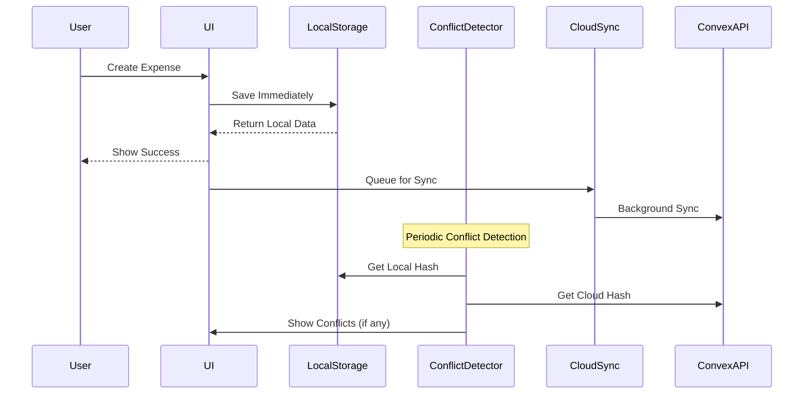

# Local-First Data Storage Implementation

This document describes the comprehensive local-first data storage system implemented for the Expense Tracker application. The system prioritizes local storage for immediate data access while maintaining cloud synchronization for backup and multi-device support.

## Architecture Overview

The local-first architecture consists of several key components:

### Core Components

1. **LocalStorageManager** - Handles all local data operations using IndexedDB
2. **CloudSyncManager** - Manages cloud synchronization with retry mechanisms
3. **ConflictDetector** - Identifies and analyzes data conflicts
4. **ConflictPrompt** - User interface for conflict resolution
5. **LocalFirstConvexClient** - Seamless API wrapper for local-first operations
6. **PerformanceOptimizer** - Background sync and performance optimizations

### Data Flow



## Key Features

### 🚀 Immediate UI Response
- All data operations complete instantly with local storage
- No waiting for network requests
- Optimistic updates with background sync

### 🔄 Intelligent Sync
- Background synchronization when online
- Retry mechanisms with exponential backoff
- Batch processing for efficiency
- Priority-based sync queuing

### ⚡ Conflict Resolution
- Hash-based conflict detection
- User-friendly conflict resolution UI
- Multiple resolution strategies (local wins, cloud wins, merge)
- Automatic conflict detection on app focus/network changes

### 📱 Offline-First
- Full functionality without internet
- Persistent local storage using IndexedDB
- Automatic sync when connectivity returns
- Visual indicators for sync status

### 🎯 Performance Optimized
- Query caching with LRU eviction
- Debounced and throttled operations
- Background cleanup tasks
- Performance metrics tracking

## Implementation Guide

### 1. Setup and Installation

```bash
# Install additional dependencies for testing
npm install --save-dev @testing-library/react @testing-library/jest-dom @testing-library/user-event fake-indexeddb jest jest-environment-jsdom ts-jest
```

### 2. Initialize Local-First Provider

```tsx
// app/layout.tsx
import { LocalFirstProvider } from '@/providers/LocalFirstProvider';

export default function RootLayout({ children }) {
  return (
    <html>
      <body>
        <LocalFirstProvider>
          {children}
        </LocalFirstProvider>
      </body>
    </html>
  );
}
```

### 3. Use Local-First Hooks

```tsx
// components/ExpenseForm.tsx
import { useExpenses } from '@/hooks/useLocalFirst';

function ExpenseForm() {
  const {
    data: expenses,
    createExpense,
    syncStatus,
    pendingCount,
    error
  } = useExpenses();

  const handleSubmit = async (expenseData) => {
    try {
      // Immediate local save, background cloud sync
      await createExpense(expenseData);
      toast.success('Expense added successfully!');
    } catch (error) {
      toast.error('Failed to add expense');
    }
  };

  return (
    <form onSubmit={handleSubmit}>
      {/* form fields */}
      
      {/* Sync status indicator */}
      <div className=\"flex items-center space-x-2\">
        {syncStatus === 'syncing' && <Spinner />}
        {pendingCount > 0 && (
          <span className=\"text-amber-600\">
            {pendingCount} pending sync
          </span>
        )}
      </div>
    </form>
  );
}
```

### 4. Handle Conflicts

Conflicts are automatically detected and displayed via the `ConflictPrompt` component:

```tsx
// The ConflictPrompt is automatically shown when conflicts are detected
// Users can choose to:
// 1. Upload local data (local wins)
// 2. Download cloud data (cloud wins)
// 3. Dismiss (manual resolution later)
```

### 5. Performance Optimization

```tsx
// hooks/useOptimizedExpenses.ts
import { PerformanceOptimizer } from '@/lib/optimization/PerformanceOptimizer';

const optimizer = new PerformanceOptimizer(
  localStorageManager,
  cloudSyncManager,
  conflictDetector,
  {
    syncInterval: 30000, // 30 seconds
    maxBatchSize: 50,
    enableQueryCaching: true,
    cacheExpirationTime: 300000 // 5 minutes
  }
);

// Use optimized queries
const expenses = await optimizer.optimizedQuery(
  'expenses-current-month',
  () => localStorageManager.getExpenses(filters)
);

// Add operations to background sync queue
optimizer.addToSyncQueue(
  () => cloudSyncManager.syncExpense(expense),
  'high' // priority
);
```

## API Reference

### LocalStorageManager

#### Methods

```typescript
// Initialize storage
async initialize(userId: string): Promise<void>

// Expense operations
async saveExpense(expense: ExpenseData): Promise<LocalExpense>
async getExpenses(filters?: DataFilters): Promise<LocalExpense[]>
async updateExpense(id: string, updates: Partial<LocalExpense>): Promise<LocalExpense | null>
async deleteExpense(id: string): Promise<boolean>

// Data management
async getDataHash(): Promise<string>
async exportData(): Promise<LocalDataExport>
async importData(data: LocalDataExport): Promise<void>
```

### CloudSyncManager

```typescript
// Sync operations
async syncToCloud(localData: LocalDataExport, token: string): Promise<SyncResult>
async syncFromCloud(token: string): Promise<CloudDataMapping>
async uploadLocalData(localData: LocalDataExport, token: string): Promise<void>
async downloadCloudData(token: string): Promise<CloudDataMapping>

// Validation
async validateCloudData(token: string): Promise<boolean>
async getCloudDataHash(token: string): Promise<string>
```

### ConflictDetector

```typescript
// Conflict detection
async detectConflicts(
  localData: LocalDataExport, 
  cloudData: CloudDataMapping
): Promise<ConflictDetectionResult>

// Data validation
async validateDataHash(localHash: string, cloudHash: string): Promise<boolean>
generateDataHash(data: any): string

// Conflict resolution
mergeData(
  localData: LocalDataExport, 
  cloudData: CloudDataMapping, 
  strategy: 'local_wins' | 'cloud_wins' | 'latest_timestamp'
): LocalDataExport
```

### useExpenses Hook

```typescript
interface UseExpensesResult {
  // Data
  data: LocalExpense[];
  isLoading: boolean;
  error: string | null;
  
  // Sync status
  syncStatus: SyncStatus;
  pendingCount: number;
  lastSyncedAt: Date | null;
  conflicts: ConflictItem[];
  
  // Operations
  createExpense: (expense: ExpenseData) => Promise<LocalExpense>;
  updateExpense: (id: string, updates: Partial<LocalExpense>) => Promise<LocalExpense | null>;
  deleteExpense: (id: string) => Promise<boolean>;
  refreshData: () => Promise<void>;
}
```

## Testing

The implementation includes comprehensive tests covering:

### Unit Tests
- LocalStorageManager operations
- ConflictDetector algorithms
- CloudSyncManager retry logic
- Performance optimization strategies

### Integration Tests
- Complete offline-to-online sync cycles
- Conflict resolution workflows
- Performance under load
- Error handling scenarios

### Running Tests

```bash
# Run all tests
npm test

# Run tests in watch mode
npm run test:watch

# Run tests with coverage
npm run test:coverage

# Run tests for CI
npm run test:ci
```

## Performance Considerations

### Optimization Strategies

1. **Query Caching**
   - LRU cache with configurable TTL
   - Automatic cache invalidation
   - Hit rate monitoring

2. **Background Sync**
   - Priority-based queue processing
   - Exponential backoff for retries
   - Batch operations for efficiency

3. **Resource Management**
   - Periodic cleanup of expired data
   - Memory usage optimization
   - Network request throttling

4. **Event-Driven Sync**
   - Sync on network connectivity changes
   - Sync on app visibility changes
   - Smart conflict detection timing

### Performance Metrics

The system tracks key performance indicators:

```typescript
interface PerformanceMetrics {
  syncOperations: number;
  successfulSyncs: number;
  failedSyncs: number;
  averageSyncTime: number;
  cacheHitRate: number;
  pendingOperations: number;
  lastSyncTime?: number;
}
```

## Migration Guide

### From Existing Implementation

1. **Gradual Migration**
   - Keep existing components functional
   - Introduce local-first hooks alongside existing code
   - Migrate components one by one

2. **Data Migration**
   ```typescript
   // Migrate existing offline queue data
   const existingData = await localforage.getItem('pending-expenses');
   if (existingData) {
     await localStorageManager.importLegacyData(existingData);
   }
   ```

3. **Component Updates**
   ```tsx
   // Replace useOfflineQueue with useExpenses
   // const { addToQueue } = useOfflineQueue();
   const { createExpense } = useExpenses();
   
   // Replace manual sync logic with automatic background sync
   // Manual sync calls are no longer needed
   ```

## Security Considerations

### Data Protection
- Local data is stored in IndexedDB (domain-scoped)
- No sensitive data stored in localStorage
- Conflict resolution preserves data integrity

### Authentication
- All cloud operations require valid authentication tokens
- Local operations work without authentication
- User data isolation maintained

### Best Practices
- Regular data validation
- Secure token handling
- Error boundary implementation
- Graceful degradation for unsupported browsers

## Troubleshooting

### Common Issues

1. **Sync Failures**
   ```typescript
   // Check sync status
   const { syncStatus, error } = useExpenses();
   
   if (syncStatus === 'failed') {
     console.error('Sync failed:', error);
     // Implement retry logic or user notification
   }
   ```

2. **Storage Quota Issues**
   ```typescript
   // Monitor storage usage
   const storageEstimate = await navigator.storage.estimate();
   console.log('Storage used:', storageEstimate.usage);
   console.log('Storage quota:', storageEstimate.quota);
   ```

3. **Conflict Resolution**
   ```typescript
   // Handle conflicts gracefully
   const { conflictState, resolveConflict } = useLocalFirst();
   
   if (conflictState.hasConflicts) {
     // Show user-friendly conflict resolution UI
     // Allow user to choose resolution strategy
   }
   ```

### Debug Mode

Enable debug logging for troubleshooting:

```typescript
// Enable detailed logging
localStorageManager.setDebugMode(true);
cloudSyncManager.setDebugMode(true);
```

## Future Enhancements

### Planned Features
- Real-time collaborative editing
- Advanced conflict resolution strategies
- Data export/import functionality
- Enhanced performance monitoring
- Progressive sync prioritization

### Contributing

When contributing to the local-first implementation:

1. **Testing Requirements**
   - All new features must include comprehensive tests
   - Integration tests for complex workflows
   - Performance benchmarks for optimization features

2. **Code Quality**
   - Follow TypeScript best practices
   - Maintain high test coverage (>90%)
   - Document public APIs thoroughly

3. **Performance**
   - Consider impact on app startup time
   - Optimize for memory usage
   - Test under various network conditions

This local-first implementation provides a robust foundation for offline-capable, performant data management while maintaining a smooth user experience across all network conditions."